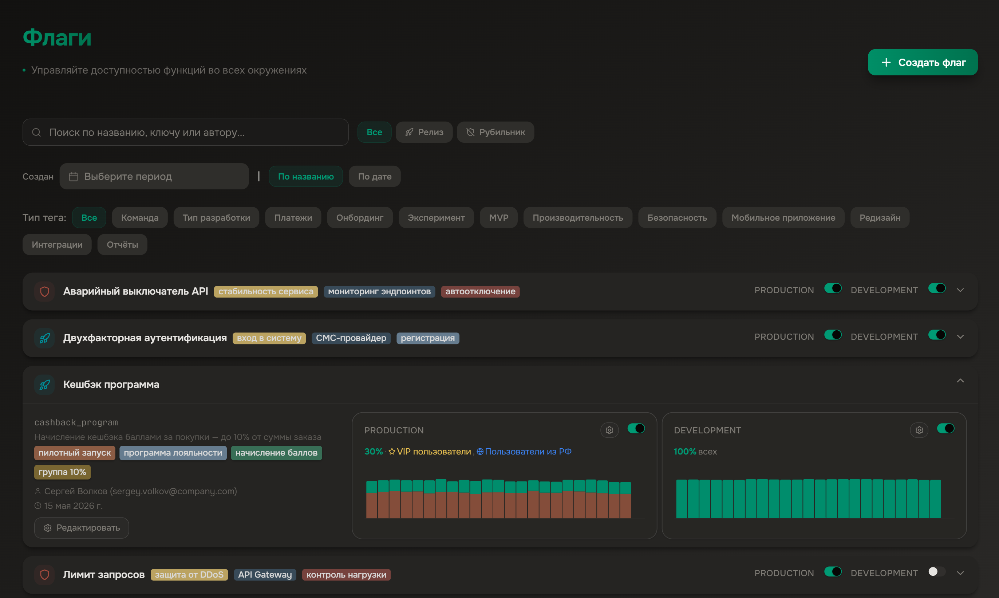
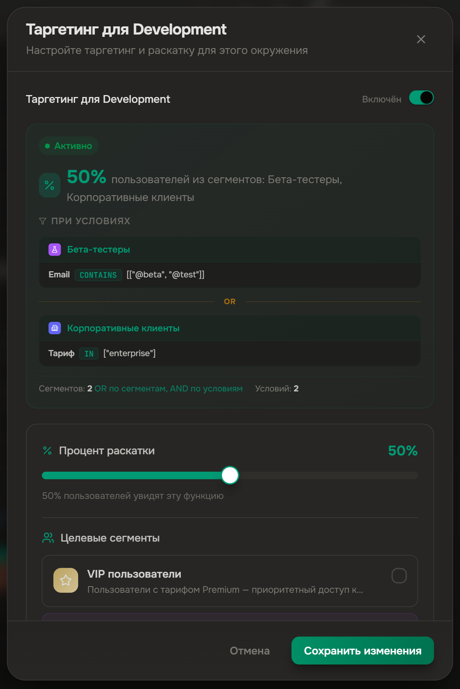
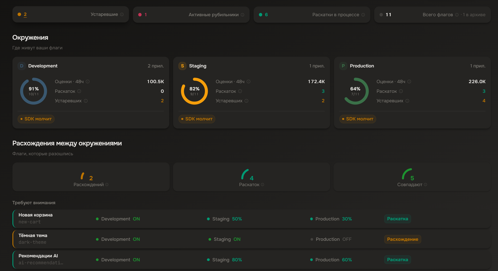

<p align="center">
  
</p>

<p align="center">Open-core, self-hosted feature flag management platform.</p>

<p align="center">
  <a href="https://github.com/mozhno-dev/mozhno/actions/workflows/ci.yml"></a>
  <a href="LICENSE"></a>
  <a href="https://github.com/mozhno-dev/mozhno/pkgs/container/mozhno"></a>
  <a href="https://github.com/mozhno-dev/mozhno/stargazers"></a>
</p>

<p align="right"><a href="README.md">Русский</a></p>

---

**можно.** — a feature flag server for teams of any size. Toggle features in production without deployment, roll out gradually, segment your audience — all from a single dashboard.

---

### Features

| Category | Description |
|----------|-------------|
| **Flags** | RELEASE and KILLSWITCH, percentage rollouts, attribute-based rules |
| **Contexts** | Evaluate flags against arbitrary user or request attributes |
| **Segments** | Reusable user groups with shared targeting rules |
| **Strategies** | Per-environment config: rules, segments, percentage rollout |
| **API Keys** | Per-environment keys with granular permissions |
| **Audit** | Full change history for every flag and configuration |
| **SDKs** | Native clients for Java and JavaScript — evaluate flags locally, zero network calls |

---

### Design Book (Storybook)

```bash
cd web && npm run storybook   # http://localhost:6006
```

Storybook shows every UI component in an isolated catalog with documentation.

### Screenshots

<table>
  <tr>
    <td align="center" width="33%">
      <br />
      <sub><b>Flag dashboard</b></sub>
    </td>
    <td align="center" width="33%">
      <br />
      <sub><b>Flag activation</b></sub>
    </td>
    <td align="center" width="33%">
      <br />
      <sub><b>Overview dashboard</b></sub>
    </td>
  </tr>
</table>

> Run the project locally (`make dev`) to see the interface.

---

### Quick Start

```yaml
# docker-compose.yml
services:
  postgres:
    image: postgres:15-alpine
    environment:
      POSTGRES_DB: feature_flags
      POSTGRES_USER: flags_user
      POSTGRES_PASSWORD: flags_password
    volumes:
      - pgdata:/var/lib/postgresql/data

  mozhno:
    image: ghcr.io/mozhno-dev/mozhno:latest
    ports:
      - '8080:8080'
    environment:
      MOZHNO_DB_URL: jdbc:postgresql://postgres:5432/feature_flags
      MOZHNO_DB_USERNAME: flags_user
      MOZHNO_DB_PASSWORD: flags_password
      MOZHNO_JWT_SECRET: ${MOZHNO_JWT_SECRET}
    depends_on:
      - postgres

volumes:
  pgdata:
```

```bash
# Generate a JWT secret (Base64, ≥32 bytes) — the server won't start without it
export MOZHNO_JWT_SECRET=$(openssl rand -base64 32)

docker compose up -d
```

Open [`http://localhost:8080`](http://localhost:8080) — the web dashboard is already built into the server.

> Full compose with healthchecks and pgAdmin — [`docker-compose.yml`](docker-compose.yml).

---

### Architecture

| Module | Purpose |
|--------|---------|
| `mozhno-spi` | Service provider interfaces |
| `mozhno-core` | Business logic, flag evaluation engine, storage |
| `mozhno-web-api` | REST controllers, Spring Security 6, JWT, OpenAPI |
| `mozhno-app` | Entry point, static resources, DB migrations (Flyway) |

Server — Spring Boot 4.0 / JDK 25. Web UI — React 19 SPA (Vite, Tailwind CSS 4, Radix UI). SDKs fetch flag rules once and evaluate locally.

**Access model:** the active project is carried in the JWT (`project_id` claim), selected at login or via `/auth/select-project`. All resources (flags, segments, contexts, API keys, audit, etc.) are scoped to that project; mutation rights depend on the role (ADMIN/DEVELOPER/VIEWER).

---

### SDKs

**Java**
```java
var config = MozhnoConfig.builder()
    .appName("my-app")
    .instanceId("instance-1")
    .mozhnoUrl("https://flags.example.com")
    .apiKey("env-abc123")
    .build();

var client = new DefaultMozhnoClient(config);
client.start();

var ctx = MozhnoContext.builder().userId("42").build();
boolean on = client.isEnabled("new-checkout", ctx);
```

**JavaScript / TypeScript**
```typescript
import { MozhnoClient } from '@mozhno/client-js';

const client = new MozhnoClient({
  url: 'https://flags.example.com',
  apiKey: 'env-abc123',
  appName: 'my-app',
});
await client.start();

const on = client.isEnabled('new-checkout', { userId: '42' });
```

---

### Configuration

| Variable | Default | Description |
|----------|---------|-------------|
| `MOZHNO_DB_URL` | `jdbc:postgresql://localhost:5432/feature_flags` | PostgreSQL JDBC URL |
| `MOZHNO_DB_USERNAME` | `flags_user` | Database user |
| `MOZHNO_DB_PASSWORD` | `flags_password` | Database password |
| `MOZHNO_JWT_SECRET` | *(must change)* | Base64 signing key, ≥32 bytes. Generate: `openssl rand -base64 32` |
| `MOZHNO_BASE_URL` | `http://localhost:8080` | Public server URL |
| `MOZHNO_CLIENT_MAX_METRICS_BATCH_SIZE` | `1000` | Max metrics batch size accepted from SDKs |
| `MOZHNO_CLIENT_INSTANCE_RETENTION_DAYS` | `30` | Client instance data retention |
| `MOZHNO_MANAGEMENT_PORT` | `9090` | Actuator port (health, metrics, prometheus) |
| `MOZHNO_SERVER_PORT` | `8080` | HTTP listen port |

Full list of variables (rate limiting, webhooks, cache, SMTP, etc.) — see [`.env.example`](.env.example).

---

### API

Swagger UI — [`http://localhost:8080/swagger-ui.html`](http://localhost:8080/swagger-ui.html). OpenAPI 3.1 spec at `/v3/api-docs`.

---

### Development

**Requirements:** JDK 25 (server), JDK 17+ (SDK), Node.js 24, PostgreSQL 15+.

The fastest way is via `make` (root `Makefile`):

```bash
make dev           # Postgres + hints to start server/web
make server-run    # build web static assets + run the server (dev profile)
make web-dev       # web UI with HMR
make server-test   # server tests
make web-test      # web tests
make js-sdk-test   # JS SDK tests
make java-sdk-test # Java SDK tests
```

Or manually:

```bash
docker compose up -d postgres
cd server && ./gradlew :mozhno-app:bootRun
cd web && npm ci && npm run dev
```

```bash
cd server && ./gradlew check   # Server tests
cd web && npm test             # Web UI tests
cd sdks/js && npm test         # JS SDK tests
cd server && ./gradlew :mozhno-client-java:check   # Java SDK tests
```

---

### Contributing

Contributions are welcome — start with [`CONTRIBUTING.md`](CONTRIBUTING.md). Please follow
the [Code of Conduct](CODE_OF_CONDUCT.md). Report vulnerabilities per the
[security policy](SECURITY.md). Release history is in [`CHANGELOG.md`](CHANGELOG.md).

---

### License

[Business Source License 1.1](LICENSE) · © 2026 Edgar Gilmanov

[Contributing](CONTRIBUTING.md) · [Security](SECURITY.md) · [Code of Conduct](CODE_OF_CONDUCT.md) · [Changelog](CHANGELOG.md)
