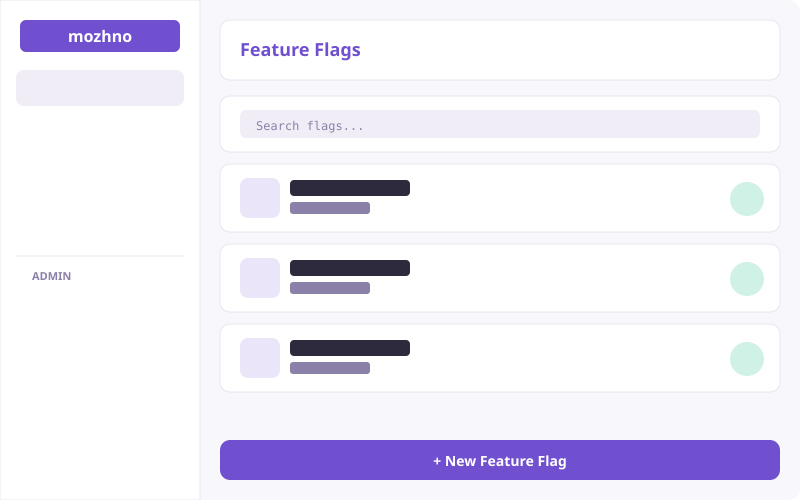
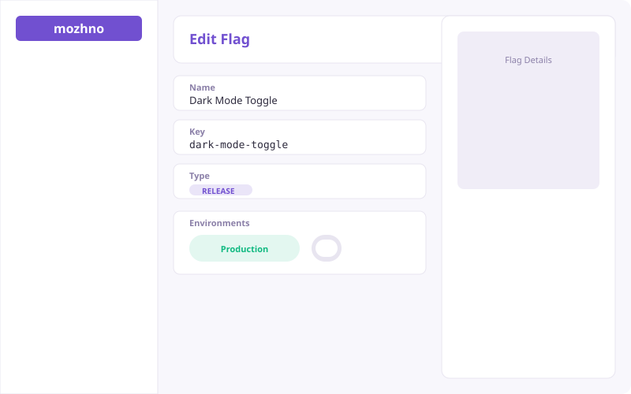
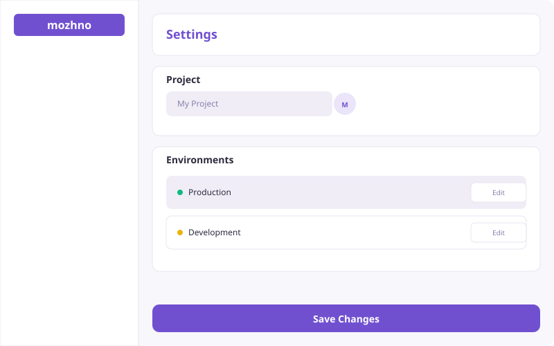

<p align="center">
  
</p>

<p align="center">Платформа управления фиче-флагами с открытым кодом.</p>

<p align="center">
  <a href="https://github.com/mozhno-dev/mozhno/actions/workflows/ci.yml"></a>
  <a href="LICENSE"></a>
  <a href="https://github.com/mozhno-dev/mozhno/pkgs/container/mozhno"></a>
  <a href="https://github.com/mozhno-dev/mozhno/stargazers"></a>
</p>

<p align="right"><a href="README.en.md">English</a></p>

---

**можно.** — сервер фиче-флагов для команд любого размера. Включай фичи на продакшене без деплоя, раскатывай изменения постепенно, сегментируй аудиторию — всё из одной панели.

---

### Возможности

| Категория | Описание |
|-----------|----------|
| **Флаги** | RELEASE и KILLSWITCH, процентный роллаут, правила на основе атрибутов |
| **Контексты** | Оценка флагов по произвольным атрибутам пользователя или запроса |
| **Сегменты** | Переиспользуемые группы пользователей с общими правилами таргетинга |
| **Стратегии** | Конфигурация на окружение: правила, сегменты, процентный роллаут |
| **API-ключи** | Ключи на каждое окружение с гранулярными правами |
| **Аудит** | Полная история изменений каждого флага и конфигурации |
| **SDK** | Нативные клиенты для Java и JavaScript — оценка флагов локально, без сетевого вызова |

---
### Дизайн-бук (Storybook)

Run: cd web && npm run storybook

Запустите Storybook на http://localhost:6006 чтобы увидеть все UI-компоненты в изолированном каталоге с документацией.

### Скриншоты

| Flags | Flag detail | Settings |
|---|---|---|
|  |  |  |

> Запустите проект локально (`make dev`) чтобы увидеть интерфейс.

---

### Быстрый старт

```yaml
# docker-compose.yml
services:
  postgres:
    image: postgres:15-alpine
    environment:
      POSTGRES_DB: feature_flags
      POSTGRES_USER: flags_user
      POSTGRES_PASSWORD: flags_password
    volumes:
      - pgdata:/var/lib/postgresql/data

  mozhno:
    image: ghcr.io/mozhno-dev/mozhno:latest
    ports:
      - '8080:8080'
    environment:
      SPRING_DATASOURCE_URL: jdbc:postgresql://postgres:5432/feature_flags
      SPRING_DATASOURCE_USERNAME: flags_user
      SPRING_DATASOURCE_PASSWORD: flags_password
      JWT_SECRET: change-me-to-a-real-256-bit-secret
    depends_on:
      - postgres

volumes:
  pgdata:
```

```bash
docker compose up -d
```

Открой [`http://localhost:8080`](http://localhost:8080) — веб-панель уже встроена в сервер.

---

### Архитектура

| Модуль | Назначение |
|--------|------------|
| `mozhno-spi` | Интерфейсы сервис-провайдеров |
| `mozhno-core` | Бизнес-логика, движок оценки флагов, хранение |
| `mozhno-web-api` | REST-контроллеры, Spring Security 6, JWT, OpenAPI |
| `mozhno-app` | Точка входа, статические ресурсы, миграции БД (Flyway) |

Сервер — Spring Boot 4.0 / JDK 25. Веб-интерфейс — React 19 SPA (Vite, Tailwind CSS 4, Radix UI). SDK загружают правила флагов один раз и принимают решение локально.

---

### SDK

**Java**
```java
var config = MozhnoConfig.builder()
    .appName("my-app")
    .instanceId("instance-1")
    .mozhnoUrl("https://flags.example.com")
    .apiKey("env-abc123")
    .build();

var client = new DefaultMozhnoClient(config);
client.start();

var ctx = MozhnoContext.builder().userId("42").build();
boolean on = client.isEnabled("new-checkout", ctx);
```

**JavaScript / TypeScript**
```typescript
import { MozhnoClient } from '@mozhno/client-js';

const client = new MozhnoClient({
  url: 'https://flags.example.com',
  apiKey: 'env-abc123',
  appName: 'my-app',
});
await client.start();

const on = client.isEnabled('new-checkout', { userId: '42' });
```

---

### Конфигурация

| Переменная | По умолчанию | Описание |
|------------|--------------|----------|
| `SPRING_DATASOURCE_URL` | `jdbc:postgresql://localhost:5432/feature_flags` | JDBC URL базы данных |
| `SPRING_DATASOURCE_USERNAME` | `flags_user` | Пользователь БД |
| `SPRING_DATASOURCE_PASSWORD` | `flags_password` | Пароль БД |
| `JWT_SECRET` | *(обязательно сменить)* | HMAC-SHA256 ключ (минимум 256 бит) |
| `APP_BASE_URL` | `http://localhost:8080` | Публичный URL сервера |
| `SERVER_PORT` | `8080` | HTTP-порт |

---

### API

Swagger UI — [`http://localhost:8080/swagger-ui.html`](http://localhost:8080/swagger-ui.html). Спецификация OpenAPI 3.1 — `/v3/api-docs`.

---

### Разработка

**Требования:** JDK 25 (сервер), JDK 17+ (SDK), Node.js 24, PostgreSQL 15+.

```bash
docker compose up -d postgres
cd server && ./gradlew :mozhno-app:bootRun
cd web && npm ci && npm run dev
```

```bash
cd server && ./gradlew check   # Тесты сервера
cd web && npm test             # Тесты веб-интерфейса
cd sdks/js && npm test         # Тесты JS SDK
cd server && ./gradlew :mozhno-client-java:check   # Тесты Java SDK
```

---

### Лицензия

[Business Source License 1.1](LICENSE) · © 2026 Edgar Gilmanov
