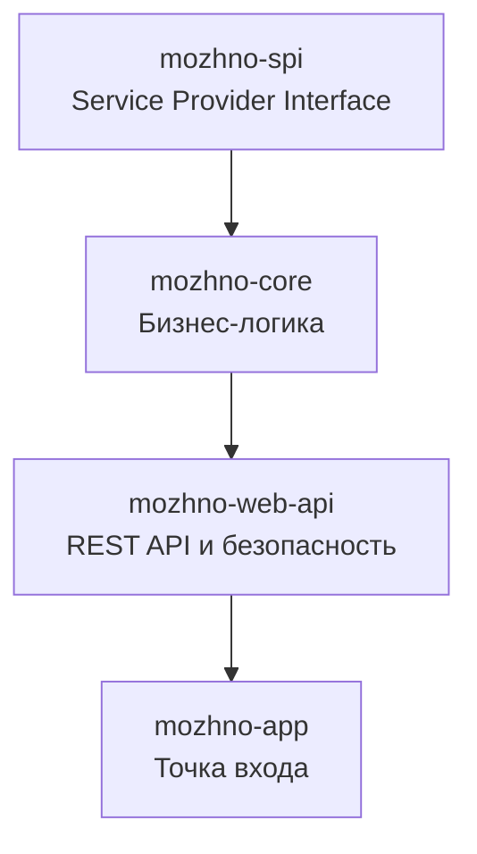
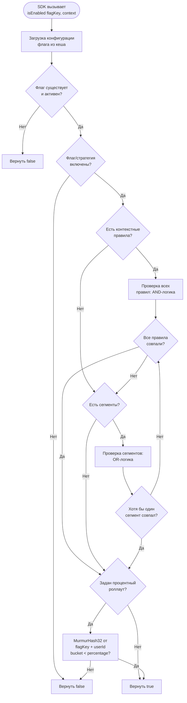
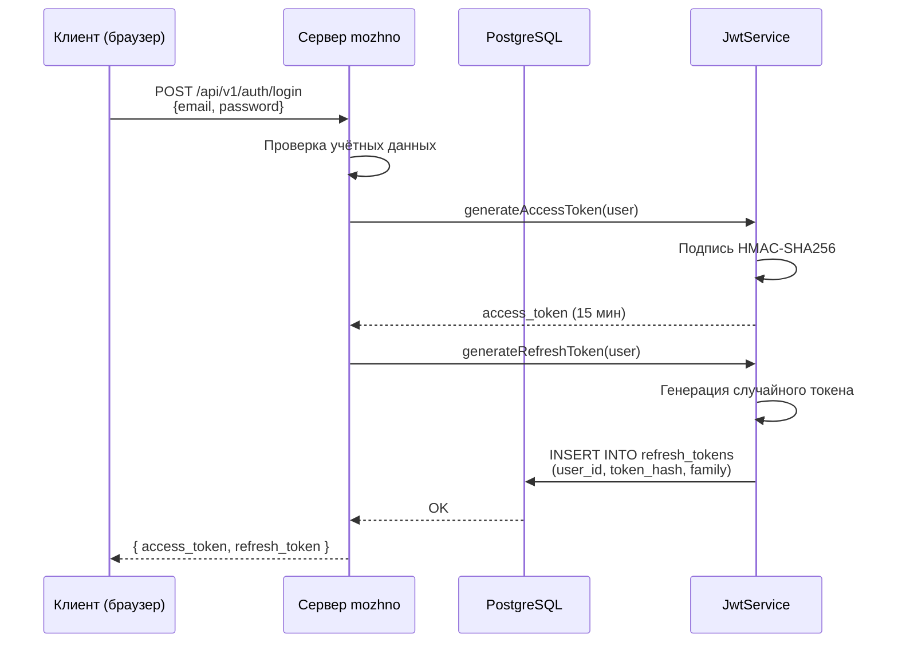
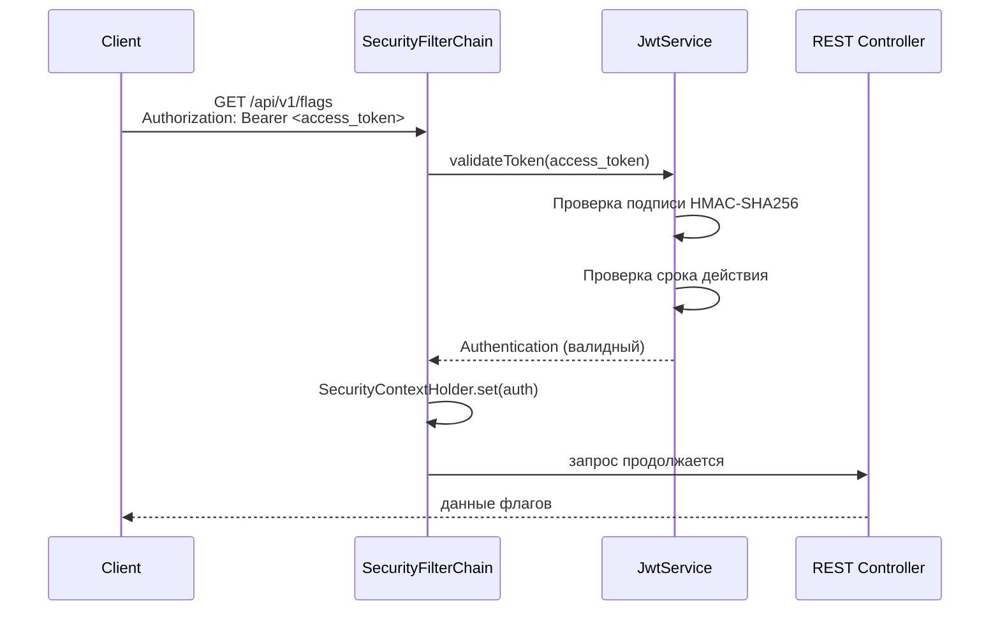
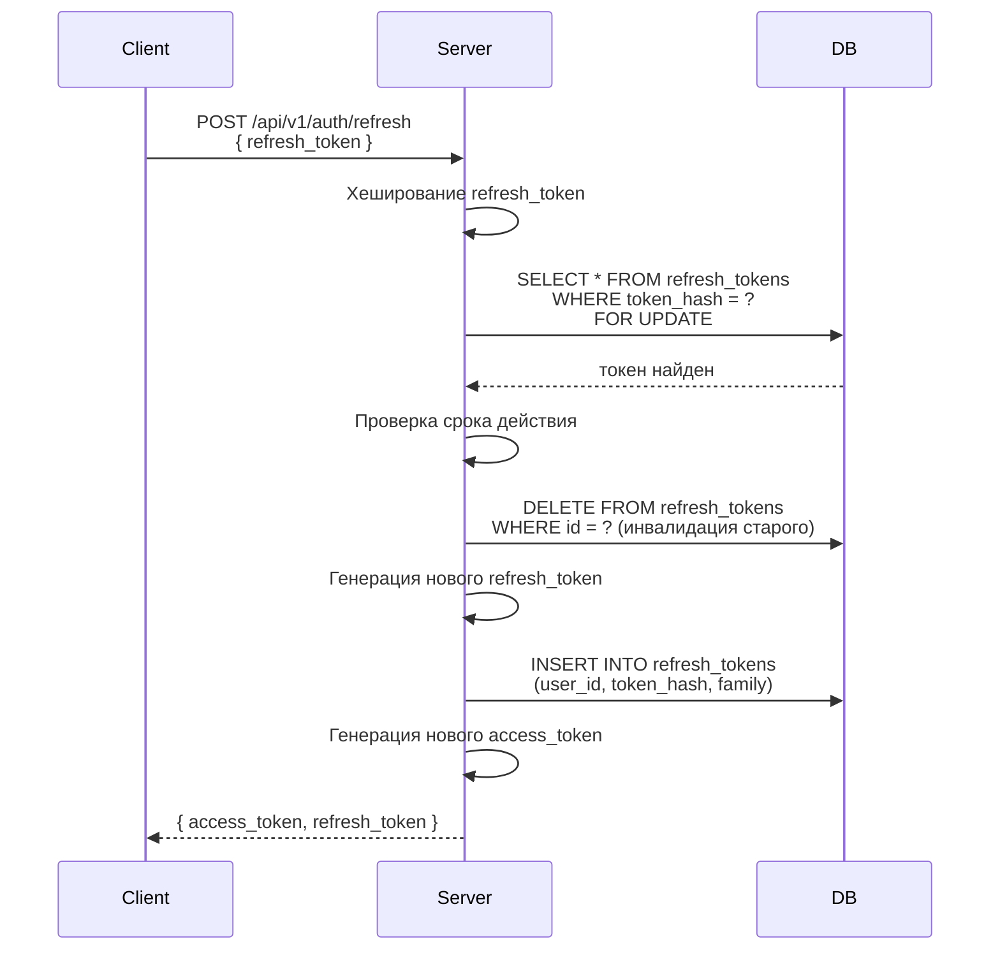
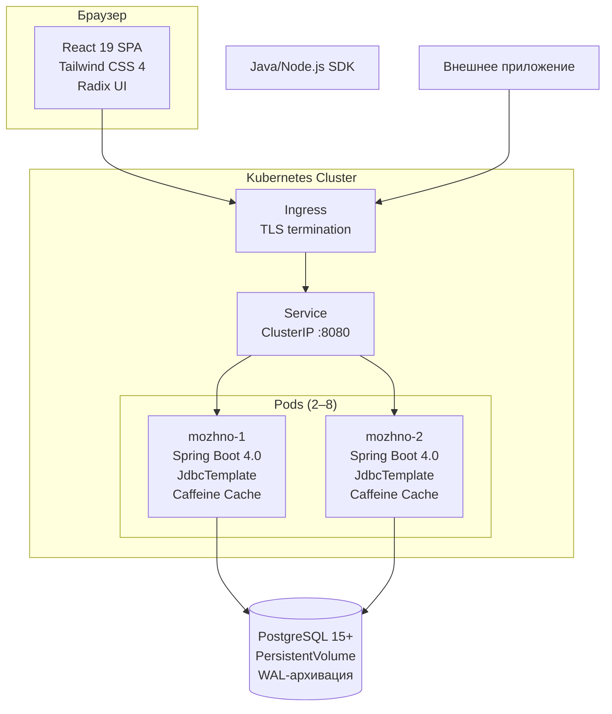

# Архитектура сервера

Модульная структура **можно.**: диаграмма модулей, технологический стек, поток оценки флагов и JWT-аутентификация.

## Модульная структура

**можно.** разделён на четыре Gradle-модуля, образующих строгий граф зависимостей:



| Модуль | Назначение | Ключевые классы |
|--------|------------|-----------------|
| `mozhno-spi` | Интерфейсы расширений (SPI) | `AuthenticationProviderSpi`, `AuthenticationFlowSpi`, `QuotaSpi`, `BillingSpi`, `FeatureGateSpi`, `AuditSpi`, `MetricsSinkSpi` |
| `mozhno-core` | Бизнес-логика, движок флагов, хранение | `FlagService`, `SegmentService`, `StrategyService`, `AuditService`, `FeatureFlagEvaluator` |
| `mozhno-web-api` | REST-контроллеры, Spring Security, JWT, OpenAPI | `FlagController`, `AuthController`, `JwtService`, `SecurityConfig` |
| `mozhno-app` | Точка входа, статические ресурсы, миграции Flyway | `Server`, `application.yml`, `db/migration/*.sql` |

### Направление зависимостей

Зависимости направлены вниз по стеку:

- `mozhno-spi` не зависит ни от одного модуля — чистые интерфейсы
- `mozhno-core` зависит только от `mozhno-spi` — реализует бизнес-логику через интерфейсы SPI
- `mozhno-web-api` зависит от `mozhno-core` — предоставляет REST API поверх бизнес-логики
- `mozhno-app` зависит от всех модулей — собирает приложение, конфигурирует Spring Boot, внедряет реализации

Это гарантирует, что бизнес-логика не зависит от HTTP-транспорта, а SPI-контракты не привязаны к конкретной реализации.

## Технологический стек

### Бэкенд

| Технология | Версия | Назначение |
|------------|--------|------------|
| **JDK** | 25 | Среда выполнения. Виртуальные потоки (Project Loom), ZGC |
| **Spring Boot** | 4.0 | DI-контейнер, авто-конфигурация, Actuator |
| **Spring Security** | 6.x | Аутентификация, авторизация, JWT-фильтры |
| **JdbcTemplate** | — | Прямые SQL-запросы без ORM. RowMapper для маппинга |
| **Flyway** | 10.x | Версионирование схемы БД, миграции |
| **HikariCP** | 6.x | Пул соединений к PostgreSQL |
| **Caffeine** | 3.x | Ин-мемори кеш (флаги, сегменты, API-ключи) |
| **ZGC** | — | Сборщик мусора с субмиллисекундными паузами |
| **jjwt** | 0.12.x | JWT: создание, подпись HMAC-SHA256, валидация |

### Фронтенд

| Технология | Версия | Назначение |
|------------|--------|------------|
| **React** | 19 | SPA-фреймворк, Server Components |
| **Tailwind CSS** | 4 | Utility-first CSS, JIT-компиляция |
| **Radix UI** | — | Headless UI-компоненты (доступность, клавиатурная навигация) |
| **Node.js** | 24 | Среда сборки фронтенда |

### Инфраструктура

| Технология | Назначение |
|------------|------------|
| **PostgreSQL** | Персистентное хранение всех данных |
| **Docker** | Контейнеризация, трёхэтапная сборка |
| **Kubernetes** | Оркестрация, авто-масштабирование, отказоустойчивость |

### Почему JdbcTemplate, а не JPA/Hibernate

| Критерий | JdbcTemplate | JPA/Hibernate |
|----------|-------------|---------------|
| Контроль SQL | Полный — запросы пишутся вручную | Ограниченный — генерация через JPQL/HQL |
| Производительность | Предсказуемая — нет магии ORM | Может деградировать из-за Lazy Loading, dirty checking |
| Потребление памяти | Низкое — нет persistence context | Выше из-за кеша первого уровня |
| Сложность маппинга | Ручные RowMapper'ы | Автоматический маппинг |
| Кривая обучения | Низкая — обычный SQL | Высокая — знание JPA-спецификации |

Выбор JdbcTemplate обусловлен тем, что система фича-флагов имеет чётко определённые SQL-запросы без сложных объектных графов. Явный SQL даёт полный контроль над планом выполнения и упрощает оптимизацию индексов.

## Встраивание фронтенда

React 19 SPA собирается отдельно (Node.js 24, Vite), результат помещается в `static/`. При сборке JAR статические файлы копируются в ресурсы `mozhno-app`:

```
mozhno-app/src/main/resources/static/
├── index.html
├── assets/
│   ├── main-abc123.js
│   └── main-abc123.css
└── favicon.ico
```

Spring Boot обслуживает статику как classpath-ресурсы. Swagger UI и OpenAPI-спецификация также раздаются из ресурсов JAR.

Docker-образ использует трёхэтапную сборку:

```dockerfile
# Этап 1: Сборка фронтенда
FROM node:24-alpine AS web-builder
WORKDIR /src/web
COPY web/package.json web/package-lock.json ./
RUN npm ci --ignore-scripts
COPY web/ ./
RUN npx vite build --outDir /static --emptyOutDir --config vite.config.js

# Этап 2: Сборка Java
FROM eclipse-temurin:25-jdk-alpine AS java-builder
WORKDIR /src
COPY server/ ./server/
COPY sdks/java/ ./sdks/java/
COPY --from=web-builder /static ./server/mozhno-app/src/main/resources/static
WORKDIR /src/server
RUN ./gradlew --no-daemon :mozhno-app:bootJar -x javadoc

# Этап 3: Runtime
FROM eclipse-temurin:25-jre-noble AS runtime
RUN apt-get update && apt-get install -y --no-install-recommends wget \
    && rm -rf /var/lib/apt/lists/* \
    && groupadd -r mozhno && useradd -r -g mozhno mozhno
COPY --from=java-builder /src/server/mozhno-app/build/libs/mozhno.jar /app/mozhno.jar
USER mozhno
EXPOSE 8080
ENTRYPOINT ["java", \
    "-XX:+UseZGC", \
    "-XX:MaxRAMPercentage=75.0", \
    "-Djava.security.egd=file:/dev/./urandom", \
    "-jar", "/app/mozhno.jar"]
```

## Поток оценки флага

Процесс принятия решения о значении флага при вызове SDK:



**Ключевой момент:** оценка флага происходит **локально в SDK** без сетевого запроса к серверу. Правила загружаются фоновым процессом и кешируются. Это даёт латентность < 1 мс.

## Поток JWT-аутентификации

### Аутентификация (логин)



### Доступ к API



### Обновление токенов (Refresh)



**Семейная ротация:** при каждом обновлении старый refresh-токен инвалидируется, а новый сохраняется в ту же «семью» (family). Если злоумышленник использует старый (уже инвалидированный) токен, вся семья аннулируется — это предотвращает replay-атаки.

`SELECT ... FOR UPDATE` гарантирует, что два конкурентных запроса на обновление (с разных экземпляров сервера) не создадут дублирующих токенов.

## SPI: архитектура расширений

Интерфейсы из `mozhno-spi` позволяют заменять компоненты системы без изменения ядра:

```
mozhno-spi/
├── AuthenticationProviderSpi.java   — аутентификация пользователей
├── AuthenticationFlowSpi.java       — дополнительные шаги аутентификации
├── QuotaSpi.java                    — квоты и лимиты
├── BillingSpi.java                  — биллинг и платёжная информация
├── FeatureGateSpi.java              — управление Enterprise-функциями
├── AuditSpi.java                    — аудит и хранение событий
├── MetricsSinkSpi.java              — экспорт метрик
├── NotificationSpi.java             — уведомления
└── WebhookSpi.java                  — доставка вебхуков
```

Подробнее — на странице [Open Core](/advanced/open-core).

## Диаграмма развёртывания



## Что дальше?

- [Open Core](/advanced/open-core) — Community vs Enterprise, SPI-интерфейсы, плагины
- [Миграция](/advanced/migration) — переход с LaunchDarkly, Unleash, Flagsmith
- [Docker](/self-hosting/docker) — продакшен-деплой
- [Kubernetes](/self-hosting/kubernetes) — оркестрация и масштабирование
