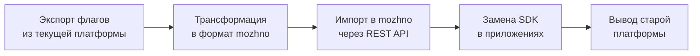
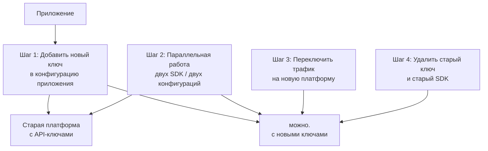

# Миграция на можно.

Руководства по переходу с LaunchDarkly, Unleash и Flagsmith на **можно**<span class=brand-dot>.</span> — экспорт/импорт флагов, миграция API-ключей, чек-лист замены SDK и типичные ошибки.

## Общий план миграции



### Этапы миграции

| Этап | Длительность | Описание |
|------|-------------|----------|
| Экспорт | ~1 час | Выгрузка флагов, сегментов, окружений |
| Трансформация | ~2 часа | Конвертация форматов, маппинг полей |
| Импорт | ~1 час | Загрузка в можно. через API |
| Замена SDK | 1–2 недели | Постепенная замена в приложениях |
| Вывод из эксплуатации | ~1 неделя | Параллельная работа, мониторинг, отключение |

## Миграция с LaunchDarkly

### Экспорт флагов

LaunchDarkly предоставляет REST API для экспорта. Получите API-токен с правами чтения:

```bash
LD_API_TOKEN="api-xxx"
LD_PROJECT="default"
LD_ENV="production"

curl -H "Authorization: $LD_API_TOKEN" \
  "https://app.launchdarkly.com/api/v2/flags/$LD_PROJECT?env=$LD_ENV" \
  | jq '.items[] | {
      key: .key,
      name: .name,
      description: .description,
      type: (if .kind == "boolean" then "boolean" else "multivariate" end),
      enabled: .environments[env.LD_ENV].on,
      variations: .variations,
      tags: .tags
    }' > ld_flags.json
```

### Маппинг концептов

| LaunchDarkly | **можно**<span class=brand-dot>.</span> | Примечание |
|-------------|-----------|------------|
| Flag | Флаг | Прямой маппинг |
| Environment | Окружение | Создайте окружения заранее |
| Flag variation | Вариант флага | Для мультивариативных флагов |
| Targeting rule | Правило стратегии | Преобразуется в стратегию Gradual |
| User segment | Сегмент | Прямой маппинг |
| Custom attribute | Атрибут контекста | Произвольный ключ-значение |
| SDK key | API-ключ | Привязан к окружению |
| User | Контекст | В можно. — обобщённый контекст |

### Трансформация

Скрипт-адаптер для преобразования дампа LaunchDarkly в формат можно.:

```python
import json, requests

MOZHNO_API = "http://localhost:8080"
MOZHNO_TOKEN = "your-admin-token"

with open("ld_flags.json") as f:
    ld_flags = json.load(f)

for flag in ld_flags:
    mozhno_flag = {
        "key": flag["key"],
        "name": flag["name"],
        "description": flag.get("description", ""),
        "flagType": "RELEASE",
        "projectId": 1
    }

    resp = requests.post(
        f"{MOZHNO_API}/api/v1/flags",
        json=mozhno_flag,
        headers={"Authorization": f"Bearer {MOZHNO_TOKEN}"}
    )
    print(f"{flag['key']}: {resp.status_code}")
```

### Особенности

1. **LaunchDarkly использует `on` в контексте окружения** — при экспорте каждый флаг содержит состояние для каждого окружения. При импорте создайте отдельные записи для каждого окружения **можно**<span class=brand-dot>.</span>

2. **Процентный роллаут** — в LaunchDarkly задаётся на уровне таргетинга. В можно. — через стратегию `Gradual` с параметром `percentage`.

3. **Prerequisites (зависимости флагов)** — LaunchDarkly позволяет флагу зависеть от других флагов. **можно**<span class=brand-dot>.</span> не поддерживает зависимости флагов напрямую. Реализуйте логику зависимостей на стороне приложения.

4. **Experiments** — A/B-тесты LaunchDarkly не имеют прямого аналога. Мультивариативные флаги в можно. Community не поддерживаются (только булевы `RELEASE`/`KILLSWITCH`); используйте кастомную стратегию (Enterprise).

## Миграция с Unleash

### Экспорт флагов

Unleash предоставляет Admin API и встроенный экспорт:

```bash
UNLEASH_URL="http://unleash.example.com"
UNLEASH_TOKEN="admin-token"

curl -H "Authorization: $UNLEASH_TOKEN" \
  "$UNLEASH_URL/api/admin/feature-toggles" \
  | jq '.features[] | {
      name: .name,
      description: .description,
      type: .type,
      enabled: .enabled,
      strategies: .strategies,
      variants: .variants,
      project: .project
    }' > unleash_flags.json
```

### Маппинг концептов

| Unleash | **можно**<span class=brand-dot>.</span> | Примечание |
|---------|-----------|------------|
| Feature toggle | Флаг | Прямой маппинг |
| Strategy | Стратегия | Unleash-стратегии маппятся на можно. стратегии |
| Activation strategy | Стратегия | Default, Gradual, Scheduled |
| Gradual rollout | Gradual-стратегия | Процентная раскатка |
| User ID strategy | Сегмент | Сегмент с правилом `userId` |
| Variant | Мультивариативное значение | Для `variant`-флагов |
| Project | Проект | Создаётся при инициализации можно. |
| API token | API-ключ | Привязан к окружению |

### Трансформация

```python
import json, requests

MOZHNO_API = "http://localhost:8080"
MOZHNO_TOKEN = "your-admin-token"

with open("unleash_flags.json") as f:
    unleash_flags = json.load(f)

for flag in unleash_flags:
    flag_type = "RELEASE"

    if flag.get("variants"):
        flag_type = "RELEASE"

    mozhno_flag = {
        "key": flag["name"],
        "name": flag.get("description", flag["name"]),
        "flagType": flag_type,
        "projectId": 1
    }

    resp = requests.post(
        f"{MOZHNO_API}/api/v1/flags",
        json=mozhno_flag,
        headers={"Authorization": f"Bearer {MOZHNO_TOKEN}"}
    )
    print(f"{flag['name']}: {resp.status_code}")
```

### Особенности

1. **Unleash-стратегии** — богатая система стратегий Unleash маппится на встроенные стратегии можно. Пользовательские стратегии Unleash реализуются через `FeatureGateSpi` (Enterprise).

2. **Unleash Context** — поля контекста Unleash (`userId`, `sessionId`, `remoteAddress`, `environment`, `properties`) маппятся на атрибуты контекста можно.

3. **Проекты** — в Unleash токены привязаны к проекту. В можно. API-ключ привязан к окружению. При миграции создайте отдельные окружения для каждого бывшего проекта.

## Миграция с Flagsmith

### Экспорт флагов

Flagsmith предоставляет REST API и экспорт в JSON:

```bash
FLAGSMITH_API="https://api.flagsmith.com/api/v1"
FLAGSMITH_TOKEN="your-admin-token"

curl -H "Authorization: Token $FLAGSMITH_TOKEN" \
  "$FLAGSMITH_API/flags/" \
  | jq '.results[] | {
      id: .id,
      feature: {name: .feature.name, id: .feature.id},
      enabled: .enabled,
      feature_state_value: .feature_state_value,
      environment: .environment,
      multivariate_options: .multivariate_options
    }' > flagsmith_flags.json
```

### Маппинг концептов

| Flagsmith | **можно**<span class=brand-dot>.</span> | Примечание |
|-----------|-----------|------------|
| Feature | Флаг | Прямой маппинг |
| Feature state | Настройки флага в окружении | Комбинация флаг + окружение |
| Segment | Сегмент | Прямой маппинг |
| Multivariate option | Вариант мультивариативного флага | Прямой маппинг |
| Environment | Окружение | Прямой маппинг |
| Identity | Контекст | Обобщённый контекст с атрибутами |
| Trait | Атрибут контекста | Произвольный ключ-значение |
| Server-side SDK key | API-ключ | Привязан к окружению |

### Трансформация

```python
import json, requests

MOZHNO_API = "http://localhost:8080"
MOZHNO_TOKEN = "your-admin-token"

with open("flagsmith_flags.json") as f:
    flagsmith_flags = json.load(f)

for flag_state in flagsmith_flags:
    feature = flag_state["feature"]

    mozhno_flag = {
        "key": feature["name"],
        "name": feature["name"],
        "flagType": "RELEASE",
        "projectId": 1
    }

    resp = requests.post(
        f"{MOZHNO_API}/api/v1/flags",
        json=mozhno_flag,
        headers={"Authorization": f"Bearer {MOZHNO_TOKEN}"}
    )
    print(f"{feature['name']}: {resp.status_code}")
```

### Особенности

1. **Flagsmith Identity + Traits** — в Flagsmith сегменты строятся на traits пользователя. В можно. — атрибуты контекста. Traits маппятся на атрибуты контекста один к одному.

2. **Feature state value** — в Flagsmith каждый флаг имеет значение в контексте окружения. При импорте в можно. значения переносятся в стратегии соответствующих окружений.

3. **Overrides (переопределения)** — Flagsmith позволяет переопределять флаг для конкретных identities. В можно. — используйте сегменты с правилами на атрибутах.

## Миграция API-ключей

### Создание API-ключей в можно.

```bash
MOZHNO_API="http://localhost:8080"
ADMIN_TOKEN="your-admin-token"

curl -X POST "$MOZHNO_API/api/v1/api-keys" \
  -H "Authorization: Bearer $ADMIN_TOKEN" \
  -H "Content-Type: application/json" \
  -d '{
    "name": "production-sdk",
    "keyType": "SERVER",
    "environmentId": 3,
    "projectId": 1
  }'
```

### Ротация без простоя



## Чек-лист замены SDK

Используйте этот список при замене SDK в каждом приложении:

### Подготовка

- [ ] **можно**<span class=brand-dot>.</span> сервер развёрнут и доступен (проверьте `/actuator/health`)
- [ ] Созданы окружения и API-ключи
- [ ] Флаги импортированы и проверены вручную
- [ ] Команда ознакомлена с концептами можно. (флаги, сегменты, стратегии)

### Код

- [ ] Удалена зависимость старого SDK (LaunchDarkly/Unleash/Flagsmith)
- [ ] Добавлена зависимость можно. SDK (`dev.mozhno:mozhno-client-java:1.0.1`)
- [ ] Заменена инициализация SDK
- [ ] Заменён вызов `isEnabled()` / `isFeatureEnabled()` на `mozhnoClient.isEnabled()`
- [ ] Заменён контекст пользователя на `MozhnoContext`
- [ ] Проверены значения по умолчанию (fallback) — должны совпадать со старыми
- [ ] Обновлены юнит-тесты
- [ ] Обновлены интеграционные тесты

### Пример замены: Java SDK

**Было (LaunchDarkly):**

```java
LDClient client = new LDClient("sdk-key-xxx");
LDUser user = new LDUser.Builder("user-123")
    .country("RU")
    .build();

boolean enabled = client.boolVariation("new-checkout", user, false);
```

**Стало (можно.):**

```java
MozhnoConfig config = MozhnoConfig.builder()
    .appName("my-app")
    .instanceId("instance-1")
    .mozhnoUrl("http://localhost:8080")
    .apiKey("mozhno-api-key")
    .build();

MozhnoClient client = new DefaultMozhnoClient(config);
client.start();

MozhnoContext ctx = MozhnoContext.builder()
    .userId("user-123")
    .addProperty("country", "RU")
    .build();

boolean enabled = client.isEnabled("new-checkout", ctx, false);
```

### Пример замены: JavaScript/Node.js SDK

**Было (LaunchDarkly):**

```javascript
const ldClient = LaunchDarkly.init('sdk-key-xxx');
await ldClient.waitForInitialization();

const user = { key: 'user-123', country: 'RU' };
const enabled = await ldClient.variation('new-checkout', user, false);
```

**Стало (можно.):**

```javascript
import { MozhnoClient } from '@mozhno/client-js';

const client = new MozhnoClient({
  url: 'http://localhost:8080',
  apiKey: 'mozhno-api-key',
  appName: 'my-app',
});
await client.start();

const ctx = { userId: 'user-123', country: 'RU' };
const enabled = client.isEnabled('new-checkout', ctx);
```

### Валидация

- [ ] Тестовое окружение: переключите флаг в панели можно. и проверьте, что приложение реагирует в течение TTL кеша
- [ ] Staging-окружение: прогоните полный набор интеграционных тестов
- [ ] Production: включите параллельный режим (старый + новый SDK), сравните результаты
- [ ] Мониторинг: убедитесь в отсутствии ошибок и регресса latency

## Типичные ошибки

### 1. Разные ключи флагов

**Проблема:** в старой платформе ключ флага — `new.checkout`, в можно. — `new-checkout`.

**Решение:** приведите ключи к единому формату на этапе трансформации. **можно**<span class=brand-dot>.</span> принимает любые строки, но рекомендуется использовать kebab-case.

### 2. Регистрозависимость имён

**Проблема:** LaunchDarkly различает `NewCheckout` и `newCheckout`. можно. сравнивает ключи флагов и атрибуты контекста с учётом регистра.

**Решение:** проверьте регистр всех ключей при миграции. Нормализуйте ключи флагов и атрибуты к нижнему регистру.

### 3. Разные значения по умолчанию

**Проблема:** старое приложение использует значение `true` по умолчанию, а можно. SDK настроен на `false`.

**Решение:** явно укажите `defaultValue` при каждом вызове SDK, не полагаясь на глобальные настройки:

```java
boolean enabled = client.isEnabled("new-checkout", ctx, /* fallback */ true);
```

### 4. Долгое время распространения изменений

**Проблема:** переключили флаг в панели, а приложение не видит изменений.

**Причина:** локальный кеш Caffeine имеет TTL 60 секунд. Изменение распространяется в течение TTL.

**Решение:** дождитесь TTL или уменьшите его для критичных флагов. Для мгновенной инвалидации используйте Enterprise-функцию Redis Pub/Sub.

### 5. Отсутствие атрибута в контексте

**Проблема:** стратегия ссылается на атрибут `country`, а контекст его не содержит.

**Решение:** убедитесь, что все атрибуты, используемые в стратегиях и правилах сегментов, передаются в `EvaluationContext` из приложения. Добавьте валидацию контекста в CI/CD.

### 6. Неправильный маппинг окружений

**Проблема:** API-ключ привязан к production, а в приложении используется dev-конфигурация.

**Решение:** создайте по одному API-ключу на каждое окружение и используйте разные ключи в разных средах (dev, staging, production).

### 7. Конкурентная инициализация SDK

**Проблема:** приложение делает вызовы `isEnabled()` до завершения инициализации SDK.

**Решение:** включите синхронную первичную загрузку через `synchronousFetchOnInitialisation(true)` — тогда `start()` блокируется до загрузки правил:

```java
MozhnoConfig config = MozhnoConfig.builder()
    .appName("my-app")
    .instanceId("instance-1")
    .mozhnoUrl("http://localhost:8080")
    .apiKey("mozhno-api-key")
    .synchronousFetchOnInitialisation(true)
    .build();

MozhnoClient client = new DefaultMozhnoClient(config);
client.start(); // блокируется до загрузки правил
```

## Сравнение форматов

| Характеристика | LaunchDarkly | Unleash | Flagsmith | **можно**<span class=brand-dot>.</span> |
|---------------|-------------|---------|-----------|-----------|
| Формат экспорта | JSON (REST API) | JSON (REST API) | JSON (REST API) | JSON (REST API) |
| Массовый импорт | REST API | REST API | REST API | REST API `/api/v1/flags` |
| Миграция сегментов | Ручной экспорт | Ручной экспорт | Ручной экспорт | Ручной импорт |
| Сохранение истории | Только аудит | Только аудит | Только аудит | Не мигрируется |
| Перенос API-ключей | Невозможно | Невозможно | Невозможно | Создать новые |

## Что дальше?

- [Open Core](/advanced/open-core) — Community vs Enterprise
- [Архитектура](/advanced/architecture) — модульная структура сервера
- [Флаги](/concepts/flags) — типы флагов и жизненный цикл
- [SDK](/sdk/java) — руководство по SDK
