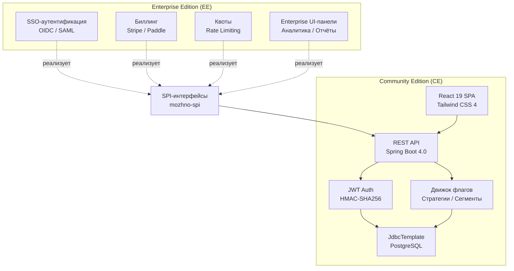
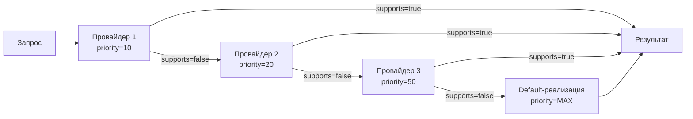
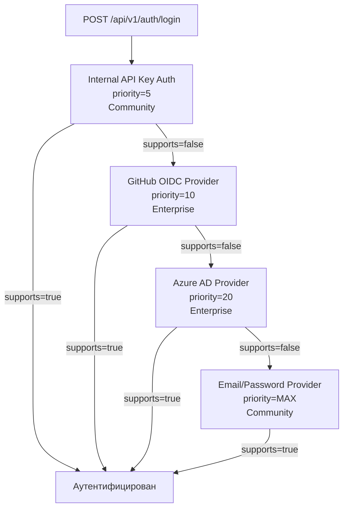

# Open Core модель

Как устроена модель Open Core в **можно**<span class=brand-dot>.</span>: Community Edition, Enterprise-расширения через SPI, цепочка приоритетов, деплой Enterprise JAR и плагинная система.

## Модель Open Core

**можно**<span class=brand-dot>.</span> распространяется по модели Open Core:

- **Community Edition (CE)** — AGPL v3. Полнофункциональная система фича-флагов: RELEASE и KILLSWITCH флаги, контекстные правила и сегменты, процентный роллаут, аудит, API-ключи, JWT-аутентификация, REST API, React-панель.
- **Enterprise Edition (EE)** — коммерческая лицензия. Дополнительные модули, подключаемые через SPI: SSO/OIDC, расширенные стратегии, биллинг, квоты, кастомные UI-панели, приоритетная поддержка.



Community Edition полностью функциональна и не требует Enterprise-компонентов. Все SPI-интерфейсы имеют реализации по умолчанию в ядре **можно**<span class=brand-dot>.</span>, обеспечивающие базовое поведение.

## SPI-интерфейсы

Интерфейсы определены в модуле `mozhno-spi` и являются единственным механизмом расширения системы:

### AuthenticationProviderSpi

Аутентификация пользователей. Community-реализация — проверка email/пароля через BCrypt. Enterprise — интеграция с внешними IdP.

```java
public interface AuthenticationProviderSpi extends Prioritized {

    boolean supports(AuthenticationRequest request);

    AuthenticationResult authenticate(AuthenticationRequest request);

    String getProviderName();

    default int getPriority() { return 100; }
}
```

| Метод | Назначение |
|-------|------------|
| `supports()` | Проверяет, может ли провайдер обработать запрос (например, по домену email) |
| `authenticate()` | Выполняет аутентификацию и возвращает результат |
| `getProviderName()` | Имя провайдера для UI и аудит-лога |
| `getPriority()` | Приоритет в цепочке (чем меньше число, тем выше приоритет) |

### AuthenticationFlowSpi

Дополнительные шаги аутентификации: MFA, капча, подтверждение email.

```java
public interface AuthenticationFlowSpi extends Prioritized {

    boolean isApplicable(AuthenticationContext context);

    FlowStepResult execute(AuthenticationContext context);

    default int getPriority() { return 100; }
}
```

### QuotaSpi

Квоты и ограничения: количество флагов, сегментов, API-ключей, запросов в минуту. Community-реализация — без ограничений.

```java
public interface QuotaSpi {

    boolean isAllowed(QuotaType type, String projectId);

    long getLimit(QuotaType type, String projectId);

    long getUsage(QuotaType type, String projectId);
}
```

| QuotaType | Описание |
|-----------|----------|
| `FLAGS_PER_ENVIRONMENT` | Максимальное число флагов в окружении |
| `SEGMENTS_PER_PROJECT` | Максимальное число сегментов в проекте |
| `API_KEYS_PER_ENVIRONMENT` | Максимальное число API-ключей |
| `EVALUATIONS_PER_MINUTE` | Максимальная частота запросов оценки флагов |

### BillingSpi

Интеграция с платёжными системами: планы, счета, история платежей. Community-реализация — заглушка (no-op).

```java
public interface BillingSpi {

    Plan getCurrentPlan(String projectId);

    List<Invoice> getInvoices(String projectId);

    boolean isFeatureAvailable(String featureKey, String projectId);
}
```

### FeatureGateSpi

| Enterprise-функция | Feature Key | Описание |
|--------------------|-------------|----------|
| SSO / OIDC | `auth.sso` | Вход через Google, GitHub, Azure AD |
| SAML | `auth.saml` | Корпоративная федеративная аутентификация |
| Расширенные стратегии | `strategy.advanced` | ML-based targeting, advanced rollout patterns |
| Аналитика | `analytics.dashboard` | Панель аналитики использования флагов |
| Аудит-экспорт | `audit.export` | Экспорт аудит-лога в CSV/JSON |
| Распределённый кеш | `cache.distributed` | Redis: `spring.cache.type=redis` + `spring-boot-starter-data-redis` |
| HA-режим | `ha.mode` | Поддержка высокой доступности с несколькими подами |

## Приоритетная цепочка (Priority Chain)

SPI-провайдеры образуют цепочку, упорядоченную по приоритету. Система опрашивает провайдеров в порядке возрастания `getPriority()`, пока один из них не обработает запрос. Если ни один провайдер не отвечает, используется реализация по умолчанию.



### Пример: цепочка аутентификации



## Деплой Enterprise JAR

Enterprise-модули поставляются в виде дополнительного JAR-файла (`mozhno-enterprise.jar`), который подключается к Community-изданию:

### Docker

```yaml
mozhno:
  image: ghcr.io/mozhno-dev/mozhno:latest
  volumes:
    - ./mozhno-enterprise.jar:/opt/mozhno/lib/mozhno-enterprise.jar
  environment:
    MOZHNO_ENTERPRISE_LICENSE_KEY: eyJ...
```

Spring Boot обнаруживает Enterprise-классы через component scan. SPI-провайдеры регистрируются через `@AutoConfiguration` в `META-INF/spring/org.springframework.boot.autoconfigure.AutoConfiguration.imports`.

### Kubernetes

```yaml
volumes:
  - name: enterprise-jar
    persistentVolumeClaim:
      claimName: mozhno-enterprise
volumeMounts:
  - name: enterprise-jar
    mountPath: /opt/mozhno/lib
    readOnly: true
```

### Переменные окружения для Enterprise

| Переменная | Описание |
|------------|----------|
| `MOZHNO_ENTERPRISE_ENABLED` | Включение Enterprise-режима (`true`/`false`) |
| `MOZHNO_ENTERPRISE_LICENSE_KEY` | Лицензионный ключ |
| `MOZHNO_ENTERPRISE_LIB_PATH` | Путь к директории с Enterprise JAR |

## Плагинная система (Plugin Slots)

Пользовательский интерфейс **можно**<span class=brand-dot>.</span> поддерживает расширение через слоты — именованные точки в React-дереве, в которые Enterprise-плагины могут вставить свои компоненты.

### Доступные слоты

| Слот | Расположение | Назначение |
|------|-------------|------------|
| `sidebar.admin` | Боковая панель, раздел «Администрирование» | Ссылки на Enterprise-панели |
| `sidebar.navigation` | Основная навигация | Дополнительные пункты меню |
| `settings.premium` | Страница настроек, секция «Premium» | Enterprise-настройки |
| `dashboard.widgets` | Главная панель | Виджеты аналитики |
| `flag.edit.bottom` | Нижняя часть страницы редактирования флага | Расширенные настройки флага |

### PluginSlot (Java)

```java
public interface PluginSlot {

    String getId();

    String getSlotLocation();

    String getComponentName();

    Map<String, Object> getProps();

    boolean isEnabled();

    default int getOrder() { return 0; }
}
```

### PremiumPlugin (Java)

```java
public interface PremiumPlugin extends PluginSlot {

    String getLicenseKey();

    boolean isLicenseValid();

    List<PluginSlot> getSlots();
}
```

Enterprise-реализация возвращает список слотов. Community-реализация возвращает пустой список.

### Регистрация плагинов

Плагины регистрируются через Java ServiceLoader и Spring `@AutoConfiguration`:

```java
@AutoConfiguration
public class EnterpriseAutoConfiguration {

    @Bean
    @ConditionalOnProperty("mozhno.enterprise.enabled")
    public PremiumPlugin analyticsPlugin() {
        return new AnalyticsPlugin();
    }

    @Bean
    @ConditionalOnProperty("mozhno.enterprise.enabled")
    public PremiumPlugin billingPlugin() {
        return new BillingPlugin();
    }
}
```

Файл `META-INF/spring/org.springframework.boot.autoconfigure.AutoConfiguration.imports` в Enterprise JAR объявляет авто-конфигурации.

React-фронтенд загружает список доступных слотов через API:

```
GET /api/admin/plugins/slots
```

и рендерит их в соответствующих местах UI:


## Community vs Enterprise: сводная таблица

| Функция | Community (AGPL v3) | Enterprise |
|---------|----------------------|------------|
| RELEASE флаги | Да | Да |
| KILLSWITCH флаги | Да | Да |
| Контекстные правила и сегменты | Да | Да |
| Процентный роллаут | Да | Да |
| Сегменты и правила таргетинга | Да | Да |
| Аудит-лог | Да | Да |
| API-ключи и гранулярные права | Да | Да |
| JWT-аутентификация | Да | Да |
| REST API | Да | Да |
| React 19 SPA панель | Да | Да |
| Flyway-миграции | Да | Да |
| SSO / OIDC | Нет | Да |
| SAML | Нет | Да |
| Расширенные стратегии (ML-based) | Нет | Да |
| Аналитика | Нет | Да |
| Биллинг (Stripe/Paddle) | Нет | Да |
| Квоты и ограничения | Нет | Да |
| Экспорт аудит-лога | Нет | Да |
| Распределённый кеш (Redis) | Нет | Да |
| Enterprise UI-панели | Нет | Да |
| Приоритетная поддержка | Нет | Да |
| Лицензия | AGPL v3 | Коммерческая |

## Что дальше?

- [Архитектура](/advanced/architecture) — модульная структура сервера
- [Миграция](/advanced/migration) — переход с LaunchDarkly, Unleash, Flagsmith
- [Docker](/self-hosting/docker) — деплой Community и Enterprise
- [Kubernetes](/self-hosting/kubernetes) — оркестрация в кластере