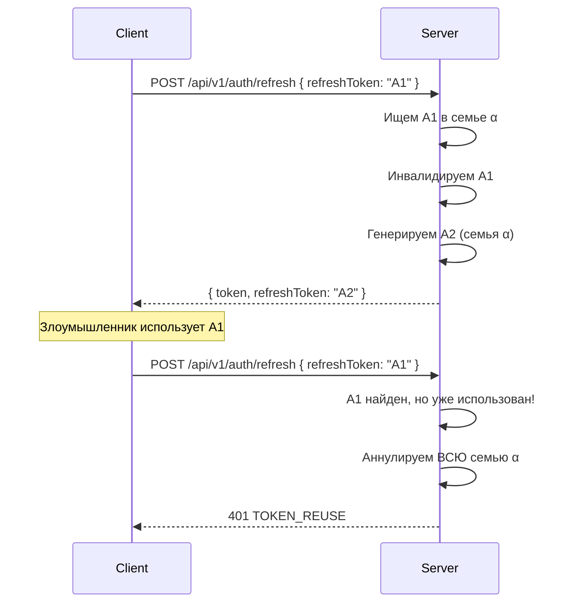

# Безопасность

**можно**<span class=brand-dot>.</span> использует несколько уровней защиты: JWT-аутентификацию для веб-панели, API-ключи для SDK, rate limiting для предотвращения атак, и security-заголовки для защиты браузера.

## Аутентификация

### JWT (веб-панель и REST API)

Алгоритм: **HMAC-SHA256**. Структура токена:

```json
{
  "sub": "1",
  "email": "admin@example.com",
  "role": "ADMIN",
  "iss": "mozhno",
  "iat": 1719000000,
  "exp": 1719000900
}
```

| Параметр | По умолчанию | Описание |
|----------|-------------|----------|
| Access token TTL | 15 минут | `JWT_ACCESS_TOKEN_TTL_MINUTES` |
| Refresh token TTL | 30 дней | `JWT_REFRESH_TOKEN_TTL_DAYS` |
| Секрет | Обязателен в проде | `JWT_SECRET`, минимум 256 бит |
| Издатель | `mozhno` | `JWT_ISSUER` |

### Refresh Token Rotation (семейная ротация)

При обновлении access-токена:

1. Старый refresh-токен инвалидируется
2. Генерируется новый refresh-токен в ту же «семью» (family)
3. Если украденный токен используется повторно — **вся семья аннулируется**



Это означает: если refresh-токен скомпрометирован, злоумышленник получит максимум одну сессию, после чего легитимный пользователь будет вынужден перелогиниться.

### API-ключи (SDK)

Ключ передаётся как Bearer-токен: `Authorization: Bearer <api-key>`. Тип ключа определяет доступные операции:

| Тип | Доступ |
|-----|--------|
| `SERVER` | `GET /api/client/features`, `POST /api/client/metrics` |
| `FRONTEND` | `POST /api/client/evaluate`, `POST /api/client/metrics` |

Подробнее — [API-ключи](/concepts/api-keys).

### BCrypt

Пароли хешируются BCrypt со сложностью **12** раундов. Это означает ~0.3 секунды на проверку пароля — достаточно медленно для защиты от перебора, достаточно быстро для комфортного логина.

## Rate Limiting

Используется алгоритм **Token Bucket** (Bucket4j). Лимиты применяются к IP-адресу клиента:

| Эндпоинт | Ёмкость | Пополнение | Интервал |
|----------|---------|------------|----------|
| `POST /api/v1/auth/login` | 5 | +5 | 1 мин |
| `POST /api/v1/auth/forgot-password`, `/reset-password`, `/accept-invite` | 3 | +3 | 60 мин |
| `POST /api/v1/auth/refresh` | 10 | +10 | 1 мин |
| `POST /api/client/*` (SDK) | 1000 | +1000 | 1 мин |
| `POST/PUT/DELETE /api/v1/*` (admin write) | 100 | +100 | 1 мин |

При превышении возвращается `429 RATE_LIMIT_EXCEEDED`.

Все лимиты настраиваются через переменные окружения — см. [Конфигурацию](/guide/configuration#rate-limiting).

## Защита браузера

### CORS

Настраивается через `APP_CORS_ALLOWED_ORIGINS`. Для продакшена укажите конкретный домен:

```
APP_CORS_ALLOWED_ORIGINS=https://app.example.com
```

### Security-заголовки

| Заголовок | Значение |
|-----------|----------|
| `Strict-Transport-Security` | `max-age=31536000` (1 год) |
| `Content-Security-Policy` | Настроен для защиты от XSS |

## Рекомендации для продакшена

| Рекомендация | Как сделать |
|-------------|-------------|
| **Сложный JWT_SECRET** | `openssl rand -base64 32` |
| **HTTPS-only** | Используйте обратный прокси (Nginx, Traefik, Caddy) с TLS |
| **Ограниченный CORS** | Укажите конкретный домен, не `*` |
| **Secrets manager** | Не храните пароли и ключи в `docker-compose.yml` |
| **Ротация ключей** | API-ключи — раз в квартал; JWT_SECRET — при смене команды |
| **Не запускайте от root** | Docker: `user: '1000:1000'`, read-only FS |
| **Логирование без секретов** | `SensitiveDataMasker` маскирует JWT, ключи, пароли в логах |

## Что дальше?

- [API-ключи](/concepts/api-keys) — управление ключами доступа
- [Пользователи и роли](/concepts/users) — ролевая модель
- [Конфигурация](/guide/configuration) — все переменные окружения
- [Docker](/self-hosting/docker) — безопасный деплой
