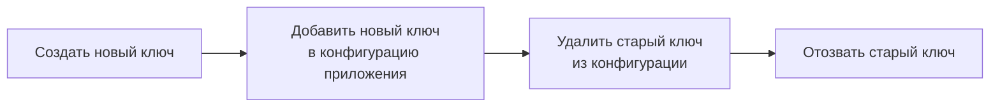

# API-ключи

API-ключ — это способ авторизации SDK при подключении к серверу **можно.**. Ключ привязан к конкретному окружению и проекту, определяет, к каким флагам имеет доступ клиент и какие операции разрешены.

## Типы ключей

**можно.** поддерживает два типа API-ключей:

| Тип | Права | Эндпоинты | Для чего |
|-----|-------|-----------|----------|
| **SERVER** | Чтение правил флагов + запись метрик | `GET /api/client/features`, `POST /api/client/metrics` | Серверные SDK (Java, Node.js backend) |
| **FRONTEND** | Оценка флагов + отправка метрик | `POST /api/client/evaluate`, `POST /api/client/metrics` | Браузерные и мобильные SDK |

### Когда использовать SERVER

- Бэкенд-сервисы (Spring Boot, Express, Ktor)
- CI/CD пайплайны
- Сервисы, где API-ключ не раскрывается клиенту

### Когда использовать FRONTEND

- Браузерные SPA
- Мобильные приложения
- Клиенты, где ключ может быть извлечён из кода

## Формат ключа

API-ключ — это 64-символьная Base64url-строка без префикса:

```
dGhpcyBpcyBhIDY0LWNoYXJhY3RlciBiYXNlNjR1cmwgZW5jb2RlZCBrZXk
```

Значение ключа показывается **только один раз** при создании. Сохраните его немедленно — восстановить значение невозможно.

## Создание ключа

### В веб-панели

1. Перейдите в раздел **API-ключи**
2. Нажмите **«Создать ключ»**
3. Укажите имя (например, `backend-prod`, `mobile-staging`)
4. Выберите тип: `SERVER` или `FRONTEND`
5. Выберите окружение
6. Скопируйте ключ и сохраните в безопасное место

### Через REST API

```bash
curl -X POST "http://localhost:8080/api/v1/api-keys" \
  -H "Authorization: Bearer $JWT_TOKEN" \
  -H "Content-Type: application/json" \
  -d '{
    "name": "Production SDK Key",
    "keyType": "SERVER",
    "environmentId": 3,
    "projectId": 1
  }'
```

## Передача ключа в SDK

### Java

```java
MozhnoConfig config = MozhnoConfig.builder()
    .mozhnoUrl("http://localhost:8080")
    .apiKey("your-api-key-here")
    .appName("my-app")
    .instanceId("instance-1")
    .environment("production")
    .build();
var client = new DefaultMozhnoClient(config);
```

### JavaScript / TypeScript

```typescript
const client = new MozhnoClient({
  url: 'http://localhost:8080',
  apiKey: 'your-api-key-here',  // SERVER
  // или clientKey для FRONTEND
  appName: 'my-app',
});
```

## Ротация ключей

Ротация — это замена ключа без простоя приложения. Процесс:



1. **Создайте новый ключ** в веб-панели
2. **Добавьте новый ключ** в переменные окружения или secrets manager приложения
3. **Перезапустите приложение** или обновите конфигурацию на лету
4. **Удалите старый ключ** через веб-панель

> **Рекомендация:** ротируйте ключи не реже раза в квартал.

## Отзыв ключа

Удаление ключа через веб-панель или API (`DELETE /api/v1/api-keys/{id}`) немедленно прекращает доступ для всех клиентов, использующих этот ключ. Сервер вернёт `401` на все последующие запросы.

## Безопасность

| Правило | Почему |
|---------|--------|
| **Не коммитьте ключи в репозиторий** | Ключ в Git = ключ у всех, кто имеет доступ к репозиторию |
| **Используйте secrets manager** | Environment variables, HashiCorp Vault, AWS Secrets Manager |
| **Разные ключи для разных окружений** | Ключ от dev не должен давать доступ к production |
| **Минимальные права** | Для SDK-клиентов — SERVER или FRONTEND, не административный JWT |
| **Ротируйте регулярно** | Не реже раза в квартал |

### Как не надо

```java
// ❌ Ключ прямо в коде
var config = MozhnoConfig.builder()
    .apiKey("dGhpcyBpcyBhIDY0LWNo...")  // виден всем в репозитории
    .build();
```

### Как надо

```java
// ✅ Ключ из переменной окружения
var config = MozhnoConfig.builder()
    .apiKey(System.getenv("MOZHNO_API_KEY"))
    .build();
```

## Что дальше?

- [Окружения](/concepts/environments) — как ключи связаны с окружениями
- [REST API](/api/rest) — полный список endpoints для управления ключами
- [Безопасность](/advanced/security) — JWT, rate limiting, CORS
