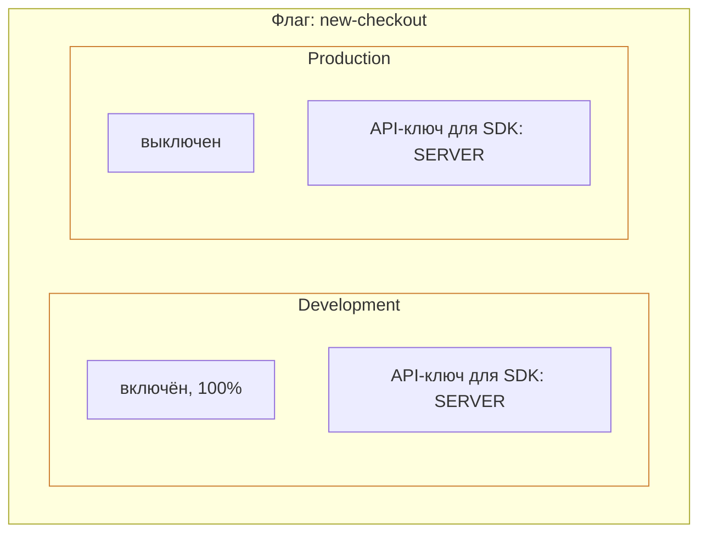

# Окружения

Окружение — изолированное пространство для флагов. Изменение правил активации на одном окружении не затрагивает другие, а API-ключи привязаны к конкретному окружению.

## Окружения по умолчанию

При создании проекта **можно**. автоматически создаёт два окружения:

| Окружение | Ключ | Назначение |
|-----------|------|------------|
| **Development** | `Development` | Локальная разработка и эксперименты |
| **Production** | `Production` | Боевое окружение, реальные пользователи |

Вы можете добавлять, переименовывать и удалять окружения. В Community-версии лимит — **3 окружения** на проект.

## Изоляция окружений

Один и тот же флаг может иметь разные правила в разных окружениях.

Изменение правил в Development не влияет на Production.

## API-ключи и окружения

API-ключ привязывается к конкретному окружению при создании. SDK, использующий ключ от Development, не получит правила флагов из Production. Подробнее — [API-ключи](/concepts/api-keys).

## Конфигурация флагов по окружениям

Каждый флаг имеет **независимую конфигурацию** в каждом окружении:

| Параметр | Описание |
|----------|----------|
| Состояние | Включён / выключен |
| Контекстные условия | Атрибуты пользователя (AND-логика) |
| Сегменты | Подключённые сегменты (OR-логика) |
| Процент роллаута | Текущий процент |

## Что дальше?

- [API-ключи](/concepts/api-keys) — управление доступом SDK
- [Правила активации](/concepts/strategies) — как настраивать таргетинг
- [Флаги](/concepts/flags) — типы флагов и жизненный цикл
- [Метрики](/guide/metrics) — статистика активации флагов по окружениям