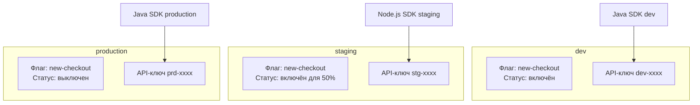
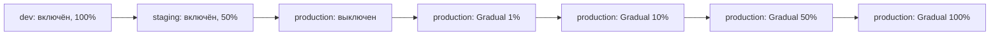

# Окружения

Окружения — это логически изолированные контексты для управления флагами. Каждое окружение имеет собственные настройки флагов, собственные API-ключи и независимый жизненный цикл изменений.

## Стандартные окружения

**можно.** поставляется с тремя предопределёнными окружениями:

| Окружение | Ключ | Назначение |
|-----------|------|------------|
| **Development** | `dev` | Локальная разработка и эксперименты |
| **Staging** | `staging` | Предпродакшен-тестирование, интеграция |
| **Production** | `production` | Боевое окружение, реальные пользователи |

## Изоляция окружений



Один и тот же флаг `new-checkout` может иметь разные настройки в разных окружениях:

- **dev** — включён для всех разработчиков
- **staging** — включён для 50% пользователей (тестирование под нагрузкой)
- **production** — выключен (ещё не готов к релизу)

## API-ключи

API-ключ — это способ авторизации SDK при подключении к серверу. Ключи **привязаны к окружению**: ключ от `dev` не даст доступа к флагам `production`.

### Создание API-ключа

1. Перейдите в веб-панели в раздел **«API-ключи»**
2. Нажмите **«Создать ключ»**
3. Укажите имя (например, `backend-service`, `mobile-app`) и выберите тип (`SERVER` или `FRONTEND`)
4. Выберите окружение, к которому привязан ключ
5. Скопируйте сгенерированный ключ и сохраните в безопасном месте

### Права доступа

| Тип ключа | Описание |
|-----------|----------|
| **SERVER** | Полный доступ: чтение правил флагов и запись метрик (`/api/client/features`, `/api/client/metrics`). Для серверных SDK. |
| **FRONTEND** | Клиентский доступ: оценка флагов и отправка метрик (`/api/client/evaluate`, `/api/client/metrics`). Для браузерных/мобильных SDK. |

API-ключи для серверных SDK обычно используют тип **SERVER**.

### Передача ключа в SDK

```java
var config = MozhnoConfig.builder()
    .mozhnoUrl("http://localhost:8080")
    .apiKey("dGhpcyBpcyBhbiBhcGkga2V5...")  // ключ от production
    .appName("my-app")
    .instanceId("instance-1")
    .build();
var client = new DefaultMozhnoClient(config);
```

```typescript
const client = new MozhnoClient({
  url: 'http://localhost:8080',
  apiKey: 'dGhpcyBpcyBhbiBhcGkga2V5...',  // ключ от production
});
```

### Ротация и отзыв

API-ключи можно ротировать (создать новый, удалить старый) или отозвать в любой момент. Это немедленно прекращает доступ для всех клиентов, использующих этот ключ.

**Рекомендация**: ротируйте ключи не реже раза в квартал.

## Конфигурация флагов по окружениям

Каждый флаг имеет **независимую конфигурацию** в каждом окружении:

| Параметр | Описание |
|----------|----------|
| Состояние | Включён / выключен |
| Стратегии | Цепочка стратегий роллаута |
| Сегменты | Применённые сегменты |
| Процент роллаута | Текущий процент |

### Типичный сценарий раскатки



## Что дальше?

- [API-ключи](/concepts/api-keys) — работа с API-ключами
- [Стратегии](/concepts/strategies) — механика роллаута
- [Флаги](/concepts/flags) — жизненный цикл флага
