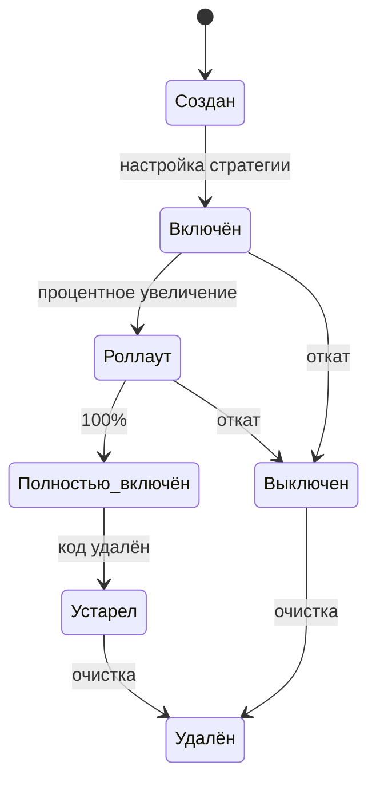

# Флаги

Флаг — это именованная точка переключения в коде. **можно.** поддерживает два типа флагов, процентный роллаут, правила на атрибутах и полный жизненный цикл.

## Типы флагов

### Булев флаг

Возвращает `true` или `false`. Самый распространённый тип — подходит для условного включения нового кода.

```java
if (client.isFlagEnabled("new-checkout", ctx)) {
    // новая логика оформления заказа
} else {
    // старая логика
}
```

```typescript
if (await client.isEnabled('new-checkout', { userId: 'user-123' })) {
  // новая логика оформления заказа
} else {
  // старая логика
}
```

### Мультивариативный флаг

Возвращает одно из нескольких заданных значений (строк). Используется для A/B-тестов, канареечных деплоев и экспериментов.

```java
String variant = client.getFlagValue("checkout-design", ctx, "default");

switch (variant) {
    case "A" -> renderClassicCheckout();
    case "B" -> renderModernCheckout();
    case "C" -> renderMinimalCheckout();
    default -> renderClassicCheckout();
}
```

```typescript
const variant = await client.getValue('checkout-design', { userId: 'user-123' }, 'default');

switch (variant) {
  case 'A': renderClassicCheckout(); break;
  case 'B': renderModernCheckout(); break;
  case 'C': renderMinimalCheckout(); break;
  default: renderClassicCheckout(); break;
}
```

Каждому значению назначается вес — процент пользователей, которые его получат.

| Вариант | Вес |
|---------|-----|
| A | 50% |
| B | 30% |
| C | 20% |

## Правила таргетинга на атрибутах

Правила на атрибутах позволяют включать флаг для конкретных пользователей или групп на основе контекста.

### Операторы сравнения

| Оператор | Описание | Пример |
|----------|----------|--------|
| `equals` | Точное совпадение | `country` equals `RU` |
| `not_equals` | Не совпадает | `plan` not_equals `free` |
| `contains` | Содержит подстроку | `email` contains `@company.com` |
| `not_contains` | Не содержит подстроку | `email` not_contains `@test.com` |
| `in` | Входит в список | `country` in `[RU, BY, KZ]` |
| `not_in` | Не входит в список | `country` not_in `[US, CA]` |
| `regex` | Соответствует регулярному выражению | `userId` regex `^beta-` |

### Пример правила

```json
{
  "attribute": "plan",
  "operator": "equals",
  "value": "premium"
}
```

Можно комбинировать несколько правил через логическое **И** (все должны выполниться) или **ИЛИ** (хотя бы одно).

## Процентный роллаут

Процентный роллаут распределяет флаг между пользователями на основе хеша от идентификатора. Это даёт **детерминированный** результат: один и тот же пользователь всегда попадает в одну и ту же группу.

```java
// Флаг включён для 25% пользователей
// Хеш вычисляется от свойства контекста (по умолчанию userId)
boolean enabled = client.isFlagEnabled("beta-feature", ctx);
```

| Процент | Поведение |
|---------|-----------|
| 0% | Флаг выключен для всех |
| 25% | Флаг включён для 25% пользователей |
| 50% | Флаг включён для половины пользователей |
| 100% | Флаг включён для всех (эквивалентно Default) |

### Свойство контекста для хеширования

По умолчанию хеш вычисляется от `userId`. Можно указать другое свойство:

```java
// Хеширование по email — пользователь всегда получит тот же результат
client.isFlagEnabled("beta-feature", ctx.withHashProperty("email"));
```

## Жизненный цикл флага

Флаг проходит несколько стадий от создания до удаления:



| Стадия | Описание | Действие |
|--------|----------|----------|
| **Создан** | Флаг зарегистрирован, но не настроен | Определите тип и стратегию |
| **Выключен** | Флаг возвращает `false` для всех | Откат проблемной фичи |
| **Включён** | Флаг активен для целевой аудитории | Настройка таргетинга |
| **Роллаут** | Постепенное увеличение охвата | 1% → 10% → 50% → 100% |
| **Полностью включён** | Работает для 100% пользователей | Удалите старый код |
| **Устарел** | Старый код удалён, флаг больше не нужен | Запланируйте удаление флага |
| **Удалён** | Флаг удалён из системы | Очистка конфигурации |

## Лучшие практики

1. **Именование** — используйте осмысленные ключи: `new-checkout`, `ai-search-enabled`, `dark-mode-rollout`
2. **Удаляйте устаревшие флаги** — флаг, полностью включённый больше месяца, должен быть удалён
3. **Не вкладывайте флаги** — избегайте `if (flagA && flagB)` — это усложняет отладку
4. **Документируйте флаги** — в веб-панели есть поле описания, заполняйте его
5. **Мониторьте** — отслеживайте, какие флаги активны и как долго

## Что дальше?

- [Стратегии](/concepts/strategies) — как работают стратегии роллаута
- [Сегменты](/concepts/segments) — переиспользуемые группы пользователей
- [Контекст](/concepts/overview#контекст) — атрибуты для оценки флагов
