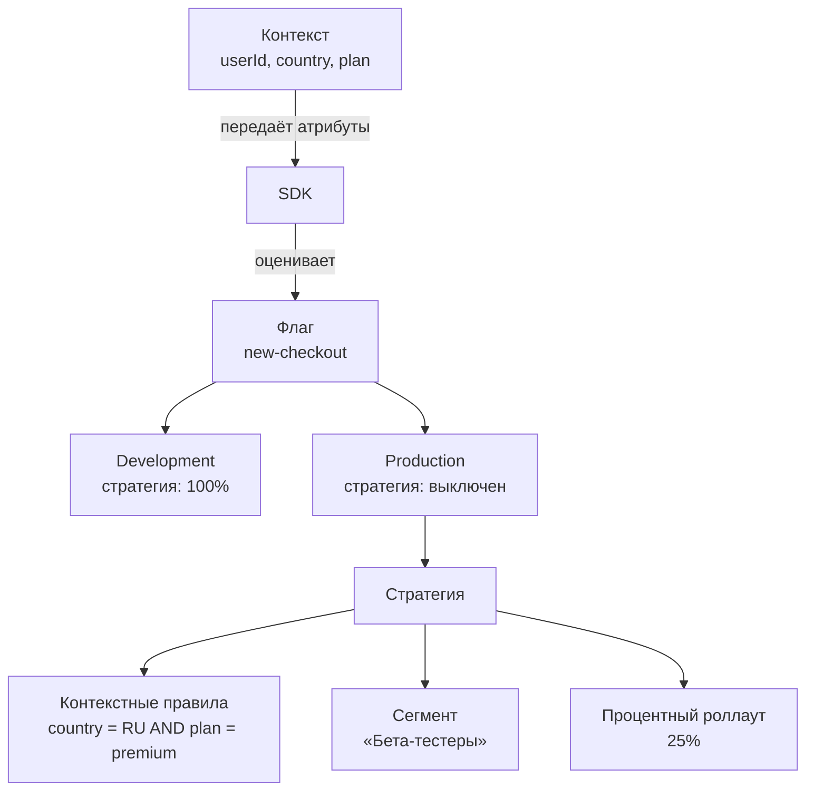

# Обзор концептов

Все ключевые понятия **можно.** связаны в единую систему. Вот как они работают вместе:



1. **Флаг** — точка переключения в коде. Один и тот же флаг (`new-checkout`) живёт во всех окружениях.
2. **Окружение** (Development, Production) — у каждого своя независимая стратегия для флага.
3. **Стратегия** — комбинация из контекстных правил, сегментов и процентного роллаута. Определяет, кто увидит фичу.
4. **Контекст** — атрибуты пользователя, которые SDK передаёт при оценке флага.
5. **API-ключ** — ключ, по которому SDK получает правила конкретного окружения.

---

### Флаг

Именованная точка переключения в вашем коде. Поддерживает два типа:

| Тип | Логика в коде | Для чего |
|-----|-------------|----------|
| **RELEASE** | `if (isEnabled("flag")) { новый код }` | Постепенная раскатка новой функциональности |
| **KILLSWITCH** | `if (!isEnabled("kill-xxx")) { заблокировать }` | Мгновенное аварийное отключение |

Подробнее: [Флаги](/concepts/flags)

### Стратегия

Определяет, **как** флаг применяется на конкретном окружении. Стратегия включает:

- **Состояние** — включён/выключен флаг на этом окружении
- **Контекстные правила** — набор условий (constraints), которым должен соответствовать пользователь (AND-логика)
- **Сегменты** — переиспользуемые группы пользователей (OR-логика между сегментами)
- **Процентный роллаут** — детерминированное распределение через MurmurHash32

Подробнее: [Стратегии](/concepts/strategies)

### Сегмент

Переиспользуемая **группа пользователей**, объединённая общими признаками. Вместо того чтобы дублировать правила таргетинга на каждом флаге, вы создаёте сегмент один раз и ссылаетесь на него.

Примеры: «Пользователи из России», «Premium-подписчики», «Бета-тестеры».

Подробнее: [Сегменты](/concepts/segments)

### Контекст

Атрибуты пользователя или запроса, которые SDK передаёт при оценке флага:

```java
MozhnoContext ctx = MozhnoContext.builder()
    .userId("user-123")
    .addProperty("country", "RU")
    .addProperty("plan", "premium")
    .build();
boolean enabled = client.isEnabled("new-checkout", ctx);
```

Подробнее: [Таргетинг](/guide/targeting)

### Окружение

Логически изолированный контекст для флагов. При создании проекта автоматически создаются **Development** и **Production**. Можно добавлять свои (например, Staging). Лимит Community — 3 окружения на проект.

Подробнее: [Окружения](/concepts/environments)

### API-ключ

Ключ доступа SDK к серверу. Привязан к окружению и проекту. Два типа: **SERVER** (серверные SDK) и **FRONTEND** (браузерные/мобильные SDK).

Подробнее: [API-ключи](/concepts/api-keys)

### Аудит

Все изменения флагов, сегментов и стратегий записываются в аудит-лог: кто, что и когда изменил.

Подробнее: [Аудит](/guide/audit)

## Что дальше?

- [Флаги](/concepts/flags) — типы флагов и жизненный цикл
- [Стратегии](/concepts/strategies) — механика роллаута
- [Окружения](/concepts/environments) — изоляция окружений и лимиты
- [API-ключи](/concepts/api-keys) — управление доступом SDK
