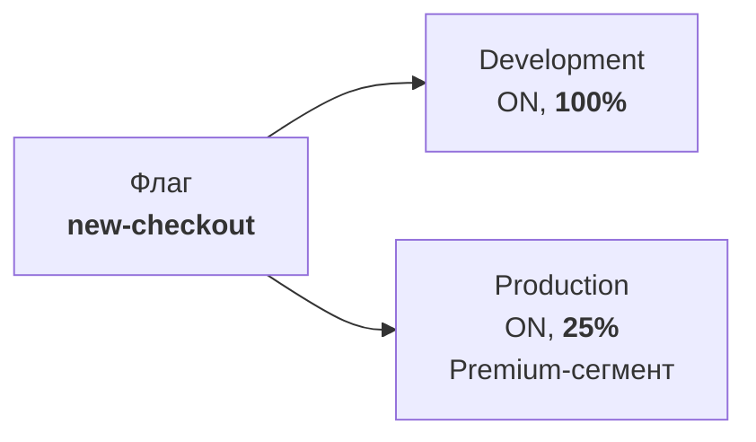
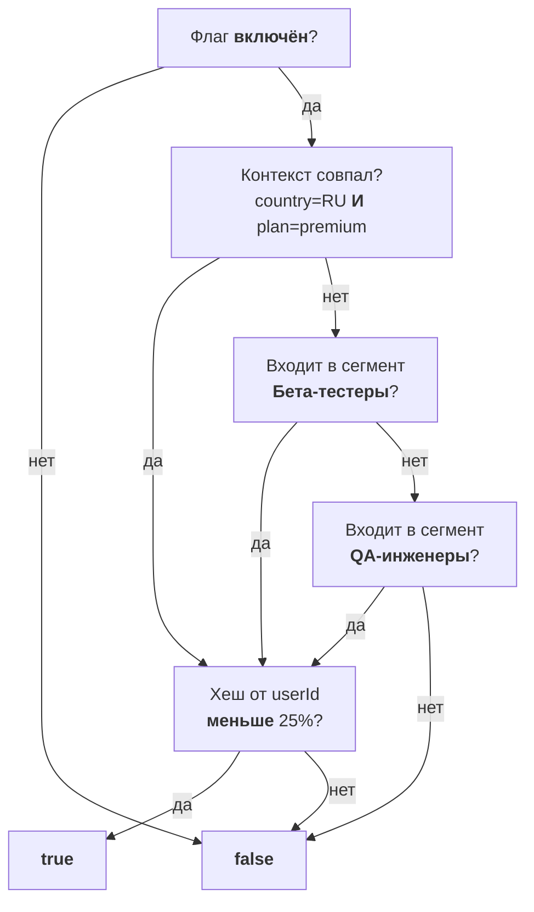
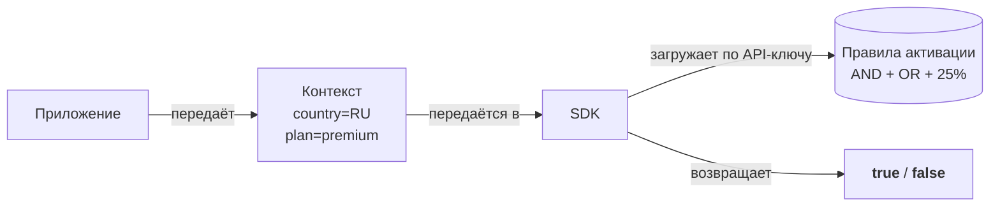

# Обзор концептов

Все ключевые понятия **можно**<span class=brand-dot>.</span> связаны в единую систему. Три диаграммы ниже показывают, как они работают вместе.

## Как устроен флаг

Один и тот же флаг живёт во всех окружениях. На каждом окружении — независимые правила активации.



В Development флаг включён для всех. В Production — только для Premium-пользователей с роллаутом 25%. Изменение правил на одном окружении не затрагивает другие.

## Из чего состоят правила активации

**Задача:** флаг `new-checkout` должен включаться для пользователей с `country=RU` И `plan=premium`, ИЛИ для бета-тестеров, ИЛИ для QA-инженеров. Раскатка — на 25%.



- **Контекст** — AND: все атрибуты должны совпасть. Не совпали — идём дальше.
- **Сегменты** — OR: проверяем каждый по очереди. Достаточно одного совпадения.
- **Роллаут** — MurmurHash32 от `flagKey + userId`. Хеш меньше процента → true.

## Как SDK оценивает флаг

Приложение передаёт контекст в SDK. SDK забирает правила с платформы и оценивает флаг локально — без задержек сети.



SDK вызывает `isEnabled("new-checkout", ctx)`, проверяет контекст по правилам, затем сверяет хеш с процентом роллаута. Сервер хранит только правила — контекст не покидает ваше приложение.

---

### Флаг

Именованная точка переключения в коде. Поддерживает два типа:

| Тип | Для чего | Пример |
|-----|----------|--------|
| **RELEASE** | Постепенная раскатка | `new-checkout` — новый процесс оформления заказа, включается с 1% до 100% |
| **KILLSWITCH** | Аварийное отключение | `kill-payment-gw` — платёжный шлюз упал, админ выключает его мгновенно |

Подробнее: [Флаги](/concepts/flags)

### Правила активации

Определяют, **кто** увидит фичу на конкретном окружении. Включают состояние (ON/OFF), контекстные условия, сегменты и процентный роллаут.

Подробнее: [Правила активации](/concepts/strategies)

### Сегмент

Переиспользуемая **группа пользователей**, объединённая общими признаками. Вместо дублирования правил на каждом флаге — создаёте сегмент один раз.

Примеры: «Premium-подписчики», «Пользователи из России», «Бета-тестеры».

Подробнее: [Сегменты](/concepts/segments)

### Контекст

Атрибуты пользователя или запроса, которые SDK передаёт при оценке флага:

```java
MozhnoContext ctx = MozhnoContext.builder()
    .userId("user-123")
    .addProperty("country", "RU")
    .addProperty("plan", "premium")
    .build();
boolean enabled = client.isEnabled("new-checkout", ctx);
```

Подробнее: [Таргетинг](/guide/targeting)

### Окружение

Логически изолированный контекст для флагов. При создании проекта автоматически создаются **Development** и **Production**. Можно добавлять свои (например, Staging). Лимит Community — 3 окружения на проект.

Подробнее: [Окружения](/concepts/environments)

### API-ключ

Ключ доступа SDK к платформе. Привязан к окружению и проекту. Два типа: **SERVER** (серверные SDK) и **FRONTEND** (браузерные/мобильные SDK).

Подробнее: [API-ключи](/concepts/api-keys)

## Что дальше?

- [Флаги](/concepts/flags) — типы флагов и жизненный цикл
- [Контексты](/concepts/contexts) — атрибуты, whitelist и операторы
- [Правила активации](/concepts/strategies) — как настраивать таргетинг
- [Окружения](/concepts/environments) — изоляция и лимиты
