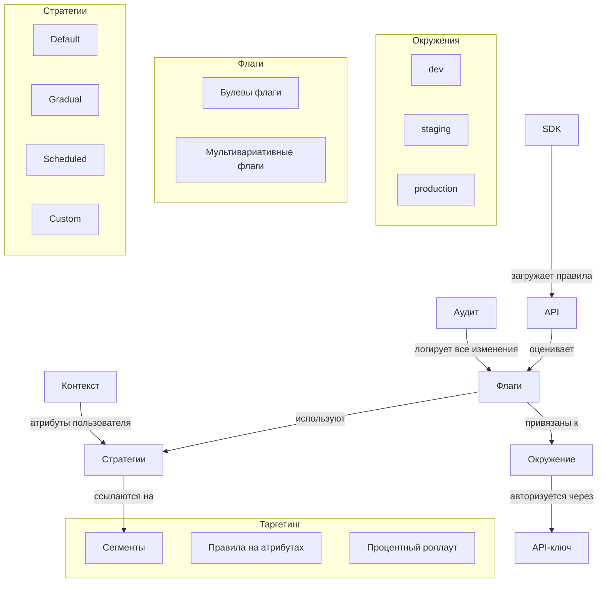
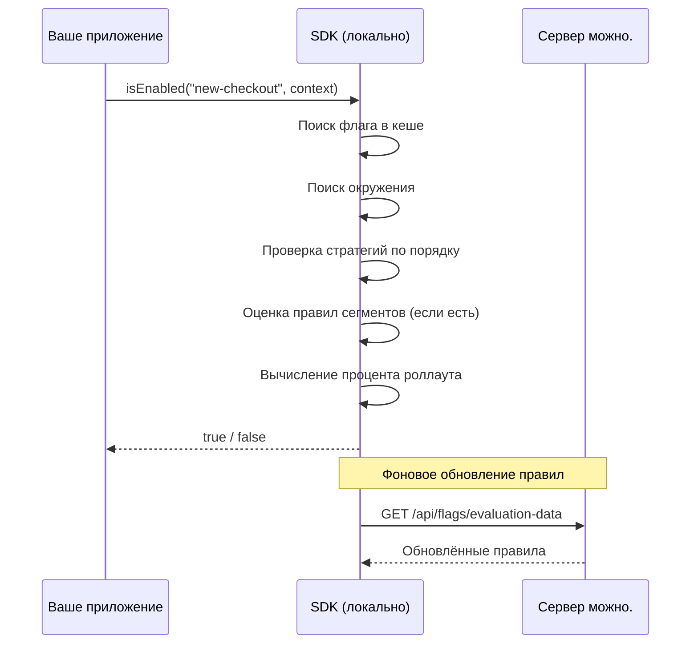

# Обзор концептов

**можно.** построен вокруг нескольких ключевых понятий. Понимание их взаимодействия поможет эффективно управлять фичами.

## Карта концептов



## Ключевые понятия

### Флаг

Именованная точка переключения в вашем коде. **можно.** поддерживает два типа флагов:

- **Булев флаг** — вкл/выкл (`true`/`false`). Базовый и самый частый сценарий.
- **Мультивариативный флаг** — возвращает одно из нескольких значений (`"A"`, `"B"`, `"C"`). Для A/B-тестов и канареечных деплоев.

Подробнее: [Флаги](/concepts/flags)

### Стратегия

Определяет, **как** флаг применяется к пользователям. Стратегии — это подключаемая логика роллаута:

- **Default** — мгновенное включение или выключение для всех
- **Gradual** — постепенная раскатка: сначала 1%, потом 10%, затем 100%
- **Scheduled** — включение по расписанию, в заданные дату и время
- **Custom** — собственная логика через SPI

Каждый флаг проходит цепочку стратегий до первого совпадения.

Подробнее: [Стратегии](/concepts/strategies)

### Сегмент

Переиспользуемая **группа пользователей**, объединённая общими признаками. Вместо того чтобы дублировать правила таргетинга на каждом флаге, вы создаёте сегмент один раз и ссылаетесь на него.

Примеры сегментов:

- Пользователи из России
- Premium-подписчики
- Мобильные устройства на iOS
- Бета-тестеры

Подробнее: [Сегменты](/concepts/segments)

### Контекст

Произвольный набор атрибутов, которые ваше приложение передаёт в SDK при оценке флага. Атрибуты могут быть любыми: `userId`, `country`, `plan`, `device`, `email` и т.д.

```java
var ctx = new EvaluationContext()
    .set("userId", "user-123")
    .set("country", "RU")
    .set("plan", "premium")
    .set("device", "ios");

boolean enabled = client.isFlagEnabled("new-checkout", ctx);
```

Стратегии и правила сегментов опираются на контекст для принятия решения.

### Окружение

Логически изолированный контекст для флагов:

- **dev** — локальная разработка, эксперименты
- **staging** — предпродакшен, интеграционное тестирование
- **production** — боевое окружение

Каждое окружение имеет **собственные настройки флагов** и **собственные API-ключи**. Флаг, включённый в dev, может быть выключен в production.

Подробнее: [Окружения](/concepts/environments)

### API-ключ

Ключ доступа SDK к серверу **можно.**. Каждый API-ключ:

- Привязан к конкретному окружению
- Имеет гранулярные права (чтение флагов, управление, администрирование)
- Может быть отозван в любой момент

### Аудит

Все изменения конфигурации флагов записываются в аудит-лог:

- Кто изменил (администратор или API-клиент)
- Что изменилось (старое и новое значение)
- Когда произошло изменение
- В каком окружении

Аудит-лог доступен через веб-панель и REST API.

## Поток принятия решения



Решение принимается **локально** в SDK — без сетевого вызова к серверу. Это устраняет задержки и делает оценку флагов мгновенной.

## Что дальше?

- [Флаги](/concepts/flags) — типы флагов и жизненный цикл
- [Сегменты](/concepts/segments) — создание переиспользуемых групп
- [Стратегии](/concepts/strategies) — механика роллаута
- [Окружения](/concepts/environments) — изоляция dev / staging / production
