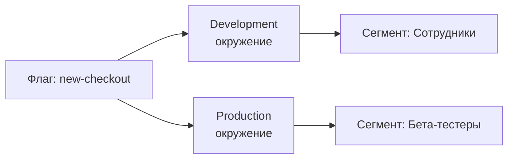

# Сегменты

Сегмент — это переиспользуемая **группа пользователей**, объединённая общими признаками. Вместо того чтобы копировать правила таргетинга на каждый флаг, вы создаёте сегмент один раз и ссылаетесь на него.

## Зачем нужны сегменты

Представьте: у вас 50 флагов, и треть из них должна быть доступна только Premium-пользователям. Без сегментов вам пришлось бы на каждом флаге вручную настраивать правило `plan = "premium"`. Если условие изменится (например, нужно добавить "business"-план), придётся обновлять все 17 флагов.

С сегментом вы создаёте правило один раз:

```json
{ "field": "plan", "operator": "in", "values": ["premium", "business"] }
```

Все флаги, ссылающиеся на этот сегмент, автоматически получают обновлённое правило.

## Правила сегментов

Правила сегментов строятся на контекст-дефинишенах — тех же атрибутах, что передаются в SDK. Поддерживаются все те же операторы и типы, что и для флагов. Подробнее — [Контексты](/concepts/contexts).

### Логическая комбинация

Несколько правил внутри сегмента объединяются логическим **И** (AND) — пользователь должен удовлетворять **всем** правилам, чтобы попасть в сегмент.

```json
{
  "name": "Premium RU iOS",
  "rules": [
    { "field": "plan", "operator": "in", "values": ["premium", "business"] },
    { "field": "country", "operator": "eq", "values": ["RU"] },
    { "field": "device", "operator": "eq", "values": ["ios"] }
  ]
}
```

Пользователь попадёт в этот сегмент, только если у него Premium (или Business), он из России **и** использует iOS.

## Сегменты и окружения

Сегменты глобальны — они доступны во всех окружениях. Но **какие сегменты применяются к флагу**, решается на уровне каждого окружения независимо.



- **Development** — флаг включён для всех сотрудников через сегмент.
- **Production** — сегмент «Бета-тестеры» — флаг включён только для них.

## Примеры сегментов

### Бета-тестеры

```json
{
  "name": "Бета-тестеры",
  "rules": [
    { "field": "userId", "operator": "contains", "values": ["beta-"] }
  ]
}
```

Включает всех пользователей, чей `userId` содержит `beta-`.

### Корпоративные пользователи

```json
{
  "name": "Корпоративные пользователи",
  "rules": [
    { "field": "email", "operator": "contains", "values": ["@company.com"] }
  ]
}
```

Включает пользователей с email на корпоративном домене `@company.com`.

## Что дальше?

- [Флаги](/concepts/flags) — типы флагов и правила таргетинга
- [Правила активации](/concepts/strategies) — как сегменты встраиваются в правила
- [Окружения](/concepts/environments) — где применяются сегменты
