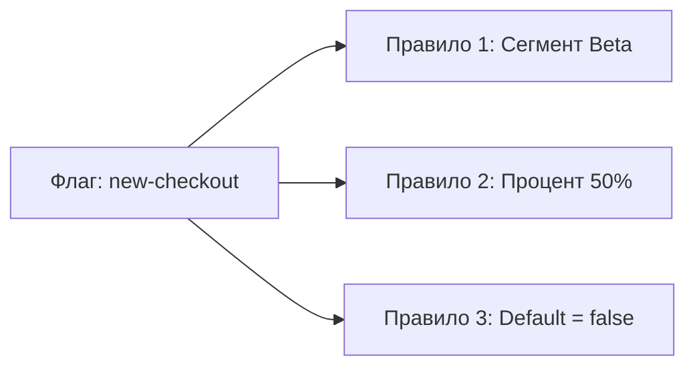

# Сегменты

Сегмент — это переиспользуемая **группа пользователей**, объединённая общими признаками. Вместо того чтобы копировать правила таргетинга на каждый флаг, вы создаёте сегмент один раз и ссылаетесь на него.

## Зачем нужны сегменты

Представьте: у вас 50 флагов, и треть из них должна быть доступна только Premium-пользователям. Без сегментов вам пришлось бы на каждом флаге вручную настраивать правило `plan = "premium"`. Если условие изменится (например, нужно добавить "business"-план), придётся обновлять все 17 флагов.

С сегментом вы создаёте правило один раз:

```
Сегмент "Premium-пользователи": plan in [premium, business]
```

Все флаги, ссылающиеся на этот сегмент, автоматически получают обновлённое правило.

## Правила сегментов

Правила сегментов строятся на атрибутах контекста — тех же, что передаются в SDK.

### Доступные операторы

| Оператор | Описание | Пример |
|----------|----------|--------|
| `eq` | Точное совпадение | `country` eq `RU` |
| `ne` | Не совпадает | `plan` ne `free` |
| `contains` | Содержит подстроку | `email` contains `@corp.com` |
| `in` | Входит в список | `country` in `[RU, BY, KZ]` |
| `not_in` | Не входит в список | `plan` not_in `[free, trial]` |
| `gt` | Больше | `loginCount` gt `10` |
| `gte` | Больше или равно | `age` gte `18` |
| `lt` | Меньше | `latencyMs` lt `100` |
| `lte` | Меньше или равно | `attempts` lte `3` |

### Логическая комбинация

Несколько правил внутри сегмента объединяются логическим **И** (AND) — пользователь должен удовлетворять **всем** правилам, чтобы попасть в сегмент.

```json
{
  "name": "Premium RU iOS",
  "rules": [
    { "attribute": "plan", "operator": "in", "value": ["premium", "business"] },
    { "attribute": "country", "operator": "eq", "value": "RU" },
    { "attribute": "device", "operator": "eq", "value": "ios" }
  ]
}
```

Пользователь попадёт в этот сегмент, только если у него Premium (или Business), он из России **и** использует iOS.

## Примеры сегментов

### Бета-тестеры

```json
{
  "name": "Бета-тестеры",
  "rules": [
    { "attribute": "userId", "operator": "contains", "value": "beta-" }
  ]
}
```

Включает всех пользователей, чей `userId` содержит `beta-`.

### Корпоративные пользователи

```json
{
  "name": "Корпоративные пользователи",
  "rules": [
    { "attribute": "email", "operator": "contains", "value": "@company.com" }
  ]
}
```

Включает пользователей с email на корпоративном домене `@company.com`.

### Платёжеспособная аудитория

```json
{
  "name": "Платёжеспособная аудитория",
  "rules": [
    { "attribute": "plan", "operator": "not_in", "value": ["free", "trial"] }
  ]
}
```

Исключает бесплатных и пробных пользователей.

### Отладка и разработка

```json
{
  "name": "Сотрудники и тестировщики",
  "rules": [
    { "attribute": "email", "operator": "contains", "value": "@mycompany.com" }
  ]
}
```

Включает всех сотрудников компании для внутреннего тестирования.

## Использование сегментов

Сегменты подключаются к флагу через правила таргетинга:



Правила проверяются по порядку:

1. Если пользователь в сегменте «Бета-тестеры» → флаг **включён**
2. Иначе если пользователь попадает в 50% роллаут → флаг **включён**
3. Иначе → флаг **выключен**

## Сегменты и окружения

Сегменты глобальны — они доступны во всех окружениях (dev, staging, production). Но **какие сегменты применяются к флагу**, решается на уровне каждого окружения независимо.

Это позволяет, например:

- В **dev** применить флаг к сегменту «Сотрудники»
- В **production** — к сегменту «Бета-тестеры» с последующей раскаткой на 100%

## Что дальше?

- [Флаги](/concepts/flags) — типы флагов и правила таргетинга
- [Стратегии](/concepts/strategies) — механика роллаута
- [Окружения](/concepts/environments) — где применяются сегменты
