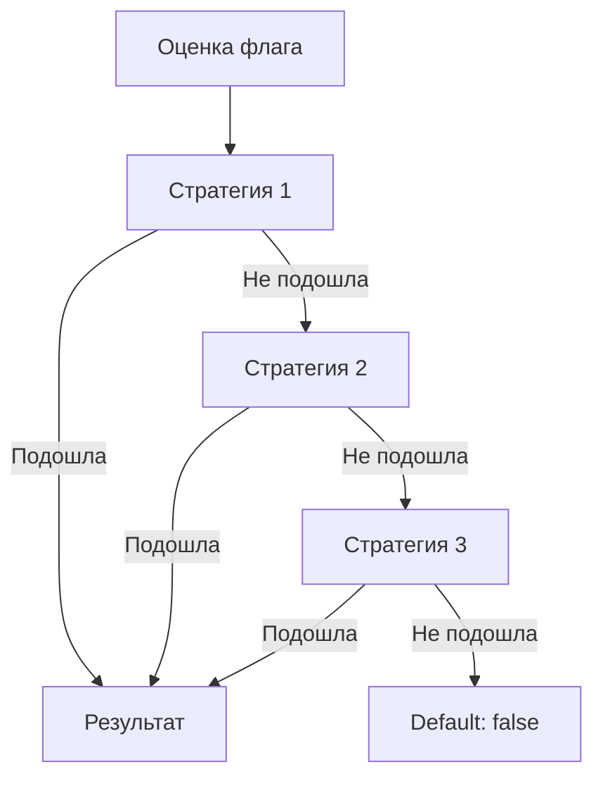
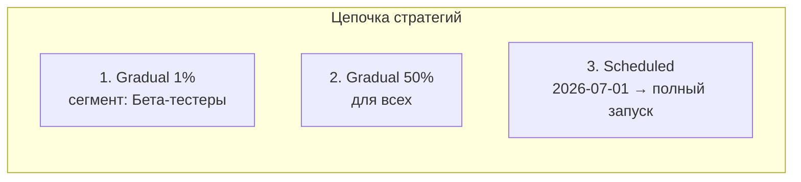

# Стратегии

Стратегия определяет, **как** флаг применяется к пользователям. Это подключаемая логика роллаута: мгновенное включение, постепенная раскатка, включение по расписанию или полностью кастомное поведение.

## Как работает цепочка стратегий

Каждый флаг может иметь **несколько стратегий**, выстроенных в цепочку. При оценке флага SDK проходит по цепочке **сверху вниз** и применяет **первую подошедшую** стратегию:



Если ни одна стратегия не подошла, флаг возвращает значение по умолчанию (`false` для булевых флагов).

## Встроенные стратегии

### Default

**Мгновенное включение или выключение** для всех пользователей.

| Параметр | Значение |
|----------|----------|
| Результат | `true` или `false` |

Подходит, когда нужно быстро включить фичу всем или, наоборот, экстренно отключить (kill switch).

```json
{
  "type": "default",
  "value": true
}
```

### Gradual

**Постепенная раскатка** — флаг включается для заданного процента пользователей. Процент можно менять в реальном времени.

| Параметр | Тип | Описание |
|----------|-----|----------|
| `percentage` | `int` | Процент пользователей (0–100) |
| `hashProperty` | `string` | Свойство контекста для хеширования (по умолчанию `userId`) |

```json
{
  "type": "gradual",
  "percentage": 25,
  "hashProperty": "userId"
}
```

Хеш-функция гарантирует, что один и тот же пользователь **всегда** получит одинаковый результат при неизменном проценте. Это позволяет безопасно наращивать процент:

```
0% → проверка инфраструктуры
1% → канареечный деплой
10% → расширенное тестирование
50% → половина аудитории
100% → все пользователи
```

### Scheduled

**Включение по расписанию** — флаг активируется в заданные дату и время.

| Параметр | Тип | Описание |
|----------|-----|----------|
| `startAt` | `datetime` | Дата и время включения (ISO 8601) |
| `endAt` | `datetime` | Дата и время выключения (опционально) |

```json
{
  "type": "scheduled",
  "startAt": "2026-06-25T12:00:00Z",
  "endAt": "2026-07-01T12:00:00Z"
}
```

Идеально для:

- Запуска акций и промо-кампаний
- Включения holiday-тематики
- Ограниченных по времени экспериментов

### Custom

**Произвольная стратегия**, реализованная через SPI (Service Provider Interface). Позволяет добавить любую логику роллаута, не предусмотренную встроенными стратегиями.

```java
// Пример контракта SPI для кастомной стратегии
public interface RolloutStrategy {
    String getType();
    boolean evaluate(Flag flag, EvaluationContext ctx);
}
```

Примеры кастомных стратегий:

- **Regional** — раскатка по географическому региону на основе IP
- **Device-based** — включение только для мобильных устройств
- **ML-driven** — решение на основе ML-модели
- **Consent-based** — проверка пользовательского согласия

Подробнее о расширении через SPI: [Open Core модель](/advanced/open-core)

## Пример цепочки стратегий

Рассмотрим флаг `new-search` с такой цепочкой:



Что происходит при оценке:

1. **Gradual 1%** — если пользователь в сегменте «Бета-тестеры» и попадает в 1%, флаг включён. Иначе переходим дальше.
2. **Gradual 50%** — если пользователь попадает в 50%, флаг включён. Иначе переходим дальше.
3. **Scheduled** — если текущая дата ≥ 2026-07-01, флаг включён для всех.
4. Если ничего не подошло — флаг выключен.

## Стратегии и мультивариативные флаги

Для мультивариативных флагов стратегии работают аналогично, но возвращают не `true/false`, а **название варианта**:

```json
{
  "type": "gradual",
  "variants": {
    "A": 50,
    "B": 30,
    "C": 20
  }
}
```

50% пользователей получат вариант `A`, 30% — `B`, 20% — `C`.

## Что дальше?

- [Флаги](/concepts/flags) — типы флагов и жизненный цикл
- [Сегменты](/concepts/segments) — переиспользуемые группы пользователей
- [Open Core модель](/advanced/open-core) — создание кастомных стратегий через SPI
