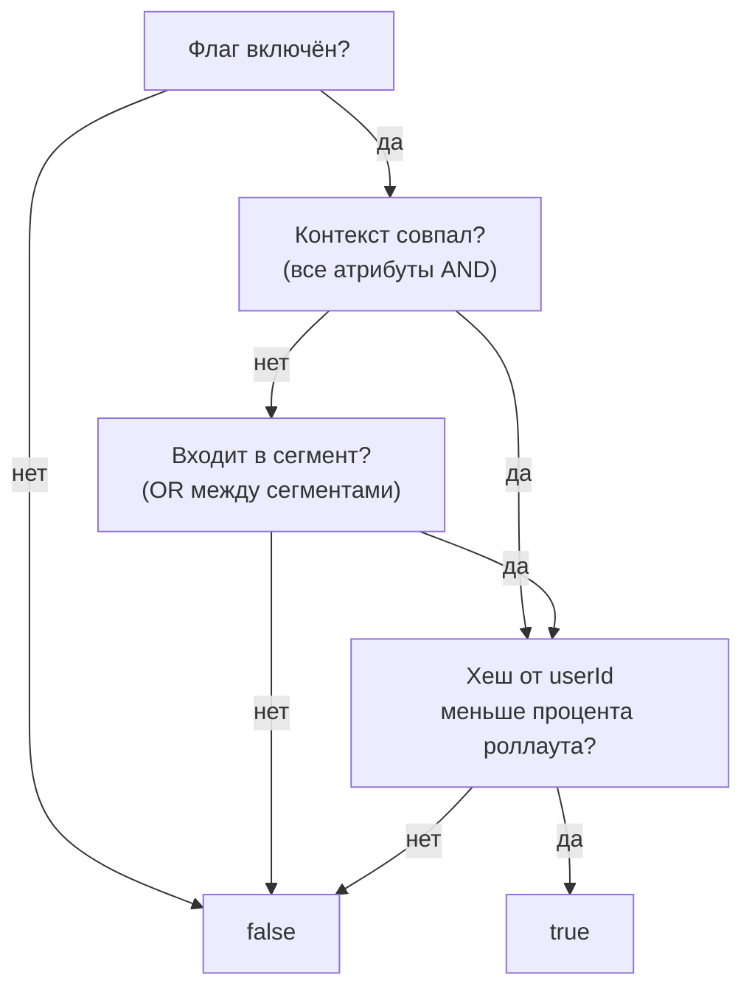

# Правила активации

Правила активации определяют, **кто** увидит фичу на конкретном окружении. Каждый флаг имеет независимые правила для каждого окружения.

## Как устроены правила



1. **Состояние** — если флаг выключен, проверка заканчивается на `false`.
2. **Контекст** — атрибуты пользователя (`country=RU`, `plan=premium`). Все должны совпасть — **AND**.
3. **Сегменты** — если контекст не совпал, проверяются подключённые сегменты. Флаг включится, если пользователь есть хотя бы в одном из них — **OR между сегментами**.
4. **Роллаут** — детерминированный хеш от `flagKey + userId` сравнивается с процентом роллаута. Меньше → `true`.

## Контекстные правила

Правила сопоставляют атрибуты, переданные в SDK. Если контекст не совпал — идём к сегментам.

```json
{
  "constraints": [
    { "field": "country", "operator": "in", "values": ["RU", "BY", "KZ"] },
    { "field": "plan", "operator": "eq", "values": ["premium"] }
  ]
}
```

Все правила внутри группы — **AND**. Если атрибут отсутствует в контексте, правило возвращает `false`.

## Сегменты

Переиспользуемые группы пользователей. Подключаются к правилам активации ссылкой — не нужно дублировать условия на каждом флаге.

Флаг может ссылаться на несколько сегментов — достаточно совпадения с любым (**OR**). Подробнее — [Сегменты](/concepts/segments).

## Процентный роллаут

MurmurHash32 от `flagKey + userId` (или `sessionId`, либо автоматически сгенерированного `anonymousId`, если `userId` нет). Один и тот же пользователь всегда попадает в одну группу. Подробнее — [Роллаут](/guide/rollout).

## Правила и окружения

Правила активации настраиваются для каждого окружения отдельно. Один и тот же флаг может быть включён для всех в Development и только для бета-тестеров в Production.

| Окружение | Правила |
|-----------|---------|
| **Development** | Включён, 100% роллаут — все разработчики видят фичу |
| **Production** | Включён, сегмент «Бета-тестеры» + роллаут 10% — постепенный запуск |

SDK получает правила только для того окружения, к которому привязан его API-ключ.

## Что дальше?

- [Флаги](/concepts/flags) — типы флагов и жизненный цикл
- [Контексты](/concepts/contexts) — атрибуты и операторы
- [Сегменты](/concepts/segments) — переиспользуемые группы
- [Окружения](/concepts/environments) — изоляция и лимиты
