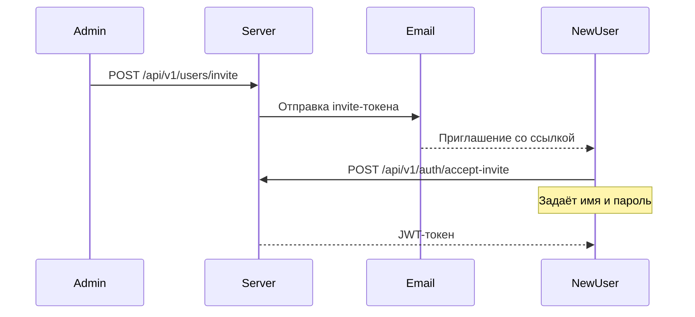

# Пользователи и роли

**можно**<span class=brand-dot>.</span> поддерживает командную работу с тремя ролями доступа. Каждый пользователь имеет свою учётную запись; приглашения отправляются через веб-панель или REST API.

## Роли

| Роль | Права |
|------|-------|
| **ADMIN** | Полный доступ: управление пользователями, проектами, окружениями, API-ключами. Создание и изменение флагов, сегментов, стратегий. |
| **DEVELOPER** | Управление флагами, сегментами, стратегиями, тегами. Просмотр аудит-лога. Не может управлять пользователями и API-ключами. |
| **VIEWER** | Только чтение: просмотр флагов, сегментов, аудит-лога. Не может вносить изменения. |

Иерархия ролей: `ADMIN` включает права `DEVELOPER`, `DEVELOPER` включает права `VIEWER`.

## Приглашение пользователя

Первый администратор создаётся при первом запуске через мастер настройки (onboarding wizard). Последующие пользователи приглашаются через веб-панель или REST API.

### Через веб-панель

1. Перейдите в раздел **Пользователи** (только ADMIN)
2. Нажмите **«Пригласить»**
3. Укажите email и роль
4. Пользователь получит письмо с ссылкой для активации

### Через REST API

```bash
curl -X POST "http://localhost:8080/api/v1/users/invite" \
  -H "Authorization: Bearer $JWT_TOKEN" \
  -H "Content-Type: application/json" \
  -d '{
    "email": "developer@example.com",
    "role": "DEVELOPER"
  }'
```

### Процесс активации



## Восстановление пароля

1. Пользователь нажимает **«Забыли пароль»** на странице логина
2. Сервер отправляет email со ссылкой сброса
3. По ссылке пользователь задаёт новый пароль

### Через REST API

```bash
# Запросить сброс
curl -X POST "http://localhost:8080/api/v1/auth/forgot-password" \
  -H "Content-Type: application/json" \
  -d '{"email": "user@example.com"}'

# Сбросить пароль с токеном из письма
curl -X POST "http://localhost:8080/api/v1/auth/reset-password" \
  -H "Content-Type: application/json" \
  -d '{"token": "...", "password": "new-password"}'
```

## Управление пользователями (ADMIN)

### Просмотр списка

```http
GET /api/v1/users
```

### Изменение роли

```http
PUT /api/v1/users/{id}
```

```bash
curl -X PUT "http://localhost:8080/api/v1/users/5" \
  -H "Authorization: Bearer $JWT_TOKEN" \
  -H "Content-Type: application/json" \
  -d '{"role": "DEVELOPER"}'
```

### Удаление пользователя

```http
DELETE /api/v1/users/{id}
```

## Профиль пользователя

Каждый пользователь имеет профиль, доступный через `GET /api/v1/auth/me`:

| Поле | Описание |
|------|----------|
| `id` | Уникальный идентификатор |
| `email` | Email (логин) |
| `name` | Отображаемое имя |
| `role` | Роль: ADMIN, DEVELOPER, VIEWER |
| `status` | ACTIVE, INACTIVE |
| `locale` | Язык интерфейса: `ru` или `en` |
| `avatar` | Аватар (изображение) |
| `createdAt` | Дата создания |
| `lastActiveAt` | Дата последней активности |

Аватар загружается через `POST /api/v1/users/{id}/avatar`.

## Аудит действий пользователей

Все действия пользователей попадают в [аудит-лог](/guide/audit):

- Создание, изменение, удаление флагов
- Приглашение и удаление пользователей
- Создание и отзыв API-ключей
- Изменение настроек проекта

Аудит-лог доступен для просмотра ролям ADMIN, DEVELOPER и VIEWER.

## Что дальше?

- [Аудит](/guide/audit) — отслеживание изменений
- [Безопасность](/advanced/security) — JWT, refresh-токены, rate limiting
- [Конфигурация](/guide/configuration) — SMTP для писем
