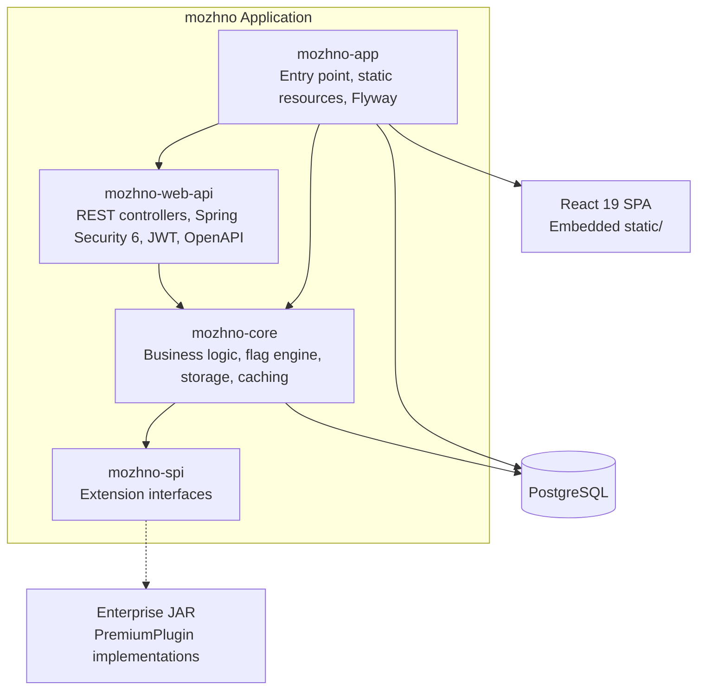
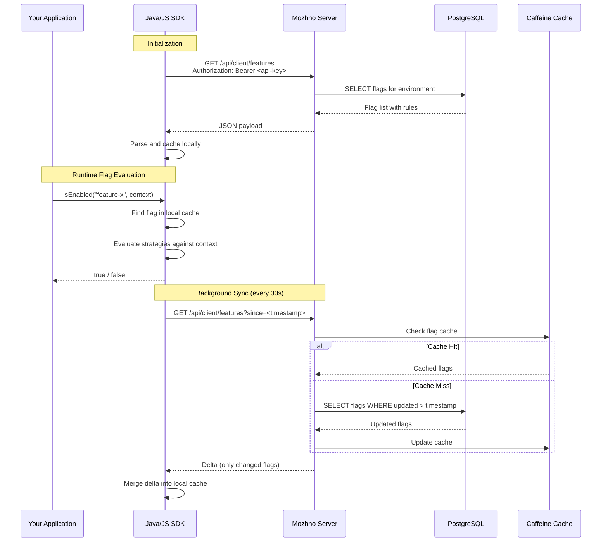
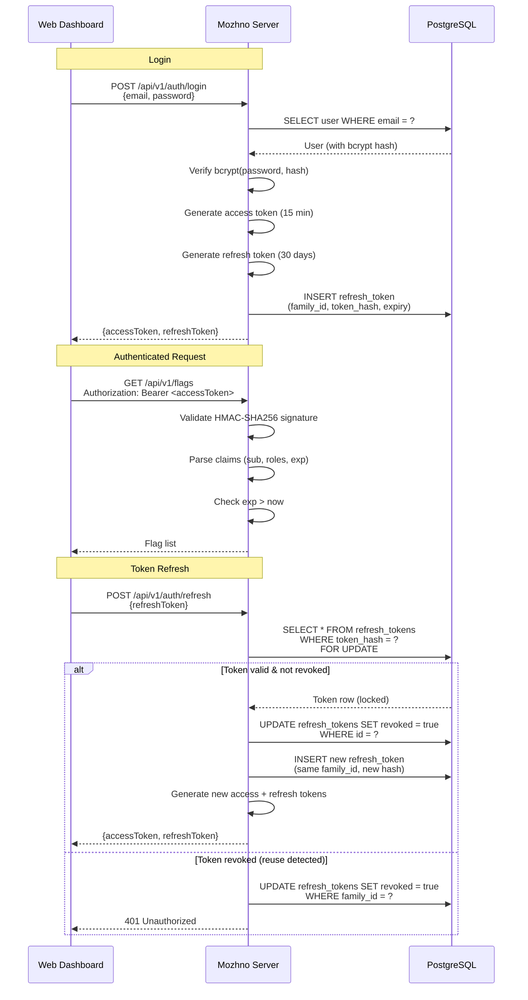
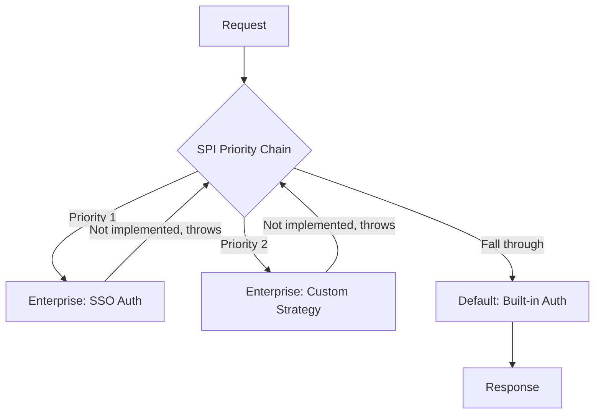

# Architecture

Technical architecture of **можно**<span class=brand-dot>.</span> — module structure, tech stack, evaluation flow, and authentication.

## Module Diagram



### Module Responsibilities

| Module | Role | Key Classes |
|--------|------|-------------|
| **mozhno-spi** | Interface definitions for the plugin system. No dependencies on other modules. | `AuthenticationProviderSpi`, `FeatureGateSpi`, `QuotaSpi`, `BillingSpi`, `AuditSpi`, `MetricsSinkSpi` |
| **mozhno-core** | Business logic: flag evaluation engine, user/segment storage, audit trail. Depends on `mozhno-spi`. | `FlagService`, `SegmentService`, `AuditService`, `FeatureFlagEvaluator` |
| **mozhno-web-api** | REST API layer: controllers, Spring Security 6 filter chain, JWT processing, OpenAPI/Swagger docs. Depends on `mozhno-core`. | `FlagController`, `AuthController`, `JwtService`, `SecurityConfig` |
| **mozhno-app** | Spring Boot entry point, embedded static React SPA, Flyway migration runner. Depends on all modules above. | `Server`, `application.yml`, `db/migration/*.sql` |

## Tech Stack

| Layer | Technology | Version | Rationale |
|-------|-----------|---------|-----------|
| **Runtime** | JDK | 25 | ZGC, latest features |
| **Framework** | Spring Boot | 4.0 | DI, auto-configuration, Actuator, production-ready defaults |
| **Database Access** | JdbcTemplate + RowMapper | — | Direct SQL, no ORM overhead, predictable query plans |
| **Migrations** | Flyway | 10.x | Schema versioning, repeatable migrations, CI/CD integration |
| **Connection Pool** | HikariCP | 6.x | Fastest JDBC pool, metrics, leak detection |
| **Caching** | Caffeine | 3.x | In-process cache, Window TinyLFU, near-optimal hit rate |
| **Auth** | Spring Security 6 | — | Filter chain, JWT stateless auth, method security |
| **JWT** | HMAC-SHA256 | — | Symmetric signing, no external auth server needed |
| **Frontend** | React | 19 | SPA, declarative UI, ecosystem |
| **CSS** | Tailwind CSS | 4 | Utility-first, JIT compilation, design system tokens |
| **UI Primitives** | Radix UI | — | Headless accessible components, unstyled by default |
| **Docs / API** | SpringDoc OpenAPI | 2.x | Swagger UI, request validation, schema generation |
| **Metrics** | Micrometer | — | Actuator integration, Prometheus support |
| **Build** | Gradle | — | Multi-module, reproducible builds |

## Flag Evaluation Flow



### Key Design Decisions

1. **Local evaluation** — the SDK holds a complete snapshot of flag rules. Evaluations happen in-process with zero network calls and zero latency. This is critical for high-throughput applications where a remote evaluation call on every `if (flag)` would add unacceptable overhead.

2. **Delta sync** — the SDK sends a `since` timestamp. The server returns only flags changed since that timestamp, not the full set. For 1000 flags where 2 changed, the payload is ~200 bytes instead of ~50 KB.

3. **Server-side cache** — the server caches flag rules in Caffeine (30 s TTL). SDK requests hit the cache, not the database directly. This absorbs the fan-out from many SDK instances polling the same environment.

## JWT Authentication Flow



### Refresh Token Family Rotation

Refresh tokens use **family rotation** for theft detection:

1. On refresh, the old refresh token is revoked and a new one issued — both share the same `family_id`.
2. If a revoked token is presented (indicating it was stolen and the attacker is using it before the legitimate user), the **entire family is revoked**.
3. This forces all devices to re-authenticate, effectively locking out the attacker.

The database uses `SELECT ... FOR UPDATE` row-level locking on refresh token lookup to prevent race conditions under concurrent requests.

### JWT Claims

| Claim | Description |
|-------|-------------|
| `sub` | User ID |
| `iat` | Issued at (epoch seconds) |
| `exp` | Expiration (epoch seconds, +15 min from `iat`) |
| `roles` | User roles array (`["ADMIN", "DEVELOPER", "VIEWER"]`) |

## SPI Extension System



Each SPI interface forms a priority chain. On each request, the system tries providers in order of priority. If a provider does not implement the interface (throws `UnsupportedOperationException`), the chain falls through to the next provider. The built-in default provider is always last.

See [Open Core](/en/advanced/open-core) for the full SPI interface catalog and enterprise deployment model.

## Static Resources

The React 19 SPA is built separately and embedded in the server JAR under `static/`. Spring Boot serves it as classpath static resources:

```
mozhno-app.jar
├── BOOT-INF/classes/static/
│   ├── index.html
│   ├── assets/
│   │   ├── index-abc123.js
│   │   └── index-def456.css
│   └── favicon.ico
└── WEB-INF/classes/db/migration/
    ├── V1__initial_schema.sql
    └── V2__add_audit_log.sql
```

No separate frontend server. No CORS configuration for the dashboard (same origin). All routes that don't match `/api/*` serve `index.html` for client-side routing.

## Virtual Threads

Spring Boot 4.0 on JDK 25 uses virtual threads by default for request handling:

```yaml
spring:
  threads:
    virtual:
      enabled: true
```

Virtual threads are lightweight JVM-managed threads that allow the server to handle tens of thousands of concurrent connections without the overhead of platform threads. They are particularly effective for I/O-bound workloads like REST APIs where most time is spent waiting for database queries.

## Related Pages

- [Open Core](/en/advanced/open-core) — SPI interfaces and enterprise features
- [Migration](/en/advanced/migration) — Migrate from other platforms
- [Docker](/en/self-hosting/docker) — Deployment
