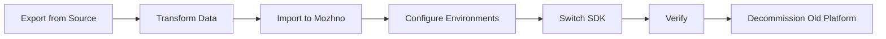
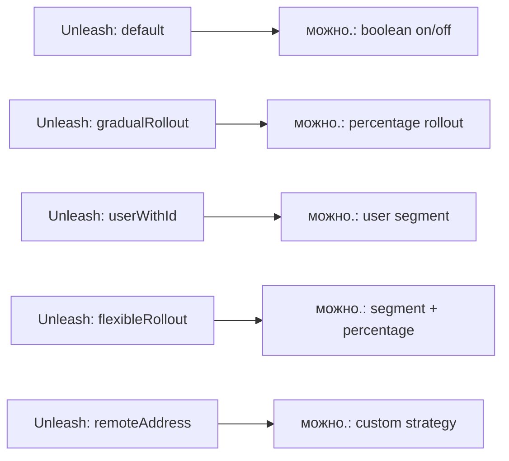

# Migration

Migrate from LaunchDarkly, Unleash, or Flagsmith to **можно.**. This guide covers flag export/import, API key migration, SDK replacement, and common pitfalls.

## General Migration Strategy



### The Parallel-Run Approach

The safest migration runs both platforms in parallel during cutover:

1. **Week 1**: Export flags from source, import into можно. Configure environments and API keys.
2. **Week 2**: Integrate можно. SDK alongside existing SDK. Evaluate flags on both platforms. Compare results in logs.
3. **Week 3**: Route 10% of traffic to можно. for flag decisions. Monitor for discrepancies.
4. **Week 4**: Ramp to 100%. Remove old SDK. Decommission old platform.

## LaunchDarkly → можно.

### Conceptual Mapping

| LaunchDarkly | можно. |
|-------------|--------|
| Project | Account (built-in, no explicit hierarchy) |
| Environment | Environment |
| Flag | Flag |
| Targeting Rule | Strategy |
| Segment | Segment |
| User / Context | Evaluation Context |
| SDK Key | API Key (per environment) |
| Mobile Key | Client-side API Key (read-only) |

### Export from LaunchDarkly

LaunchDarkly does not provide a direct flag export in their UI. Use the REST API:

```bash
# Set your LD API token
LD_API_TOKEN="api-xxxxxxxx"

# Export all flags from a project/environment
curl -H "Authorization: ${LD_API_TOKEN}" \
  "https://app.launchdarkly.com/api/v2/flags/<PROJECT_KEY>?env=<ENV_KEY>" \
  | jq '.items' > ld_flags.json
```

Export segments separately:

```bash
curl -H "Authorization: ${LD_API_TOKEN}" \
  "https://app.launchdarkly.com/api/v2/segments/<PROJECT_KEY>/<ENV_KEY>" \
  | jq '.items' > ld_segments.json
```

### Transform

LaunchDarkly uses a different flag evaluation model (server-side evaluation with streaming updates). можнo. uses local evaluation. Some LD features do not map directly:

| LD Feature | Migration Path |
|------------|---------------|
| Custom targeting rules | Convert to можнo. strategies |
| Prerequisites (flag dependencies) | Not supported — restructure with custom strategies |
| Experiments | Not supported in Community Edition |
| Relay Proxy | Not needed — SDK fetches directly from server |
| Data Export (events) | Configure webhooks (Enterprise) or poll audit log |

### Import to Mozhno

Use the REST API to create flags programmatically:

```bash
MOZHNO_URL="https://mozhno.example.com"
MOZHNO_TOKEN="<admin-jwt>"

jq -c '.[]' ld_flags.json | while read -r flag; do
  KEY=$(echo "$flag" | jq -r '.key')
  NAME=$(echo "$flag" | jq -r '.name')
  DESC=$(echo "$flag" | jq -r '.description // ""')

  curl -X POST "${MOZHNO_URL}/api/flags" \
    -H "Authorization: Bearer ${MOZHNO_TOKEN}" \
    -H "Content-Type: application/json" \
    -d "{
      \"key\": \"${KEY}\",
      \"name\": \"${NAME}\",
      \"description\": \"${DESC}\",
      \"type\": \"BOOLEAN\",
      \"environmentId\": <env-id>
    }"
done
```

### API Key Migration

LaunchDarkly SDK keys are single-purpose (one per environment). In можнo., create API keys per environment through the dashboard or API:

```bash
curl -X POST "${MOZHNO_URL}/api/environments/<env-id>/api-keys" \
  -H "Authorization: Bearer ${MOZHNO_TOKEN}" \
  -H "Content-Type: application/json" \
  -d '{"name": "Production SDK Key", "type": "SERVER"}'
# Response contains the key — save it immediately, it is not retrievable later
```

## Unleash → можно.

### Conceptual Mapping

| Unleash | можно. |
|---------|--------|
| Feature Toggle | Flag |
| Activation Strategy | Strategy |
| Segment | Segment |
| Context Field | Context Attribute |
| API Token | API Key (per environment) |
| Unleash Proxy | Not needed — SDK evaluates locally |

### Export from Unleash

Unleash provides a state export endpoint:

```bash
UNLEASH_URL="https://unleash.example.com"
UNLEASH_TOKEN="<admin-token>"

curl -H "Authorization: ${UNLEASH_TOKEN}" \
  "${UNLEASH_URL}/api/admin/state/export" \
  | jq '.features' > unleash_features.json
```

### Transform — Strategy Mapping

Unleash's activation strategies map to можнo. strategies:



| Unleash Strategy | Migration Approach |
|-----------------|-------------------|
| `default` | Set flag to ON + no additional targeting |
| `gradualRollout` | Create a percentage strategy |
| `userWithId` | Create a segment with user IDs |
| `flexibleRollout` | Segment + percentage strategy combined |
| `remoteAddress` | Implement a custom strategy in можнo. |

### Key Differences

- **Unleash sends feature toggle definitions on every SDK poll** (server-side evaluation). можнo. SDKs evaluate locally — the server sends rules, and the SDK decides.
- **Unleash has no built-in A/B testing**. можнo. supports multivariate flags natively.
- **Unleash uses string IDs**. можнo. uses numeric IDs internally; string keys are the external identifier.

## Flagsmith → можно.

### Conceptual Mapping

| Flagsmith | можно. |
|-----------|--------|
| Feature | Flag |
| Segment | Segment |
| Environment | Environment |
| Server-Side SDK Key | API Key (per environment) |
| Identities | Evaluation Context |
| Traits | Context Attributes |

### Export from Flagsmith

Flagsmith supports environment export via API:

```bash
FS_URL="https://api.flagsmith.com/api/v1"
FS_TOKEN="<admin-token>"

curl -H "Authorization: Token ${FS_TOKEN}" \
  "${FS_URL}/environments/<env-id>/featurestates/" \
  > flagsmith_features.json
```

### SDK Switch Checklist

| Step | Flagsmith SDK | можнo. SDK |
|------|-------------|-----------|
| 1. Dependency | `flagsmith-java-client` | `mozhno-client` |
| 2. Init | `FlagsmithClient.builder().withApiKey("...")` | `MozhnoClient.builder().withApiKey("...")` |
| 3. Boolean flag | `client.hasFeature("flag-key")` | `client.boolFlag("flag-key", context)` |
| 4. String flag | `client.getFeatureValue("flag-key")` | `client.stringFlag("flag-key", context)` |
| 5. Context | `FlagsmithUser` / identity | `EvaluationContext` |
| 6. Poll interval | Configurable (default 60 s) | Configurable (default 30 s) |

## SDK Switch Checklist (All Platforms)

Use this checklist regardless of source platform:

### Java SDK

1. **Remove** old SDK dependency (e.g., `launchdarkly-java-server-sdk`)
2. **Add** можнo. SDK: `implementation("ai.mozhno:mozhno-client:1.x")`
3. **Build client**:

```java
// Old (LaunchDarkly)
LDClient client = new LDClient("sdk-key-xxx");

// New (можно.)
MozhnoClient client = MozhnoClient.builder()
    .apiKey("mz_key_xxx")
    .serverUrl("https://mozhno.example.com")
    .pollInterval(Duration.ofSeconds(30))
    .build();
```

4. **Replace flag evaluations**:

```java
// Old
boolean enabled = client.boolVariation("feature-x", user, false);

// New (можно.)
boolean enabled = client.boolFlag("feature-x",
    EvaluationContext.builder()
        .userId(user.getId())
        .attribute("email", user.getEmail())
        .build());
```

5. **Update context building** — можнo. uses a flat `Map<String, Object>` for attributes.
6. **Remove event tracking** (LaunchDarkly `client.track()`) — use audit log export or webhooks instead.
7. **Shutdown hook**: `client.close()` in a `@PreDestroy` or shutdown hook.

### JavaScript SDK

1. **Remove** old SDK dependency
2. **Add** можнo. SDK: `npm install @mozhno/client`
3. **Build client**:

```javascript
// Old (LaunchDarkly)
const client = LDClient.initialize('sdk-key-xxx', user);

// New (можно.)
import { MozhnoClient } from '@mozhno/client';

const client = new MozhnoClient({
  apiKey: 'mz_key_xxx',
  serverUrl: 'https://mozhno.example.com',
  pollIntervalMs: 30_000,
});
await client.initialize();
```

4. **Replace flag evaluations**:

```javascript
// Old
const enabled = await client.variation('feature-x', false);

// New (можно.)
const enabled = await client.boolFlag('feature-x', {
  userId: user.id,
  email: user.email,
});
```

## Common Pitfalls

### 1. Flag Key Naming

можнo. flag keys must be alphanumeric with hyphens and underscores. No dots, no slashes:

| Source | Valid in можнo.? |
|--------|-----------------|
| `feature.x` (LD) | ❌ Dots not allowed |
| `feature-x` | ✅ |
| `feature/x` (FS) | ❌ Slashes not allowed |
| `feature_x` | ✅ |

**Fix**: Rename keys during export. Update your code to match.

### 2. Environment Order

можнo. evaluates flags **per environment**. A flag can be ON in production but OFF in staging. Ensure your SDK is configured with the correct environment's API key — each API key is bound to a single environment.

### 3. Boolean vs Multivariate

LaunchDarkly flags are always multivariate (they can return JSON). можнo. flags are explicitly `BOOLEAN` or `MULTIVARIATE`. If you used a boolean LD flag that also returned a JSON variation, split it into two можнo. flags.

### 4. User Targeting

можнo. evaluates flags against an `EvaluationContext` — a flat map of string keys to values. Nested LaunchDarkly custom attributes must be flattened:

```java
// LaunchDarkly: nested attributes
user.custom("address", Map.of("country", "US", "city", "NYC"));

// можно.: flat attributes
context.put("country", "US");
context.put("city", "NYC");
```

### 5. SDK Initialization Delay

During the first SDK poll (before the local cache is populated), flags return their **default value**. Ensure your code handles the uninitialized state gracefully:

```java
// Default value is used until first sync completes
boolean enabled = client.boolFlag("new-feature", context);
// enabled == false (the default) until flags are loaded
```

### 6. Percentage Rollout Precision

LaunchDarkly uses a hash-based algorithm on the user key for deterministic percentage rollout. можнo. uses a similar approach but the hash function differs. The same user may fall into a different bucket. When migrating a percentage rollout, start at 0% and ramp up gradually.

### 7. Webhooks

LaunchDarkly and Flagsmith have built-in webhooks for flag change events. можнo. Community Edition does not include webhooks. Use the audit log API to poll for changes, or use the Enterprise webhook SPI.

### 8. API Rate Limits

можнo. does not enforce hard rate limits by default, but the SDK polls every 30 seconds per instance. With 1000 SDK instances, that's ~33 requests/second — well within the capacity of a single server. If you use the REST API directly for flag management, batch operations where possible.

## Verification Checklist

Before decommissioning the old platform, verify:

- [ ] All flags exported and imported with correct keys and types
- [ ] Percentage rollouts migrated with equivalent percentages
- [ ] Segments recreated with equivalent targeting rules
- [ ] API keys generated for each environment
- [ ] SDK initializes without errors in all environments (dev, staging, production)
- [ ] Flag evaluations return expected values for 10+ test contexts
- [ ] All team members have access to the можнo. dashboard
- [ ] Audit trail is logging changes correctly
- [ ] Backups are configured (see [Database](/en/self-hosting/database))

## Related Pages

- [Architecture](/en/advanced/architecture) — How можнo. works internally
- [Open Core](/en/advanced/open-core) — SPI and enterprise features
- [Docker](/en/self-hosting/docker) — Deployment
