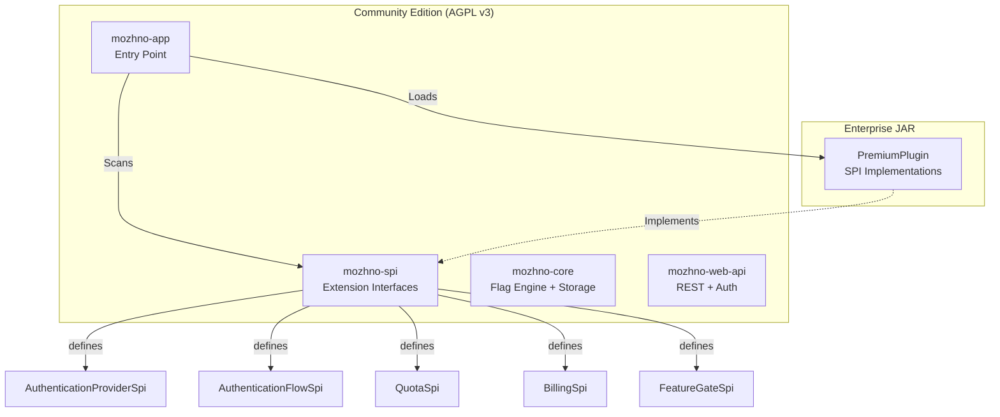
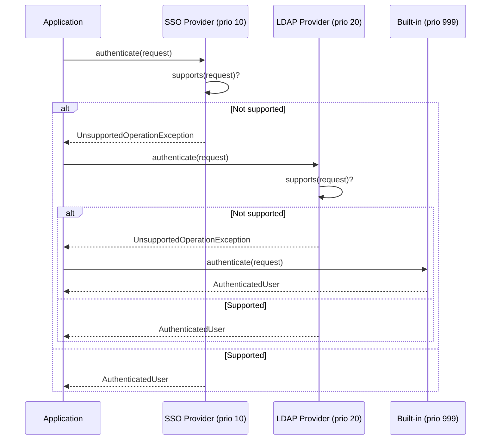

# Open Core

**можно**<span class=brand-dot>.</span> follows an Open Core model. The Community Edition is fully functional under AGPL v3. Enterprise features are delivered as a pluggable JAR — no fork, no feature gates in the core code.

## How It Works



### The Contract

- **Community Edition** defines the **SPI interfaces** — what the system can extend. These interfaces ship in `mozhno-spi.jar` under AGPL v3.
- **Enterprise Edition** provides **implementations** of those interfaces in a separate JAR (`mozhno-enterprise.jar`). This JAR is proprietary, not open source.
- At startup, `mozhno-app` scans the classpath for `PremiumPlugin` implementations. If it finds `mozhno-enterprise.jar`, enterprise features activate. If not, built-in defaults handle everything.

## SPI Interfaces

### AuthenticationProviderSpi

Pluggable authentication backends. The Community Edition ships with email/password (bcrypt). Enterprise adds SSO.

```java
public interface AuthenticationProviderSpi {
    String getName();
    int getPriority();
    AuthenticatedUser authenticate(AuthenticationRequest request)
        throws UnsupportedOperationException;
    boolean supports(AuthenticationRequest request);
}
```

| Implementation | Priority | Description |
|---------------|----------|-------------|
| `LdapAuthenticationProvider` | 10 | LDAP / Active Directory |
| `SamlAuthenticationProvider` | 20 | SAML 2.0 IdP |
| `OidcAuthenticationProvider` | 30 | OpenID Connect (Google, Okta, Azure AD) |
| `BuiltInAuthenticationProvider` | 999 | Email + bcrypt (Community, always last) |

### AuthenticationFlowSpi

Custom authentication UX flows injected into the login page.

```java
public interface AuthenticationFlowSpi {
    String getFlowId();
    String getButtonLabel();
    String getRedirectUrl(String callbackUrl);
}
```

| Implementation | Flow ID | Description |
|---------------|---------|-------------|
| `SsoAuthenticationFlow` | `sso` | "Sign in with SSO" button on login page |
| `SocialAuthenticationFlow` | `social` | Google/GitHub OAuth buttons |

### QuotaSpi

Account-level usage limits.

```java
public interface QuotaSpi {
    boolean canCreateFlag(long accountId);
    boolean canAddUser(long accountId);
    boolean canCreateEnvironment(long accountId);
    int getMaxFlags();
    int getMaxUsers();
    int getMaxEnvironments();
}
```

| Implementation | Max Flags | Max Users | Max Environments |
|---------------|-----------|-----------|-----------------|
| `CommunityQuota` | Unlimited | Unlimited | Unlimited |
| `TieredQuota` | Based on plan | Based on plan | Based on plan |

### BillingSpi

Subscription management and payment integration.

```java
public interface BillingSpi {
    SubscriptionStatus getSubscription(long accountId);
    String getBillingPortalUrl(long accountId);
    void handleWebhook(String payload, String signature);
}
```

| Implementation | Description |
|---------------|-------------|
| `StripeBilling` | Stripe Checkout + webhooks |
| `PaddleBilling` | Paddle Billing integration |

### FeatureGateSpi

Enterprise-only runtime flags and gating.

```java
public interface FeatureGateSpi {
    boolean isEnabled(String featureKey, long accountId);
    Set<String> getEnabledFeatures(long accountId);
}
```

| Feature Key | Description |
|-------------|-------------|
| `advanced.audit.export` | Export audit log to CSV/SIEM |
| `advanced.webhooks` | Webhook notifications for flag changes |
| `advanced.scheduled_flags` | Time-based scheduled rollout |

## Priority Chain

Each SPI interface uses a priority chain to resolve which implementation handles a request:



The chain tries each provider in ascending priority order (lower number = higher priority). If a provider throws `UnsupportedOperationException`, the chain falls through to the next one. The built-in default has priority `Integer.MAX_VALUE` — it always runs last and never throws.

## Plugin System

### PluginSlot

UI extension points in the React dashboard:

```java
public enum PluginSlot {
    SIDEBAR_ADMIN,
    SETTINGS_PREMIUM
}
```

| Slot | Location | Purpose |
|------|----------|---------|
| `SIDEBAR_ADMIN` | Admin sidebar navigation | Add enterprise menu items (Billing, SSO Settings, Audit Export) |
| `SETTINGS_PREMIUM` | Settings page sections | Add enterprise configuration panels (Plan Details, Usage Charts) |

### PremiumPlugin

Entry point for enterprise features:

```java
public interface PremiumPlugin {
    String getPluginId();
    String getVersion();
    List<PluginSlotRegistration> getSlotRegistrations();
    List<Object> getSpiImplementations();
}
```

A single `PremiumPlugin` implementation in `mozhno-enterprise.jar` registers all enterprise providers and UI extensions.

## Placement and Discovery

```
mozhno-home/
├── mozhno.jar              (Community: AGPL v3)
├── plugins/
│   └── mozhno-enterprise.jar   (Enterprise: Proprietary)
└── config/
    └── application.yml
```

Spring Boot scans the `plugins/` directory at startup via `PropertiesLauncher` or a custom `ClasspathScanner`. If `mozhno-enterprise.jar` is present, its `PremiumPlugin` is loaded and SPI implementations are registered.

For Docker, mount the enterprise JAR:

```yaml
services:
  mozhno:
    volumes:
      - ./plugins/mozhno-enterprise.jar:/app/plugins/mozhno-enterprise.jar:ro
```

For Kubernetes, bundle it in a custom image or use an init container:

```yaml
initContainers:
  - name: enterprise-plugin
    image: registry.example.com/mozhno-enterprise:latest
    command: ["cp", "/mozhno-enterprise.jar", "/plugins/"]
    volumeMounts:
      - name: plugins
        mountPath: /plugins
```

## Community vs Enterprise

| Feature | Community | Enterprise |
|---------|-----------|------------|
| Feature flags (boolean) | ✅ | ✅ |
| Feature flags (advanced targeting) | ✅ | ✅ |
| Percentage rollout | ✅ | ✅ |
| User segments | ✅ | ✅ |
| Custom strategies | ✅ | ✅ |
| Environments (dev/staging/prod) | ✅ | ✅ |
| API keys per environment | ✅ | ✅ |
| Audit log | ✅ | ✅ |
| Web dashboard (React 19) | ✅ | ✅ |
| Java SDK | ✅ | ✅ |
| JavaScript SDK | ✅ | ✅ |
| REST API | ✅ | ✅ |
| OpenAPI docs | ✅ | ✅ |
| Docker & K8s deployment | ✅ | ✅ |
| Horizontal scaling | ✅ | ✅ |
| SSO (OIDC / SAML / LDAP) | ❌ | ✅ |
| Webhook notifications | ❌ | ✅ |
| Scheduled flags | ❌ | ✅ |
| Audit log export (CSV/SIEM) | ❌ | ✅ |
| Usage quotas & billing | ❌ | ✅ |
| Premium support SLA | ❌ | ✅ |

## License

The Community Edition is licensed under **GNU AGPL v3**. Anyone can use, modify, and distribute it. If you modify the server and offer it as a network service, you must make your modifications available under the same license.

The Enterprise JAR is distributed under a proprietary license. SPI interfaces in `mozhno-spi` are AGPL v3 — anyone can implement them, including for proprietary plugins.

SDKs (Java, JavaScript) are licensed under **MIT** — no copyleft restrictions on the code you write with them.

## Related Pages

- [Architecture](/en/advanced/architecture) — Module diagram and tech stack
- [Migration](/en/advanced/migration) — Migrate from other platforms
- [Docker](/en/self-hosting/docker) — Deployment
