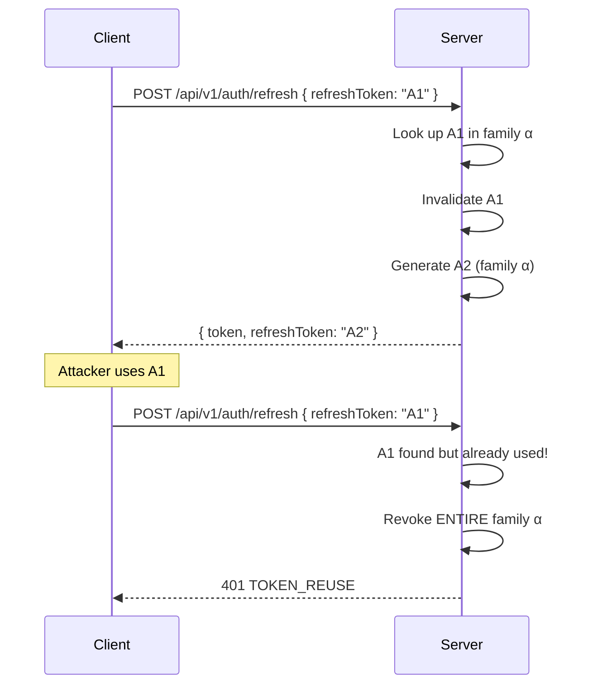

# Security

**можно.** implements multiple layers of protection: JWT authentication for the web dashboard, API keys for SDKs, rate limiting to prevent attacks, and security headers for browser protection.

## Authentication

### JWT (Web Dashboard and REST API)

Algorithm: **HMAC-SHA256**. Token structure:

```json
{
  "sub": "1",
  "email": "admin@example.com",
  "role": "ADMIN",
  "iss": "mozhno",
  "iat": 1719000000,
  "exp": 1719000900
}
```

| Parameter | Default | Description |
|-----------|---------|-------------|
| Access token TTL | 15 minutes | `JWT_ACCESS_TOKEN_TTL_MINUTES` |
| Refresh token TTL | 30 days | `JWT_REFRESH_TOKEN_TTL_DAYS` |
| Secret | Required in production | `JWT_SECRET`, minimum 256 bits |
| Issuer | `mozhno` | `JWT_ISSUER` |

### Refresh Token Rotation (Family Rotation)

When refreshing an access token:

1. The old refresh token is invalidated
2. A new refresh token is generated in the same "family"
3. If a stolen token is reused — **the entire family is revoked**



This means: if a refresh token is compromised, the attacker gets at most one session, after which the legitimate user is forced to re-login.

### API Keys (SDK)

The key is passed as a Bearer token: `Authorization: Bearer <api-key>`. The key type determines allowed operations:

| Type | Access |
|------|--------|
| `SERVER` | `GET /api/client/features`, `POST /api/client/metrics` |
| `FRONTEND` | `POST /api/client/evaluate`, `POST /api/client/metrics` |

See [API Keys](/en/concepts/api-keys) for details.

### BCrypt

Passwords are hashed with BCrypt at **strength 12**. This means ~0.3 seconds per password check — slow enough to resist brute-force, fast enough for comfortable login.

## Rate Limiting

Uses the **Token Bucket** algorithm (Bucket4j). Limits are applied to the client's IP address:

| Endpoint | Capacity | Refill | Interval |
|----------|---------|--------|----------|
| `POST /api/v1/auth/login` | 5 | +5 | 1 min |
| `POST /api/v1/auth/forgot-password`, `/reset-password`, `/accept-invite` | 3 | +3 | 60 min |
| `POST /api/v1/auth/refresh` | 10 | +10 | 1 min |
| `POST /api/client/*` (SDK) | 1000 | +1000 | 1 min |
| `POST/PUT/DELETE /api/v1/*` (admin write) | 100 | +100 | 1 min |

Exceeding the limit returns `429 RATE_LIMIT_EXCEEDED`.

All limits are configurable via environment variables — see [Configuration](/en/guide/configuration#rate-limiting).

## Browser Protection

### CORS

Configured via `APP_CORS_ALLOWED_ORIGINS`. In production, specify a concrete domain:

```
APP_CORS_ALLOWED_ORIGINS=https://app.example.com
```

### Security Headers

| Header | Value |
|--------|-------|
| `Strict-Transport-Security` | `max-age=31536000` (1 year) |
| `Content-Security-Policy` | Configured to prevent XSS |

## Production Recommendations

| Recommendation | How To |
|---------------|--------|
| **Strong JWT_SECRET** | `openssl rand -base64 32` |
| **HTTPS-only** | Use a reverse proxy (Nginx, Traefik, Caddy) with TLS |
| **Restricted CORS** | Specify a concrete domain, not `*` |
| **Secrets manager** | Don't store passwords and keys in `docker-compose.yml` |
| **Key rotation** | API keys — quarterly; JWT_SECRET — when team changes |
| **Don't run as root** | Docker: `user: '1000:1000'`, read-only FS |
| **Logging without secrets** | `SensitiveDataMasker` masks JWT, keys, passwords in logs |

## Related Pages

- [API Keys](/en/concepts/api-keys) — access key management
- [Users & Roles](/en/concepts/users) — role model
- [Configuration](/en/guide/configuration) — all environment variables
- [Docker](/en/self-hosting/docker) — secure deployment
