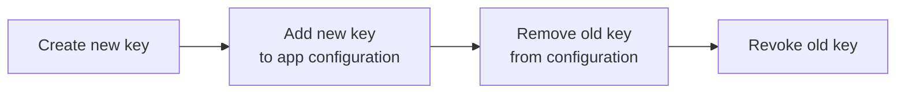

# API Keys

An API key is how SDKs authenticate with the **можно**<span class=brand-dot>.</span> server. Each key is bound to a specific environment and project, determining which flags the client can access and what operations are allowed.

## Key Types

**можно**<span class=brand-dot>.</span> supports two types of API keys:

| Type | Permissions | Endpoints | Use For |
|------|------------|-----------|---------|
| **SERVER** | Read flag rules + write metrics | `GET /api/client/features`, `POST /api/client/metrics` | Server-side SDKs (Java, Node.js backend) |
| **FRONTEND** | Evaluate flags + send metrics | `POST /api/client/evaluate`, `POST /api/client/metrics` | Browser and mobile SDKs |

### When to Use SERVER

- Backend services (Spring Boot, Express, Ktor)
- CI/CD pipelines
- Services where the API key is not exposed to the client

### When to Use FRONTEND

- Browser SPAs
- Mobile applications
- Clients where the key could be extracted from code

## Key Format

An API key is a 64-character Base64url string without a prefix:

```
dGhpcyBpcyBhIDY0LWNoYXJhY3RlciBiYXNlNjR1cmwgZW5jb2RlZCBrZXk
```

The key value is shown **only once** on creation. Save it immediately — the value cannot be recovered.

## Creating a Key

### In the Web Dashboard

1. Go to the **API Keys** section
2. Click **Create Key**
3. Enter a name (e.g., `backend-prod`, `mobile-staging`)
4. Select the type: `SERVER` or `FRONTEND`
5. Select an environment
6. Copy the key and store it securely

### Via REST API

```bash
curl -X POST "http://localhost:8080/api/v1/api-keys" \
  -H "Authorization: Bearer $JWT_TOKEN" \
  -H "Content-Type: application/json" \
  -d '{
    "name": "Production SDK Key",
    "keyType": "SERVER",
    "environmentId": 3,
    "projectId": 1
  }'
```

## Passing the Key to the SDK

### Java

```java
MozhnoConfig config = MozhnoConfig.builder()
    .mozhnoUrl("http://localhost:8080")
    .apiKey("your-api-key-here")
    .appName("my-app")
    .instanceId("instance-1")
    .environment("production")
    .build();
var client = new DefaultMozhnoClient(config);
```

### JavaScript / TypeScript


## Key Rotation

Rotation replaces a key without application downtime. The process:



1. **Create a new key** in the web dashboard
2. **Add the new key** to your application's environment variables or secrets manager
3. **Restart the application** or update configuration live
4. **Delete the old key** via the web dashboard

> **Recommendation:** rotate keys at least once per quarter.

## Key Revocation

Deleting a key via the dashboard or API (`DELETE /api/v1/api-keys/{id}`) immediately cuts off access for all clients using that key. The server returns `401` on all subsequent requests.

## Security

| Rule | Why |
|------|-----|
| **Never commit keys to a repository** | A key in Git = a key for everyone with repo access |
| **Use a secrets manager** | Environment variables, HashiCorp Vault, AWS Secrets Manager |
| **Different keys for different environments** | A dev key must not grant access to production |
| **Least privilege** | For SDK clients — SERVER or FRONTEND, not an admin JWT |
| **Rotate regularly** | At least quarterly |

### What Not to Do

```java
// ❌ Key hardcoded in source
var config = MozhnoConfig.builder()
    .apiKey("dGhpcyBpcyBhIDY0LWNo...")  // visible to everyone in the repo
    .build();
```

### What to Do

```java
// ✅ Key from environment variable
var config = MozhnoConfig.builder()
    .apiKey(System.getenv("MOZHNO_API_KEY"))
    .build();
```

## Related Pages

- [Environments](/en/concepts/environments) — how keys relate to environments
- [REST API](/en/api/rest) — full list of key management endpoints
- [Security](/en/advanced/security) — JWT, rate limiting, CORS