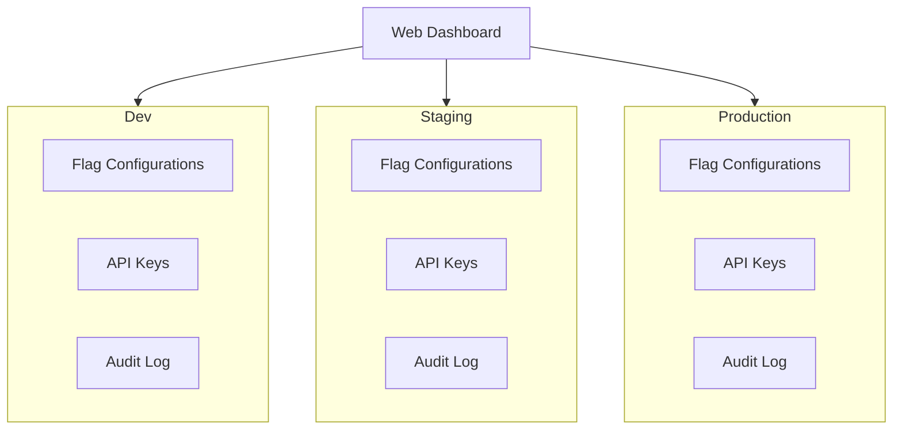
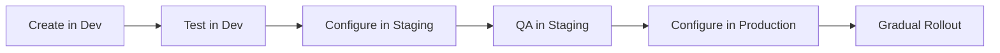

# Environments

An **environment** is an isolated namespace for flag configuration. Environments let you manage flags independently across `dev`, `staging`, and `production` — with separate settings, API keys, and permissions for each.

## Why Environments?

Without environments, a flag change intended for testing in dev could accidentally affect production traffic. Environments enforce isolation:

- A flag can be **on** in dev (for testing) and **off** in prod (not yet released)
- A percentage rollout at 100% in staging means nothing about production
- API keys are scoped to one environment — a dev key can't modify production flags

## Environment Model



Each environment has its own:

- **Flag configurations** — independent settings per flag
- **Segments** — segment definitions can differ per environment
- **API keys** — scoped to one environment with environment-specific permissions
- **Audit log** — changes are tracked separately per environment

## Default Environments

**можно.** ships with three environments created on initial setup:

| Environment | Key | Typical Use |
|-------------|-----|-------------|
| Development | `dev` | Local development, rapid experimentation |
| Staging | `staging` | Pre-production validation, QA, integration tests |
| Production | `prod` | Live traffic, real users |

You can add custom environments (e.g., `qa`, `demo`, `load-test`) via the dashboard.

## API Keys per Environment

API keys are the primary mechanism for SDK authentication. Each key is scoped to exactly one environment and has a permission level.

### Key Permissions

| Permission | Description |
|------------|-------------|
| `read` | Can fetch flag configurations. Used by SDKs in production. |
| `write` | Can create and modify flags, segments, and strategies. Used by CI/CD pipelines and developer tools. |
| `admin` | Full access including API key management and environment settings. Used by operations teams. |

### Typical Key Setup

| Environment | Key Name | Permission | Used By |
|-------------|----------|------------|---------|
| Dev | `dev-readwrite` | `write` | Developer local machines |
| Staging | `staging-readonly` | `read` | Staging application instances |
| Staging | `staging-cicd` | `write` | CI/CD pipeline (automated flag updates) |
| Production | `prod-readonly` | `read` | Production application instances |
| Production | `prod-admin` | `admin` | Operations team |

### Creating and Managing Keys

API keys are managed from the web dashboard under **Settings → API Keys**. Each key:

- Has a **name** for identification
- Is scoped to a single **environment**
- Has one **permission** level
- Can be **revoked** at any time (immediately invalidates the key)

The key value is shown only once at creation time. Store it securely.

## Environment-Specific Flag Configuration

Each flag exists independently in every environment. The same flag key (`new-checkout`) can have completely different rules in dev, staging, and production:

### Dev

```yaml
flag: new-checkout
environment: dev
strategies:
  - type: default
    value: true  # Always on for development
```

### Staging

```yaml
flag: new-checkout
environment: staging
strategies:
  - type: gradual
    percentage: 100  # Full rollout for QA testing
```

### Production

```yaml
flag: new-checkout
environment: prod
strategies:
  - type: segment
    segmentKey: beta-testers  # Only beta testers
  - type: default
    value: false  # Everyone else: off
```

## Promotion Workflow

A typical workflow for promoting a flag from dev to production:



1. Create the flag in the **dev** environment — experiment freely
2. Once the flag logic is stable, configure it in **staging** for QA
3. After QA approves, set up the flag in **production** with a conservative gradual rollout
4. Increase the rollout percentage as confidence grows
5. Eventually set the default strategy to `true` and remove temporary strategies

## Switching Environments in the Dashboard

The dashboard has an environment selector in the top navigation bar. Switching environments changes the view — all flag lists, segment lists, and settings reflect the selected environment.

When you edit a flag, you're editing it **only** for the currently selected environment.

## SDK Environment Selection

The SDK connects to a specific environment by using an API key scoped to that environment:

```java
var client = MozhnoClient.builder()
    .serverUrl("https://flags.example.com")
    .apiKey("prod-readonly-key-here")  // Determines the environment
    .build();
```

The server identifies the environment from the API key and returns only that environment's flag configurations.

## Related Pages

- [Flags](/en/concepts/flags) — flag types and targeting rules
- [Strategies](/en/concepts/strategies) — rollout strategies per environment
- [Configuration](/en/guide/configuration) — environment variables for the server
- [API](/en/api/overview) — REST API authentication with API keys
