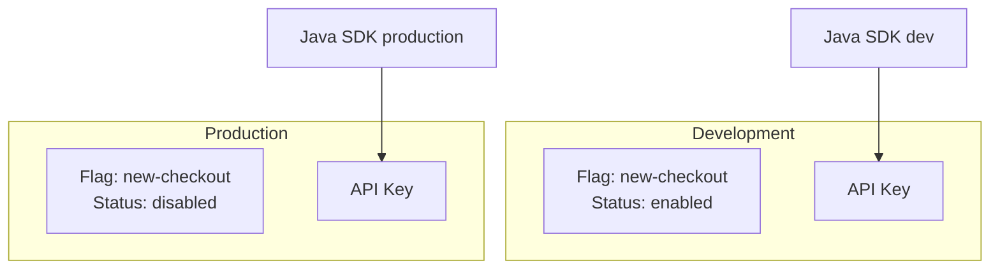
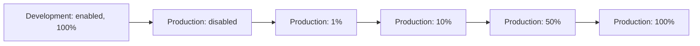

# Environments

An **environment** is an isolated namespace for flag configuration. **можно**<span class=brand-dot>.</span> does not hardcode environments — you control which environments exist and can add/remove them as needed.

## Default Environments

When a project is created, **можно**<span class=brand-dot>.</span> automatically provisions two environments:

| Environment | Key | Purpose |
|-------------|-----|---------|
| **Development** | `Development` | Local development and experiments |
| **Production** | `Production` | Live environment, real users |

You can add, rename, and remove environments. The Community limit is **3 environments** per project. Enterprise allows lifting this limit via the `EnvironmentLimitProvider` SPI.

Typical practice: add a third **Staging** environment between Development and Production for pre-production testing.

## Environment Isolation



The same flag `new-checkout` can have different settings per environment:

- **Development** — enabled for all developers
- **Production** — disabled (not yet ready for release)

## API Keys

API keys are how SDKs authenticate with the server. Keys are **bound to an environment**: a key from `Development` cannot access `Production` flags.

### Creating an API Key

1. Go to the **API Keys** section in the web dashboard
2. Click **Create Key**
3. Enter a name (e.g., `backend-service`, `mobile-app`) and select the type (`SERVER` or `FRONTEND`)
4. Select the environment this key is bound to
5. Copy the generated key and store it securely

### Key Types

| Key Type | Description |
|----------|-------------|
| **SERVER** | Full access: read flag rules and write metrics (`/api/client/features`, `/api/client/metrics`). For server-side SDKs. |
| **FRONTEND** | Client access: evaluate flags and send metrics (`/api/client/evaluate`, `/api/client/metrics`). For browser/mobile SDKs. |

### Passing the Key to the SDK

```java
var config = MozhnoConfig.builder()
    .mozhnoUrl("http://localhost:8080")
    .apiKey("your-api-key-here")
    .appName("my-app")
    .instanceId("instance-1")
    .build();
var client = new DefaultMozhnoClient(config);
```


### Rotation and Revocation

API keys can be rotated (create a new one, delete the old one) or revoked at any time. This immediately cuts off access for all clients using that key.

## Flag Configuration per Environment

Each flag has **independent configuration** in each environment:

| Parameter | Description |
|-----------|-------------|
| State | Enabled / disabled |
| Strategies | Rollout strategy chain |
| Segments | Applied segments |
| Rollout percentage | Current percentage |

### Typical Rollout Scenario



## Related Pages

- [Flags](/en/concepts/flags) — flag types and lifecycle
- [Strategies](/en/concepts/strategies) — rollout mechanics
- [API](/en/api/overview) — REST API usage