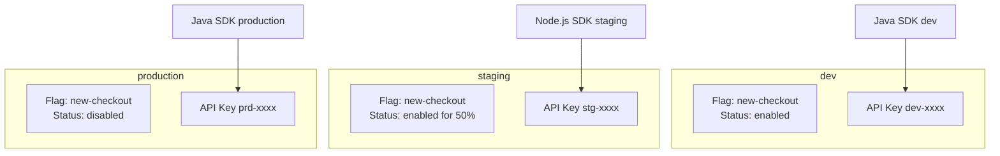
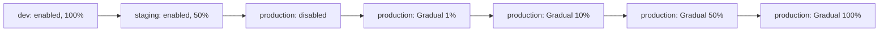

# Environments

An **environment** is an isolated namespace for flag configuration. Environments let you manage flags independently across `dev`, `staging`, and `production` — with separate settings and API keys for each.

## Environment Model



The same flag `new-checkout` can have different settings per environment:

- **dev** — enabled for all developers
- **staging** — enabled for 50% of users (load testing)
- **production** — disabled (not yet ready for release)

## Default Environments

**можно.** ships with three predefined environments:

| Environment | Key | Purpose |
|-------------|-----|---------|
| **Development** | `dev` | Local development and experiments |
| **Staging** | `staging` | Pre-production testing, QA |
| **Production** | `production` | Live environment, real users |

## API Keys

API keys are how SDKs authenticate with the server. Keys are **bound to an environment**: a key from `dev` cannot access `production` flags.

### Creating an API Key

1. Go to the **API Keys** section in the web dashboard
2. Click **Create Key**
3. Enter a name (e.g., `backend-service`, `mobile-app`) and select the type (`SERVER` or `FRONTEND`)
4. Select the environment this key is bound to
5. Copy the generated key and store it securely

### Key Types

| Key Type | Description |
|----------|-------------|
| **SERVER** | Full access: read flag rules and write metrics (`/api/client/features`, `/api/client/metrics`). For server-side SDKs. |
| **FRONTEND** | Client access: evaluate flags and send metrics (`/api/client/evaluate`, `/api/client/metrics`). For browser/mobile SDKs. |

Server-side SDKs typically use the **SERVER** key type.

### Passing the Key to the SDK

```java
var config = MozhnoConfig.builder()
    .mozhnoUrl("http://localhost:8080")
    .apiKey("your-api-key-here")  // production key
    .appName("my-app")
    .instanceId("instance-1")
    .build();
var client = new DefaultMozhnoClient(config);
```

```typescript
const client = new MozhnoClient({
  url: 'http://localhost:8080',
  apiKey: 'your-api-key-here',  // production key
});
```

### Rotation and Revocation

API keys can be rotated (create a new one, delete the old one) or revoked at any time. This immediately cuts off access for all clients using that key.

## Flag Configuration per Environment

Each flag has **independent configuration** in each environment:

| Parameter | Description |
|-----------|-------------|
| State | Enabled / disabled |
| Strategies | Rollout strategy chain |
| Segments | Applied segments |
| Rollout percentage | Current percentage |

### Typical Rollout Scenario



## Related Pages

- [Flags](/en/concepts/flags) — flag types and lifecycle
- [Strategies](/en/concepts/strategies) — rollout mechanics
- [API](/en/api/overview) — REST API usage
