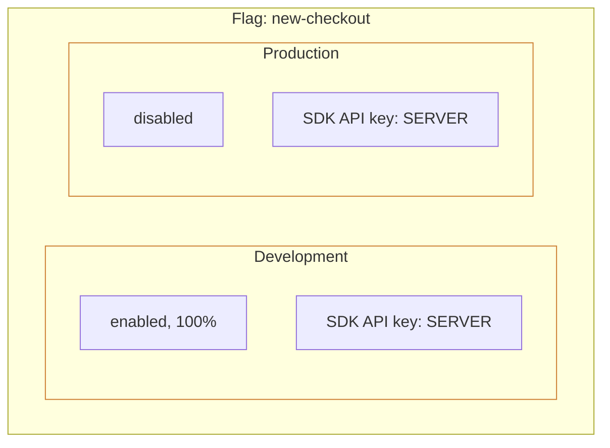

# Environments

An **environment** is an isolated namespace for flag configuration. **можно**. does not hardcode environments — you control which environments exist and can add/remove them as needed.

## Default Environments

When a project is created, **можно**. automatically provisions two environments:

| Environment | Key | Purpose |
|-------------|-----|---------|
| **Development** | `Development` | Local development and experiments |
| **Production** | `Production` | Live environment, real users |

You can add, rename, and remove environments. The Community limit is **3 environments** per project.

## Environment Isolation

A single flag can have different rules in different environments.

## API Keys & Environments

An API key is bound to a specific environment at creation. An SDK using a Development key cannot access Production flag rules. See [API Keys](/en/concepts/api-keys).

## Flag Configuration per Environment

Each flag has **independent configuration** in each environment:

| Parameter | Description |
|-----------|-------------|
| State | Enabled / disabled |
| Context constraints | User attributes (AND logic) |
| Segments | Attached segments (OR logic) |
| Rollout percentage | Current percentage |

## Related Pages

- [API Keys](/en/concepts/api-keys) — SDK access management
- [Activation Rules](/en/concepts/strategies) — how to configure targeting
- [Flags](/en/concepts/flags) — flag types and lifecycle
- [Metrics](/en/guide/metrics) — flag activation stats per environment