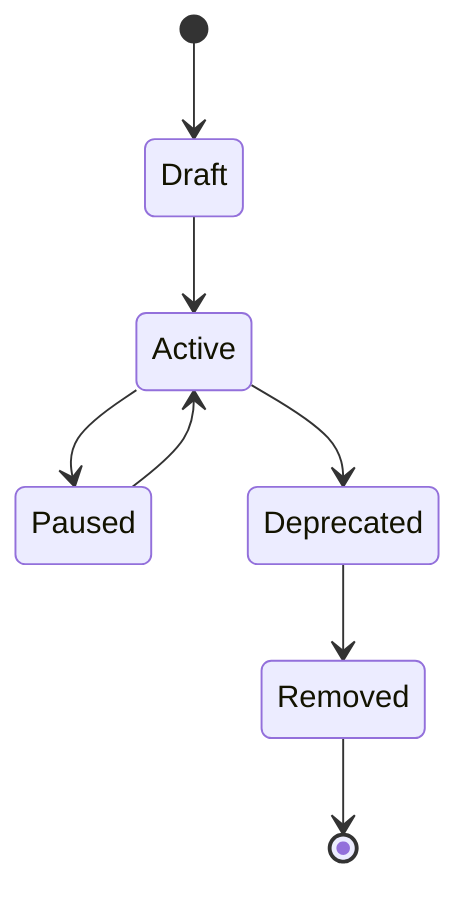

# Flags

A **flag** (feature toggle) is the central unit of configuration in **можно.**. It controls whether a feature is active for a given user or request.

## Flag Types

### Boolean Flags

The simplest form of flag. Returns `true` or `false` — a feature is either enabled or disabled.

```java
boolean enabled = client.isFlagEnabled("new-checkout", ctx);
if (enabled) {
    // show new checkout flow
} else {
    // show old checkout flow
}
```

Use boolean flags for:
- Gradual rollouts of new features
- Kill switches for emergency shutoffs
- A/B test toggles (show variant A or B)

### Multivariate Flags

Returns one of several predefined values instead of just `true`/`false`. Each variant is a named value of type `string`, `number`, or `json`.

```java
String variant = client.getFlagValue("checkout-theme", ctx, "default");
switch (variant) {
    case "blue"  -> applyTheme("blue");
    case "green" -> applyTheme("green");
    default      -> applyTheme("default");
}
```

Use multivariate flags for:
- Configuration values that differ per environment or user segment (e.g., API endpoint URLs)
- Multi-variant experiments
- Feature configurations with more than two states

### Variant Distribution

For multivariate flags, you define how traffic is split across variants. The distribution must sum to 100%.

| Variant | Value | Distribution |
|---------|-------|-------------|
| Control | `"default"` | 50% |
| Blue    | `"blue"`    | 25% |
| Green   | `"green"`   | 25% |

## Flag Rules

Flag rules determine *who* sees a flag. Rules are evaluated top-to-bottom; the first matching rule determines the result.

### Rule Types

**Individual Targeting**
Target specific users by their identifier. Useful for allowlisting team members during development.

```json
{
  "type": "individual",
  "attribute": "userId",
  "values": ["user-001", "user-002", "user-003"],
  "serve": true
}
```

**Attribute Matching**
Target users based on any context attribute. Supports operators: `equals`, `notEquals`, `contains`, `startsWith`, `endsWith`, `in`, `notIn`, `greaterThan`, `lessThan`.

```json
{
  "type": "attribute",
  "attribute": "country",
  "operator": "in",
  "values": ["DE", "FR", "NL"],
  "serve": true
}
```

**Segment Targeting**
Reference a predefined [segment](/en/concepts/segments) by its key. Segments are reusable across multiple flags.

```json
{
  "type": "segment",
  "segmentKey": "beta-testers",
  "serve": true
}
```

### Percentage Rollout

A special rule that enables the flag for a random percentage of traffic. The percentage is applied deterministically based on a context attribute (default: `userId`), so the same user always gets the same result.

```json
{
  "type": "percentage",
  "percentage": 20,
  "attribute": "userId",
  "serve": true
}
```

With `attribute: "userId"`, user `user-123` will consistently be in or out of the 20% bucket — the assignment is stable across calls.

### Default Rule

The last rule in every flag configuration. If no rules above match, the default rule applies. It's commonly set to `serve: false` for gradual rollouts.

```json
{
  "type": "default",
  "serve": false
}
```

## Flag Lifecycle

Flags have a defined lifecycle that helps teams manage technical debt from stale toggles.



| State | Description |
|-------|-------------|
| **Draft** | Flag is being configured. Not served by the SDK. |
| **Active** | Flag is live and being evaluated by SDKs. |
| **Paused** | Flag is temporarily disabled. Acts as if the default rule returns `false`. |
| **Deprecated** | Flag should be removed from code. Still served but shows a warning in the dashboard. |
| **Removed** | Flag is archived. SDKs no longer receive its configuration. |

### Best Practices for Lifecycle Management

1. **Create as Draft** — configure rules and test before activating.
2. **Move to Deprecated** once the feature is stable and the flag is no longer needed in code.
3. **Clean up** — remove the flag from your application code, then archive it (Removed state).
4. **Avoid leaving flags in Paused** — either activate or deprecate them.

## Flag Evaluation Example

Given this flag configuration for `new-checkout`:

1. Individual targeting: `userId` is `user-001` → **`true`**
2. Percentage rollout: 20% of users → **`true`**
3. Default rule → **`false`**

The SDK evaluates:

```
Rule 1: ctx.userId == "user-001"?  → yes → return true
Rule 1: ctx.userId == "user-002"?  → no  → continue
Rule 2: user-002 in 20% bucket?    → yes → return true
Rule 2: user-003 in 20% bucket?    → no  → continue
Rule 3: default                    → return false
```

Rules are short-circuit evaluated — the first match wins.

## Related Pages

- [Segments](/en/concepts/segments) — reusable user groups for targeting rules
- [Strategies](/en/concepts/strategies) — how rollout strategies work
- [Environments](/en/concepts/environments) — per-environment flag configuration
