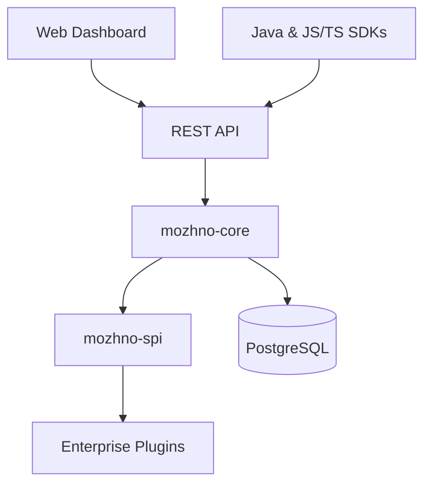
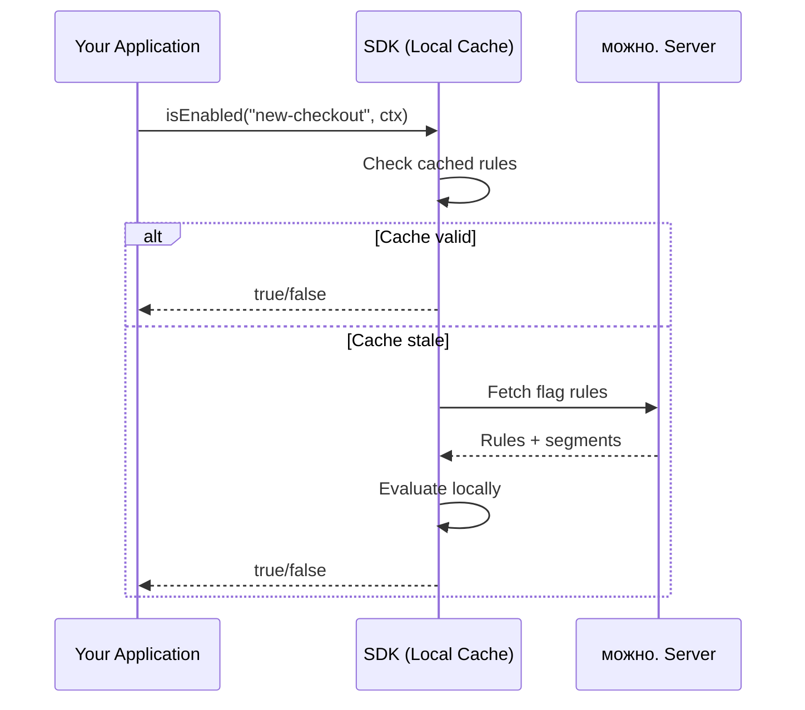

# Overview

**можно.** is an open-core feature flag management platform. This page gives a high-level overview of all core concepts and how they fit together.

## Architecture at a Glance



The server is a Spring Boot 4.0 application built on JDK 25 with a React 19 SPA frontend. It uses `JdbcTemplate` for database access (no JPA) and Flyway for schema migrations.

## Core Concepts

### Flags

A **flag** (feature toggle) controls whether a feature is enabled or disabled for a given request. Flags come in two types:

- **Boolean** — simple on/off toggle
- **Multivariate** — returns one of several predefined values (e.g., a string, number, or JSON)

Flags are evaluated in real time by the SDK using locally cached rules — no network calls on the hot path.

See [Flags](/en/concepts/flags).

### Segments

A **segment** is a reusable group of users defined by matching rules. Instead of repeating the same targeting conditions across multiple flags, you define a segment once and reference it from any flag.

Examples: "beta testers" (users with `beta: true`), "EU users" (users where `country` is in a list of EU country codes), "internal employees" (users with email ending in `@company.com`).

See [Segments](/en/concepts/segments).

### Strategies

A **strategy** determines *how* a flag is rolled out. Strategies are pluggable — the platform ships with three built-in strategies and supports custom ones via SPI:

- **Default** — the flag is either on or off for everyone
- **Gradual** — progressively increase the percentage of users who see the flag
- **Scheduled** — enable the flag between specific dates/times
- **Custom** — implement any rollout logic via the SPI extension point

Strategies are chained: if the first strategy doesn't match, the next one is tried. If none match, the flag defaults to off.

See [Strategies](/en/concepts/strategies).

### Environments

An **environment** is an isolated namespace for flag configuration — typically `dev`, `staging`, and `production`. Each environment has:

- Its own set of flag configurations (a flag can be on in dev but off in prod)
- Its own API keys with granular permissions
- Independent targeting rules

See [Environments](/en/concepts/environments).

### API Keys

**API keys** are used by SDKs and external services to authenticate with the server. Keys are scoped to a single environment and can have read, write, or admin permissions. You create and manage API keys from the web dashboard.

A typical setup:
- Dev environment: read+write key for developer machines
- Staging: read-only key for CI/CD pipelines
- Production: read-only key for the live application, admin key for the operations team

### Context

**Context** is the set of attributes passed to the SDK during flag evaluation. It describes the current user or request and is used by targeting rules and segments to decide whether a flag should be enabled.

```java
var ctx = new EvaluationContext()
    .set("userId", "user-123")
    .set("country", "DE")
    .set("plan", "enterprise")
    .set("beta", true);
```

Context can include any arbitrary key-value pairs. Common attributes: user ID, email, country, subscription tier, device type, user agent.

### Audit Log

Every change to flags, segments, strategies, environments, and API keys is recorded in an immutable **audit log**. Each entry includes:

- The user who made the change
- What was changed (field-level diff)
- Timestamp of the change
- The environment where the change was applied

The audit log is accessible from the web dashboard and via the REST API, giving teams full visibility into configuration history.

## How Flag Evaluation Works



1. Your application calls the SDK with a flag key and evaluation context
2. The SDK checks its local cache of flag rules
3. If the cache is fresh, the SDK evaluates the flag locally in microseconds
4. If the cache is stale, the SDK fetches updated rules from the server, then evaluates locally
5. The SDK caches the new rules for subsequent calls

This local-evaluation architecture eliminates network latency on every flag check.

## Module Architecture

**можно.** is organized as a multi-module Maven project:

| Module | Purpose |
|--------|---------|
| `mozhno-spi` | Service Provider Interface — extension points for enterprise plugins |
| `mozhno-core` | Core business logic: flag evaluation, segment matching, strategy engine |
| `mozhno-web-api` | REST controllers, DTOs, request/response mapping |
| `mozhno-app` | Spring Boot application entry point, auto-configuration, Flyway migrations |

The SPI layer is the foundation of the open-core model. Community features live in `mozhno-core`; enterprise features (SSO, billing, webhooks) are implemented as SPI plugins loaded at startup.

## Related Pages

- [Flags](/en/concepts/flags) — flag types, rules, and lifecycle
- [Segments](/en/concepts/segments) — reusable user groups
- [Strategies](/en/concepts/strategies) — rollout strategies and chaining
- [Environments](/en/concepts/environments) — environment isolation and API keys
