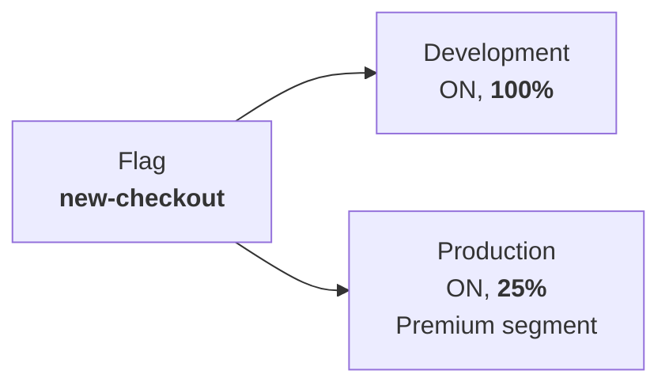
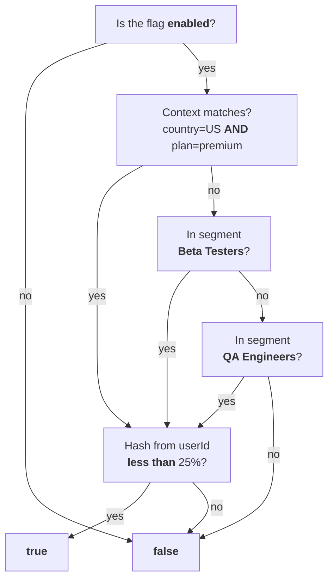
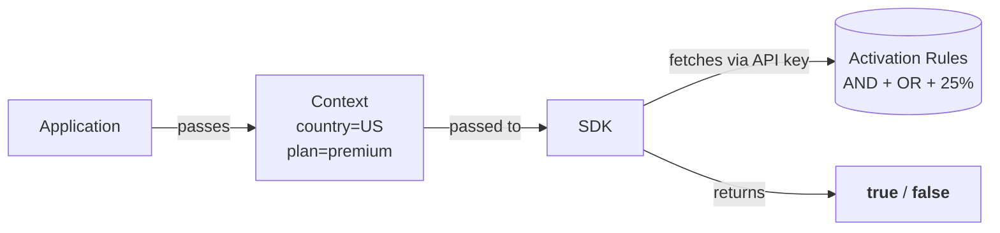

# Concepts Overview

All key concepts in **mozhno** form a unified system. The three diagrams below show how they work together.

## How a Flag Is Structured

A single flag exists across all environments. Each environment has independent activation rules.



In Development the flag is enabled for everyone. In Production — only for Premium users with a 25% rollout. Changing rules on one environment does not affect others.

## What Activation Rules Are Made Of

**Scenario:** flag `new-checkout` should be enabled for users with `country=US` AND `plan=premium`, OR for beta testers, OR for QA engineers. Rollout at 25%.



- **Context** — AND: all attributes must match. If not, continue.
- **Segments** — OR: each is checked in order. A single match is enough.
- **Rollout** — MurmurHash32 from `flagKey + userId`. Hash below threshold → true.

## How the SDK Evaluates a Flag

The application passes context to the SDK. The SDK fetches rules from the platform and evaluates the flag locally — with zero network latency.



The SDK calls `isEnabled("new-checkout", ctx)`, evaluates context against rules, then checks the hash against the rollout percentage. The server stores only rules — context never leaves your application.

---

### Flags

A named toggle point in your code. Two types:

| Type | Purpose | Example |
|------|---------|---------|
| **RELEASE** | Gradual rollout | `new-checkout` — new checkout flow, rolled out from 1% to 100% |
| **KILLSWITCH** | Emergency shutdown | `kill-payment-gw` — payment gateway down, admin disables it instantly |

See [Flags](/en/concepts/flags).

### Activation Rules

Defines **who** sees a feature in a given environment. Includes state (ON/OFF), context constraints, segments, and percentage rollout.

See [Activation Rules](/en/concepts/strategies).

### Segments

A reusable **user group** defined by shared attributes. Instead of duplicating rules across flags, define a segment once.

Examples: "Premium subscribers", "US users", "Beta testers".

See [Segments](/en/concepts/segments).

### Context

User or request attributes passed to the SDK for flag evaluation:

```java
MozhnoContext ctx = MozhnoContext.builder()
    .userId("user-123")
    .addProperty("country", "US")
    .addProperty("plan", "premium")
    .build();
boolean enabled = client.isEnabled("new-checkout", ctx);
```

See [Targeting](/en/guide/targeting).

### Environments

Isolated namespaces for flags. Two environments are created automatically on project setup: **Development** and **Production**. You can add more (e.g., Staging). Community limit — 3 environments per project.

See [Environments](/en/concepts/environments).

### API Keys

SDK authentication keys, bound to an environment and project. Two types: **SERVER** (backend SDKs) and **FRONTEND** (browser/mobile SDKs).

See [API Keys](/en/concepts/api-keys).

## What's Next

- [Flags](/en/concepts/flags) — flag types and lifecycle
- [Contexts](/en/concepts/contexts) — attributes, whitelist and operators
- [Activation Rules](/en/concepts/strategies) — how to configure targeting
- [Environments](/en/concepts/environments) — isolation and limits
