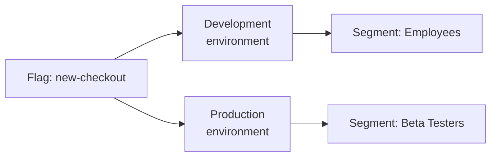

# Segments

A segment is a reusable **user group** defined by shared attributes. Instead of duplicating targeting rules across flags, you define a segment once and reference it.

## Why Segments

Imagine you have 50 flags, and a third of them should only be available to Premium users. Without segments, you'd manually configure `plan = "premium"` on each flag. If the condition changes (e.g., you need to add the "business" plan), you'd have to update all 17 flags.

With a segment, you define the rule once:

```json
{ "field": "plan", "operator": "in", "values": ["premium", "business"] }
```

Every flag referencing this segment automatically gets the updated rule.

## Segment Rules

Segment rules are built on context definitions — the same attributes passed to the SDK. All the same operators and types are supported as for flags. See [Contexts](/en/concepts/contexts).

### Rule Combination

Multiple rules within a segment are combined with **AND** logic — all rules must match for the user to be included.

```json
{
  "name": "Premium RU iOS",
  "rules": [
    { "field": "plan", "operator": "in", "values": ["premium", "business"] },
    { "field": "country", "operator": "eq", "values": ["RU"] },
    { "field": "device", "operator": "eq", "values": ["ios"] }
  ]
}
```

The user is included only if they have Premium (or Business), are from Russia, **and** use iOS.

## Segments & Environments

Segments are global — available across all environments. But **which segments apply to a flag** is decided independently at each environment level.



- **Development** — flag enabled for all employees via a segment.
- **Production** — «Beta Testers» segment — flag enabled only for them.

## Segment Examples

### Beta Testers

```json
{
  "name": "Beta Testers",
  "rules": [
    { "field": "userId", "operator": "contains", "values": ["beta-"] }
  ]
}
```

Includes all users whose `userId` contains `beta-`.

### Corporate Users

```json
{
  "name": "Corporate Users",
  "rules": [
    { "field": "email", "operator": "contains", "values": ["@company.com"] }
  ]
}
```

Includes users with email on the `@company.com` corporate domain.

### Paying Users

```json
{
  "name": "Paying Users",
  "rules": [
    { "field": "plan", "operator": "not_in", "values": ["free", "trial"] }
  ]
}
```

Excludes free and trial users.

## What's Next

- [Flags](/en/concepts/flags) — flag types and targeting rules
- [Activation Rules](/en/concepts/strategies) — how segments integrate into rules
- [Environments](/en/concepts/environments) — where segments are applied
