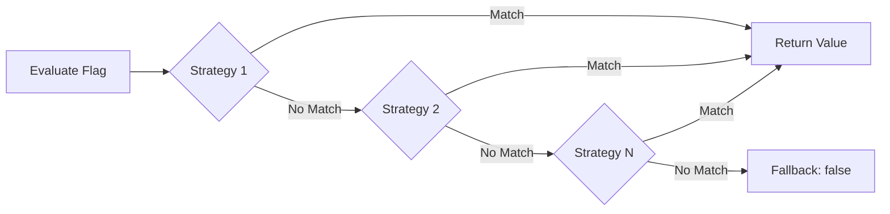
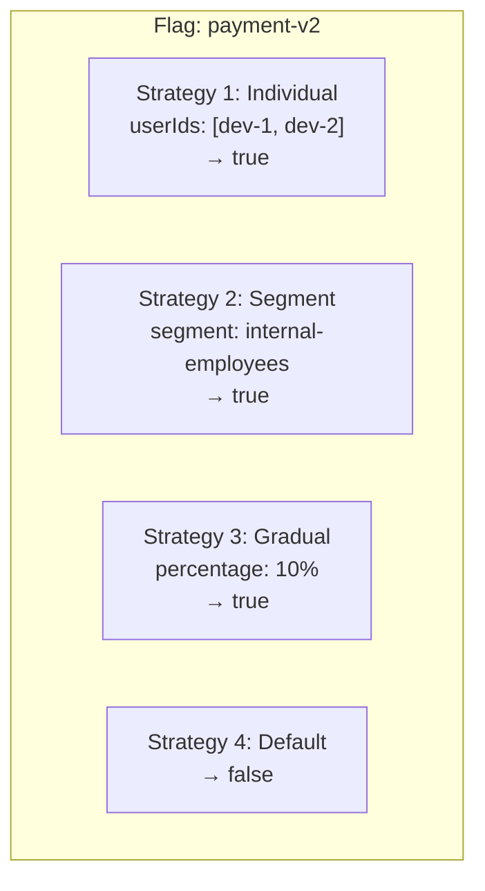

# Strategies

A **strategy** defines the rollout logic for a flag — *how* the flag is delivered to users. Strategies are pluggable components that can be chained together for complex rollout scenarios.

## Strategy Chain

Strategies are evaluated in order. The first strategy that "matches" the current context determines the result. If no strategy matches, the flag defaults to its fallback value.



This chaining model allows progressive rollouts:

1. **Target specific users** (individual strategy) — hand-picked testers see it first
2. **Target a segment** (segment strategy) — then the beta group
3. **Roll out gradually** (gradual strategy) — then 10% of all users
4. **Everyone else** — off until the next phase

## Built-in Strategies

### Default Strategy

The simplest strategy. The flag is either on or off for everyone that reaches this strategy in the chain.

```yaml
type: default
value: true
```

Parameters:
- `value` — `true` or `false`

Use cases:
- Kill switches (default: `false`, override to `true` to disable)
- Global feature flags with no targeting
- As the last strategy in a chain (catch-all)

### Gradual Strategy

Enables the flag for a percentage of users, deterministically based on a context attribute.

```yaml
type: gradual
percentage: 25
attribute: userId
```

Parameters:
- `percentage` — integer from 0 to 100
- `attribute` — context attribute used for hashing (defaults to `userId`)

The percentage assignment is **stable**: user `user-123` will consistently be in the same bucket across calls, as long as the percentage value doesn't change.

```
hash(userId + flagKey) % 100 < percentage → match
```

Gradual strategies are ideal for:

- **Canary releases** — start at 5%, monitor, increase to 25%, 50%, 100%
- **Dark launches** — release to 1% of traffic to validate in production
- **A/B tests** — split traffic equally between control and experiment

### Scheduled Strategy

Enables the flag within a specific time window. Outside the window, the strategy does not match and evaluation falls through to the next strategy.

```yaml
type: scheduled
startAt: "2026-07-01T00:00:00Z"
endAt: "2026-07-15T23:59:59Z"
```

Parameters:
- `startAt` — ISO 8601 datetime when the flag becomes active
- `endAt` — ISO 8601 datetime when the flag deactivates

Use cases:
- **Time-limited promotions** — "free shipping" banner active only during a sale
- **Feature announcements** — enable a feature on a specific launch date
- **Maintenance windows** — disable a feature during scheduled maintenance

Scheduled strategies use the server's clock at evaluation time. The SDK's local clock is used for local evaluation — ensure server and application clocks are synchronized (NTP).

### Custom Strategies

Custom strategies implement the `FlagEvaluationStrategy` interface from `mozhno-spi`. They can contain arbitrary logic and access external data sources.

```java
public class RegionBasedStrategy implements FlagEvaluationStrategy {

    @Override
    public String getType() {
        return "region-based";
    }

    @Override
    public StrategyResult evaluate(
            FlagConfiguration flag,
            EvaluationContext ctx,
            Map<String, Object> params) {

        String userRegion = ctx.getString("region");
        String allowedRegion = (String) params.get("region");

        if (userRegion != null && userRegion.equals(allowedRegion)) {
            return StrategyResult.match(flag.getDefaultValue());
        }

        return StrategyResult.noMatch();
    }
}
```

Register the strategy through the SPI system and it becomes available in the dashboard alongside built-in strategies.

Custom strategies are an enterprise feature — the SPI extension point is available in the community edition, but loading external strategy implementations requires the enterprise plugin framework.

## Strategy Configuration in the Dashboard

When you create or edit a flag in the web dashboard, you configure strategies in the **Rollout** section:

1. **Add a strategy** — choose from Default, Gradual, Scheduled, or any registered custom strategies
2. **Set parameters** — percentage, time range, attribute, target values
3. **Order strategies** — drag to reorder; the first match wins
4. **Preview** — enter a sample context to see which strategy would match

## Chaining Example: Staged Rollout

A common pattern for rolling out a critical feature:



1. **Phase 1** — Only the two developers testing the feature (`dev-1`, `dev-2`)
2. **Phase 2** — Entire internal team via segment
3. **Phase 3** — 10% of real users via gradual rollout (monitor error rates)
4. **Phase 4** — Increase gradual percentage to 50%, then 100%
5. **Phase 5** — Remove the first two strategies, keep only Default → `true`

## Related Pages

- [Flags](/en/concepts/flags) — flag types and targeting rules
- [Segments](/en/concepts/segments) — reusable user groups used in strategies
- [Environments](/en/concepts/environments) — per-environment strategy configuration
- [Overview](/en/concepts/overview) — how strategies fit into the evaluation flow
