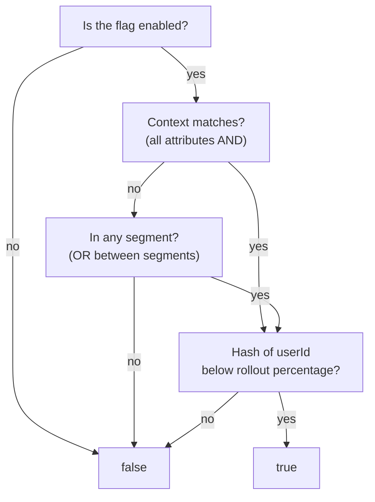

# Activation Rules

Activation rules determine **who** sees a feature in a given environment. Each flag has independent rules for each environment.

## How Rules Work



1. **State** — if the flag is disabled, the check ends at `false`.
2. **Context** — user attributes (`country=US`, `plan=premium`). All must match — **AND**.
3. **Segments** — if context didn't match, attached segments are checked. The flag enables if the user is in any one of them — **OR between segments**.
4. **Rollout** — a deterministic hash of `flagKey + userId` is compared against the rollout percentage. Below → `true`.

## Context Constraints

Constraints match attributes passed to the SDK. If context doesn't match — move on to segments.

```json
{
  "constraints": [
    { "field": "country", "operator": "in", "values": ["US", "CA"] },
    { "field": "plan", "operator": "eq", "values": ["premium"] }
  ]
}
```

All rules within a group use **AND** logic. If an attribute is missing from the context, the rule returns `false`.

## Segments

Reusable user groups. Attach them to activation rules by reference — no need to duplicate conditions across flags.

A flag can reference multiple segments — matching any one is enough (**OR**). See [Segments](/en/concepts/segments).

## Percentage Rollout

MurmurHash32 of `flagKey + userId` (or `sessionId` if `userId` is absent). The same user always lands in the same bucket.

## Rules & Environments

Activation rules are configured independently per environment. The same flag can be enabled for everyone in Development and only for beta testers in Production.

| Environment | Rules |
|-------------|-------|
| **Development** | Enabled, 100% rollout — all developers see the feature |
| **Production** | Enabled, «Beta Testers» segment + 10% rollout — gradual launch |

The SDK receives rules only for the environment its API key is bound to.

## What's Next

- [Flags](/en/concepts/flags) — flag types and lifecycle
- [Contexts](/en/concepts/contexts) — attributes and operators
- [Segments](/en/concepts/segments) — reusable groups
- [Environments](/en/concepts/environments) — isolation and limits
