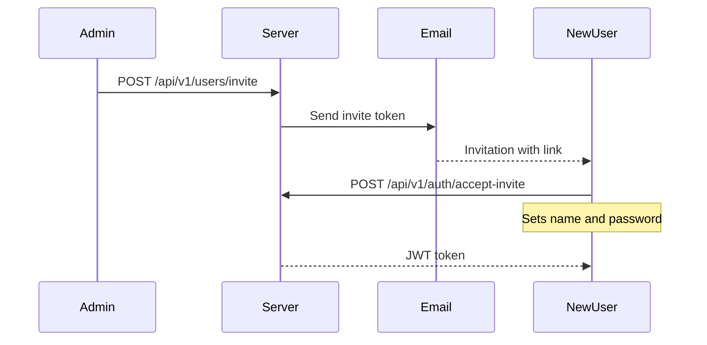

# Users & Roles

**можно.** supports team collaboration with three access roles. Each user has their own account; invitations are sent via the web dashboard or REST API.

## Roles

| Role | Permissions |
|------|------------|
| **ADMIN** | Full access: manage users, projects, environments, API keys. Create and modify flags, segments, strategies. |
| **DEVELOPER** | Manage flags, segments, strategies, tags. View audit log. Cannot manage users and API keys. |
| **VIEWER** | Read-only: view flags, segments, audit log. Cannot make changes. |

Role hierarchy: `ADMIN` includes `DEVELOPER` permissions, `DEVELOPER` includes `VIEWER` permissions.

## Inviting a User

### Via the Web Dashboard

1. Go to the **Users** section (ADMIN only)
2. Click **Invite**
3. Enter email and role
4. The user receives an email with an activation link

### Via REST API

```bash
curl -X POST "http://localhost:8080/api/v1/users/invite" \
  -H "Authorization: Bearer $JWT_TOKEN" \
  -H "Content-Type: application/json" \
  -d '{
    "email": "developer@example.com",
    "role": "DEVELOPER"
  }'
```

### Activation Flow



## Password Recovery

1. User clicks **"Forgot Password"** on the login page
2. Server sends an email with a reset link
3. User sets a new password via the link

### Via REST API

```bash
# Request a reset
curl -X POST "http://localhost:8080/api/v1/auth/forgot-password" \
  -H "Content-Type: application/json" \
  -d '{"email": "user@example.com"}'

# Reset password with the token from the email
curl -X POST "http://localhost:8080/api/v1/auth/reset-password" \
  -H "Content-Type: application/json" \
  -d '{"token": "...", "password": "new-password"}'
```

## User Management (ADMIN)

### List Users

```http
GET /api/v1/users
```

### Change Role

```http
PUT /api/v1/users/{id}
```

```bash
curl -X PUT "http://localhost:8080/api/v1/users/5" \
  -H "Authorization: Bearer $JWT_TOKEN" \
  -H "Content-Type: application/json" \
  -d '{"role": "DEVELOPER"}'
```

### Delete User

```http
DELETE /api/v1/users/{id}
```

## User Profile

Each user has a profile, accessible via `GET /api/v1/auth/me`:

| Field | Description |
|-------|-------------|
| `id` | Unique identifier |
| `email` | Email (login) |
| `name` | Display name |
| `role` | Role: ADMIN, DEVELOPER, VIEWER |
| `status` | ACTIVE, INACTIVE |
| `locale` | Interface language: `en` or `ru` |
| `avatar` | Avatar (image) |
| `createdAt` | Creation date |
| `lastActiveAt` | Last activity date |

Avatars are uploaded via `POST /api/v1/users/{id}/avatar`.

## User Activity Audit

All user actions are recorded in the [audit log](/en/guide/audit):

- Flag creation, modification, deletion
- User invitations and removals
- API key creation and revocation
- Project settings changes

The audit log is accessible to ADMIN, DEVELOPER, and VIEWER roles.

## Related Pages

- [Audit](/en/guide/audit) — tracking changes
- [Security](/en/advanced/security) — JWT, refresh tokens, rate limiting
- [Configuration](/en/guide/configuration) — SMTP for emails
