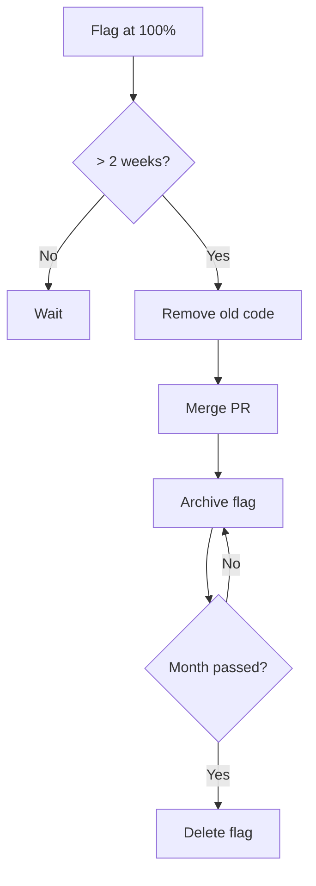

# Best Practices

Recommendations for working with feature flags in **можно**<span class=brand-dot>.</span>: from naming conventions to cleanup strategies.

## Flag Naming

A good flag name is self-documenting and unambiguous. A bad one requires telepathy.

### Naming Convention

```
<functionality>-<action/status>
```

| Pattern | Example | Good/Bad |
|---------|---------|----------|
| `new-component` | `new-checkout` | Good |
| `feature-enabled` | `ai-search-enabled` | Good |
| `kill-component` | `kill-payment-gw` | Good |
| `experiment-description` | `exp-cta-color` | Good |
| `flag1` | — | Bad |
| `test` | — | Bad |
| `feature_flag_new` | — | Bad (uninformative) |

### Recommendations

| Rule | Example |
|------|---------|
| **kebab-case** | `new-checkout`, `dark-mode-rollout` |
| **Latin letters, digits, and hyphens only** | `api-v2`, `search-v3` |
| **Don't use `flag` or `feature` in the key** | ❌ `feature-new-checkout-flag` → ✅ `new-checkout` |
| **Kill switch — prefix `kill-`** | `kill-payment-gateway`, `kill-third-party-api` |
| **Experiments — prefix `exp-`** | `exp-pricing-layout`, `exp-cta-placement` |
| **Temporary features — prefix `tmp-`** | `tmp-holiday-banner-2026` |
| **Permanent configuration — prefix `cfg-`** | `cfg-rate-limit`, `cfg-max-upload-size` |

### Naming Flag Keys

| Rule | Good | Bad |
|------|------|-----|
| Short meaningful identifiers | `A`, `B`, `control`, `treatment` | `variant1`, `variant2` |
| Control group — `control` or `A` | `control` | `old`, `current` |
| Explain variants in the flag description | A = old design, B = new | — |

## When to Archive vs Delete

| Criterion | Archive | Delete |
|-----------|---------|--------|
| Flag served its purpose, old code removed | ✅ Yes | ❌ No |
| Audit history must be preserved | ✅ Yes | ❌ No |
| Experiment flag, never went to production | ❌ No | ✅ Yes |
| Flag created by mistake (typo in key) | ❌ No | ✅ Yes |
| Test flag for local development | ❌ No | ✅ Yes |
| Duplicate flag | ❌ No | ✅ Yes |

> **Tip:** Default rule — archive. Deletion is irreversible. If in doubt, archive and delete after a month if the flag is truly not needed.

## Permission Model

**можно**<span class=brand-dot>.</span> uses a role-based access model with the hierarchy `ADMIN` → `DEVELOPER` → `VIEWER` (each role includes the privileges of lower roles):

| Action | Admin | Developer | Viewer |
|--------|-------|-----------|--------|
| View flags and segments | ✅ | ✅ | ✅ |
| View and export audit log | ✅ | ✅ | ✅ |
| Create flags | ✅ | ✅ | ❌ |
| Modify strategies and targeting | ✅ | ✅ | ❌ |
| Archive flags | ✅ | ✅ | ❌ |
| Manage segments | ✅ | ✅ | ❌ |
| Delete flags | ✅ | ✅ | ❌ |
| Manage environments | ✅ | ❌ | ❌ |
| Manage API keys | ✅ | ❌ | ❌ |
| Manage users | ✅ | ❌ | ❌ |
| Manage integrations (webhooks) | ✅ | ❌ | ❌ |

### Role Recommendations

| Principle | Description |
|-----------|-------------|
| **Least privilege** | Developer cannot manage keys, users, or environments |
| **Infrastructure — admin only** | API keys, users, environments, and integrations are admin-only |
| **Viewer for external parties** | Auditors, product managers — view only |
| **Regular audit** | Review the user list and roles quarterly |

## Cleanup Strategy

Flags left in code after full rollout create **flag debt** — technical debt specific to feature flag systems.

### Signs of Flag Debt

- `if (flag)` constructs with dead old-code branches
- Flags at 100% for over a month
- Complex dependency chains between flags
- Code that is hard to understand without knowing flag state

### Cleanup Process



### Flag Cleanup Checklist

1. **Flag at 100%** for at least 2 weeks
2. **Metrics are stable** — no regressions
3. **Old code not needed** — no rollback planned
4. **Remove `if (flag)`**: keep only the new code, delete old code
5. **Remove SDK import/dependency** if this was the last flag
6. **Archive the flag** in the dashboard
7. **Document the removal** in the flag description: date, reason

## Architecture Patterns

### Patterns for Organizing Flags in Code

| Pattern | Code | When to Use |
|---------|------|-------------|
| **Inline** | `if (client.isEnabled("flag", ctx)) { ... }` | Single flags, quick start |
| **Feature Wrapper** | `featureService.ifEnabled("flag", ctx, () -> newCode())` | Many flags in one service — eliminates repeated `if` |
| **Context Factory** | `MozhnoContextFactory.forUser(user)` | Same attribute set passed to dozens of calls |
| **Middleware** | HTTP/gRPC interceptor adding attributes to context | Attributes from request headers (userId, tenantId, country) |
| **ContextProvider** | `client` auto-injects context via `MozhnoContextProvider` | Spring apps — no need to pass context to every `isEnabled()` |

### Example: Feature Wrapper (Java)

```java
@Service
public class FeatureService {
    private final MozhnoClient client;

    public <T> T ifEnabled(String flag, MozhnoContext ctx,
                           Supplier<T> newCode, Supplier<T> oldCode) {
        return client.isEnabled(flag, ctx) ? newCode.get() : oldCode.get();
    }
}

// Usage:
var result = featureService.ifEnabled("new-checkout", ctx,
    () -> processNew(order),
    () -> processOld(order)
);
```

### Example: Context Factory (Java)

```java
public class MozhnoContextFactory {
    public static MozhnoContext forRequest(HttpServletRequest req) {
        return MozhnoContext.builder()
            .userId(req.getHeader("X-User-Id"))
            .addProperty("tenantId", req.getHeader("X-Tenant-Id"))
            .addProperty("country", req.getHeader("X-Country"))
            .addProperty("device", req.getHeader("X-Device"))
            .build();
    }
}
```

### Example: MozhnoContextProvider (Java)

```java
@Configuration
public class MozhnoConfig {

    @Bean
    public MozhnoContextProvider contextProvider() {
        return () -> {
            var request = ((ServletRequestAttributes)
                RequestContextHolder.currentRequestAttributes()).getRequest();
            return MozhnoContext.builder()
                .userId(request.getHeader("X-User-Id"))
                .addProperty("tenantId", request.getHeader("X-Tenant-Id"))
                .addProperty("country", request.getHeader("X-Country"))
                .build();
        };
    }
}

// Context is automatically injected:
boolean enabled = client.isEnabled("new-checkout");
```

## Testing with Feature Flags

### Unit Testing

Test **both** code paths — with and without the flag:

```java
@Test
void testNewCheckoutFlow() {
    var ctx = MozhnoContext.builder().userId("test-user").build();
    when(client.isEnabled("new-checkout", ctx)).thenReturn(true);

    var result = checkoutService.process(order, ctx);

    assertThat(result.getFlow()).isEqualTo("new");
}

@Test
void testOldCheckoutFlow() {
    var ctx = MozhnoContext.builder().userId("test-user").build();
    when(client.isEnabled("new-checkout", ctx)).thenReturn(false);

    var result = checkoutService.process(order, ctx);

    assertThat(result.getFlow()).isEqualTo("old");
}
```

> **Tip:** Mock the SDK client in tests, not the **можно**<span class=brand-dot>.</span> server. Tests should be fast and network-independent.

## Anti-patterns

| Anti-pattern | Why It's Bad | How to Fix |
|-------------|-------------|-----------|
| **Flag on flag** | `if (flagA && flagB)` — impossible to debug | Merge into a segment or single flag |
| **Flags in loops** | Checking flag on every iteration — overhead | Check flag before the loop |
| **Flag as config** | `if (flag) timeout = 30 else timeout = 60` | Use actual config, not a feature flag |
| **Eternal flags** | Flag exists 6+ months | Schedule removal or mark as permanent |
| **Ownerless flags** | No one is responsible for cleanup | Assign an owner in the flag description |
| **Context copy-paste** | Duplicated `MozhnoContext.builder()...` | Extract to factory method or middleware |

## Next Steps

- [Flag Workflow](/en/guide/flags-workflow) — lifecycle and team process
- [Targeting](/en/guide/targeting) — rules and segments
- [Audit](/en/guide/audit) — tracking changes
- [SDK Overview](/en/sdk/overview) — SDK architecture and code integration
