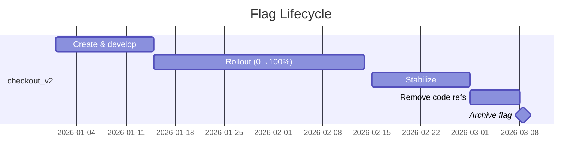
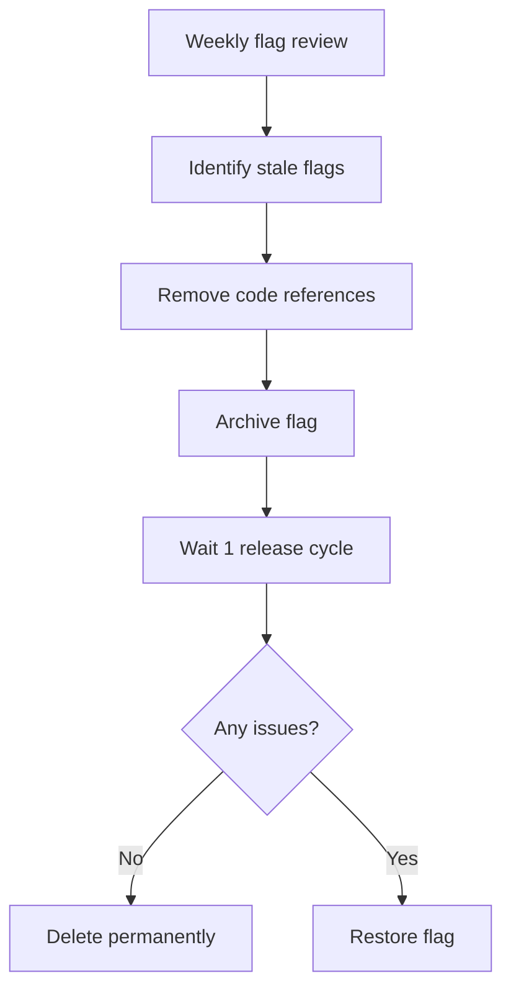

# Best Practices

This guide covers naming conventions, permission models, cleanup strategies, testing patterns, and flag debt management for teams using можно at scale.

## Naming Conventions

A consistent naming scheme keeps flags discoverable and prevents collisions across teams and services.

### Recommended Pattern

```
<domain>_<feature>_<detail>
```

| Component | Description | Example |
|-----------|-------------|---------|
| `domain` | Service or business area | `checkout`, `auth`, `search`, `billing` |
| `feature` | The feature being gated | `redesign`, `upsell`, `darkmode` |
| `detail` | Variant or version (optional) | `v2`, `experiment_a`, `beta` |

**Examples:**

| Good | Poor | Why |
|------|------|-----|
| `checkout_one_click_v2` | `flag_42` | Descriptive vs. opaque |
| `auth_sso_saml` | `new_auth` | Specific vs. vague |
| `search_ranking_ml_v3` | `search_v3` | Includes purpose |
| `billing_tax_eu_vat` | `tax_stuff` | Scoped and precise |

### Naming Rules

- Use **snake_case** (lowercase with underscores).
- Start with the **service or domain name**.
- Include a **version suffix** (`_v2`, `_v3`) when iterating on a feature.
- Use **descriptive action words** for kill switches: `checkout_payment_disable_provider_x`.

### Tagging Strategy

Supplement keys with tags for cross-cutting organisation:

```
team:platform
owner:alice
type:kill-switch
env:production
service:api-gateway
temporary:true
expires:2026-09-01
```

> **Tip:** The `temporary` and `expires` tags are community conventions. There is no automatic expiry in можно — use these tags to identify flags for manual cleanup.

## When to Archive vs Delete

| Criterion | Archive | Delete |
|-----------|---------|--------|
| Flag still referenced in any codebase | ✅ | ❌ |
| Feature fully rolled out and stable | ✅ | ❌ |
| Need to preserve audit history | ✅ | ❌ |
| Possible future rollback needed | ✅ | ❌ |
| Flag was an aborted experiment | ✅ | ✅ (if code removed) |
| Flag created in error (never used) | ❌ | ✅ |
| All code references have been removed | ✅ | ✅ |
| Flag key conflicts with a new flag | ❌ | ✅ |

**Default rule:** Archive first. Delete only when you are certain the flag key will never be needed again.

> **Warning:** Deleting a flag that is still referenced in application code will cause SDK evaluations to return an error for that key. Remove all code references before deletion.

## Permission Model

можно uses a role-based access model. Assign the minimum permissions necessary for each user.

### Recommended Roles

| Role | Read | Write | Admin | Typical Assignee |
|------|------|-------|-------|------------------|
| **Viewer** | ✅ | ❌ | ❌ | Support, analysts, read-only dashboards |
| **Editor** | ✅ | ✅ | ❌ | Developers, QA engineers |
| **Admin** | ✅ | ✅ | ✅ | Team leads, platform engineers |

### API Key Scopes

Create separate API keys with limited scopes for different environments and services:

| Key Name | Environment | Permissions | Used By |
|----------|-------------|-------------|---------|
| `sdk-production` | Production | `flags:read`, `segments:read` | Production application servers |
| `sdk-staging` | Staging | `flags:read`, `segments:read` | Staging application servers |
| `ci-cd-bot` | All | `flags:read`, `flags:write` | CI/CD pipelines |
| `monitoring-bot` | Production | `flags:read` | Monitoring dashboards |

> **Tip:** Never share API keys between environments. A compromised staging key should not affect production flags.

### JWT vs API Keys

| Auth Method | Use Case | Example |
|-------------|----------|---------|
| **JWT** | Dashboard access (human users) | Web UI login sessions |
| **API Key** | SDK and API access (machine clients) | Java SDK, CI/CD scripts |

## Cleanup Strategies

Feature flags accumulate over time. Without a cleanup process, you end up with **flag debt**: stale flags that clutter the dashboard, slow down evaluation, and confuse developers.

### Flag Lifecycle Timeline



### Weekly Flag Review Checklist

Run through this checklist weekly for all flags you own:

1. **Rollout at 100% for > 2 weeks?** → Schedule code removal and archive the flag.
2. **Flag has not been evaluated in > 30 days?** → Investigate. It may be dead code.
3. **Flag has an `expires` tag in the past?** → Archive or extend the expiry.
4. **Flag is paused and > 60 days old?** → Archive if no intention to re-enable.
5. **Flag description is empty or outdated?** → Update it.

### Automated Cleanup Script

Use the API to identify stale flags:

```bash
#!/bin/bash
# List flags not evaluated in the last 30 days
curl "https://your-instance/api/flags?lastEvaluatedBefore=$(date -d '30 days ago' -u +%Y-%m-%dT%H:%M:%SZ)" \
  -H "Authorization: Bearer $JWT_TOKEN" \
  | jq '.items[] | {key: .key, lastEvaluated: .lastEvaluatedAt, state: .state}'
```

### Code Removal Pattern

Before archiving, remove the flag from your application code:

```java
// Before: flag-guarded code
if (client.isFlagEnabled("checkout_v2", context)) {
    return newCheckoutFlow();
}
return oldCheckoutFlow();

// After: flag removed, new code is the default
return newCheckoutFlow();
```

> **Tip:** When removing a flag, do it in a separate PR from the feature work. This makes it easy to audit and revert if needed.

## Testing with Feature Flags

### Unit Testing

Mock the SDK client in unit tests to control flag values directly:

**Java:**
```java
@Test
void testNewCheckoutFlow() {
    MozhnoClient mockClient = mock(MozhnoClient.class);
    when(mockClient.isFlagEnabled(eq("checkout_v2"), any())).thenReturn(true);

    CheckoutService service = new CheckoutService(mockClient);
    Result result = service.checkout(cart);

    assertThat(result).isInstanceOf(NewCheckoutResult.class);
}
```

**JavaScript:**
```js
import { MozhnoClient } from "@mozhno/client-js";

jest.mock("@mozhno/client-js");

test("shows new checkout when flag is enabled", async () => {
  MozhnoClient.mockImplementation(() => ({
    isEnabled: jest.fn().mockResolvedValue(true),
  }));

  const result = await renderCheckout();
  expect(result.type).toBe("new_checkout");
});
```

### Integration Testing

Test both flag states in your CI pipeline:

```yaml
- name: Test with flag enabled
  run: MOZHNO_FLAG_overrides='{"checkout_v2":true}' npm test

- name: Test with flag disabled
  run: MOZHNO_FLAG_overrides='{"checkout_v2":false}' npm test
```

### Testing in Staging

Before enabling a flag in production:

1. Enable the flag at 100% in staging.
2. Run end-to-end tests against staging.
3. Manually verify the feature with targeted rules (`userId equals "qa-user"`).
4. Test edge cases: missing context attributes, connection failures (SDK should return defaults).

### Testing Rollback

Regularly test that toggling a flag off correctly restores the old behaviour:

```bash
# Test rollback in staging
curl -X PATCH "$MOZHNO_STAGING_URL/api/flags/$FLAG_KEY" \
  -H "Authorization: Bearer $MOZHNO_JWT" \
  -H "Content-Type: application/json" \
  -d '{"state": "PAUSED"}'

# Run smoke tests — should see old behaviour
npm run smoke-test

# Re-enable
curl -X PATCH "$MOZHNO_STAGING_URL/api/flags/$FLAG_KEY" \
  -H "Authorization: Bearer $MOZHNO_JWT" \
  -H "Content-Type: application/json" \
  -d '{"state": "ACTIVE"}'
```

## Flag Debt Management

**Flag debt** is the accumulated cost of maintaining stale or unnecessary feature flags. Left unchecked, it leads to:

- Increased SDK evaluation overhead.
- Dashboard clutter and confusion.
- Risk of accidentally toggling a forgotten flag.
- Bloated codebase with dead code paths.

### Measuring Flag Debt

Track these metrics in your team's dashboard:

| Metric | Target | How to Measure |
|--------|--------|----------------|
| **Total active flags** | < 50 per service | Dashboard count |
| **Flags at 100% rollout > 30 days** | 0 | API query |
| **Flags never evaluated in 60 days** | 0 | API query (`lastEvaluatedBefore`) |
| **Paused flags > 90 days** | 0 | Dashboard filter by state |
| **Average flag lifetime** | < 90 days | Creation-to-archive duration |

### Flag Debt Reduction Workflow



### Preventing Flag Debt

- **Set an `expires` tag** on every temporary flag during creation.
- **Create a ticket** in your issue tracker for flag removal when the flag is created. Link the ticket to the flag key.
- **Enforce flag ownership:** every flag must have an `owner` tag. The owner is responsible for its entire lifecycle.
- **Include flag removal in Definition of Done:** a feature is not "done" until the flag is archived and code references removed.
- **Limit total active flags:** agree on a team maximum and treat exceeding it as a blocker.

## Environment Strategy

| Environment | Instance | Flag Behaviour |
|-------------|----------|----------------|
| **Local development** | Local Docker (`make dev`) | Flags can be toggled freely |
| **CI** | Ephemeral | Use SDK test mode or override file |
| **Staging** | Shared staging instance | Mirror of production flags; test rollouts here first |
| **Production** | Production instance | Controlled changes only; require PR approval for flag modifications |

> **Tip:** Use the `make web-dev` command to run the dashboard locally. The Swagger UI is available at `http://localhost:8080/swagger-ui.html` for API exploration.

## Next Steps

- Learn about the [Java SDK](../sdk/java.md) or [JavaScript SDK](../sdk/javascript.md) for application integration.
- Read the [API Overview](../api/overview.md) for programmatic flag management.
- Set up [Audit Log](./audit.md) monitoring to track who makes changes.
