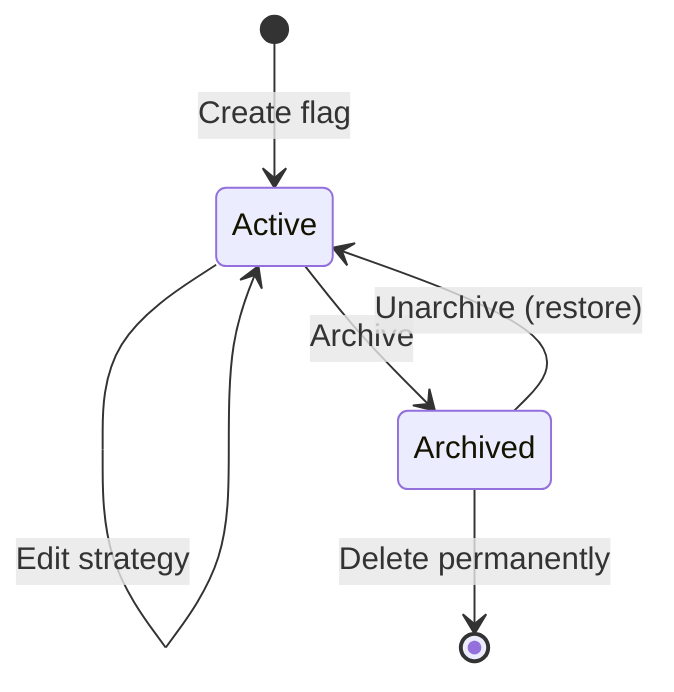
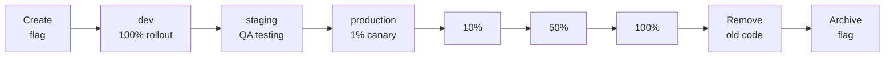

# Flag Lifecycle & Workflow

The feature flag lifecycle in можно has two main states: **Active** and **Archived**. This document covers the complete workflow, from creating your first flag to managing flags in a team environment.

## Flag Lifecycle States



| State | Description |
|-------|-------------|
| **Active** | Flag is live. SDKs evaluate rules and return values. Default after creation. |
| **Archived** | Flag removed from active evaluation. Retained for audit and historical reference. |

Per-environment, a strategy controls whether the flag is **enabled** or **disabled**, along with constraints, segments, and percentage rollout.

## Creating a Flag

Navigate to the **Flags** page and click **New Flag**. Fill in the required fields:

| Field | Required | Description |
|-------|----------|-------------|
| **Key** | Yes | Unique identifier, immutable after creation. Use kebab-case (e.g., `dark-mode-v2`). |
| **Name** | Yes | Human-readable label shown in the dashboard. |
| **Description** | No | Details about the flag's purpose and expected behaviour. |
| **Type** | Yes | `RELEASE` (standard feature flag) or `KILLSWITCH` (emergency disable). |
| **Tags** | No | Labels for organization and filtering. |

After creation, configure the strategy for the target environment(s) before the flag takes effect.

> **Tip:** Keep flag keys descriptive and scoped to their domain. Prefer `checkout-redesign` over `flag-42`.

## Editing a Flag

All fields except the **key** can be modified. Changes are recorded in the [audit log](./audit.md) with full diff details.

Common edits include:
- Adjusting strategy configuration (enabled, percentage, constraints, segments)
- Updating name and description
- Managing tags

## Configuring a Strategy

After creating a flag, configure the strategy per environment:

1. Select the environment (Development, Production)
2. Set **enabled** state
3. Add **context constraints** for targeting
4. Attach **segments** (reusable user groups)
5. Set **percentage rollout** (0–100%)
6. Save

## Full Lifecycle: Creation to Archive



Each stage is a strategy change on a specific environment. Stages D–G are a gradual production rollout with metrics monitoring at each step.

## Typical Team Workflow

1. **Create flag** — developer creates flag with description
2. **Development** — flag enabled in dev for all (100% or no constraints)
3. **Testing** — flag enabled in staging for QA (segment)
4. **Canary** — 1-5% rollout in production, monitor metrics
5. **Gradual rollout** — increase: 5% → 25% → 50% → 100%
6. **Code cleanup** — remove old code path after full rollout
7. **Archive flag** — move to archive via dashboard or API

## Archive and Delete

### When to Archive
- Flag at 100% rollout and old code removed
- Need to preserve audit history
- Flag may be needed again

### When to Delete
- Flag created in error (typo in key)
- Aborted experiment flag
- Test flag for local development

### Archive via API

```bash
curl -X POST "http://localhost:8080/api/v1/flags/42/archive" \
  -H "Authorization: Bearer $TOKEN"
```

### Restore from Archive

```bash
curl -X POST "http://localhost:8080/api/v1/flags/42/unarchive" \
  -H "Authorization: Bearer $TOKEN"
```

## Flag Organization

### Tags

Group flags using tags:

| Tag | Description | Example Flags |
|-----|-------------|---------------|
| `team:checkout` | Checkout team | `new-checkout`, `one-click-buy` |
| `type:killswitch` | Emergency switches | `kill-payment-gw`, `kill-third-party` |

### Naming Conventions

Use kebab-case with meaningful prefixes:

- **Standard features:** `new-checkout`, `ai-search-enabled`
- **Kill switch:** `kill-payment-gateway`, `kill-third-party-api`
- **Experiments:** `exp-pricing-layout`, `exp-cta-placement`
- **Temporary:** `tmp-holiday-banner-2026`

## Next Steps

- [Targeting](./targeting.md) — Configure rules and segments
- [Rollout](./rollout.md) — Percentage rollouts
- [Audit](./audit.md) — Track changes
- [Best Practices](./best-practices.md) — Flag debt management
