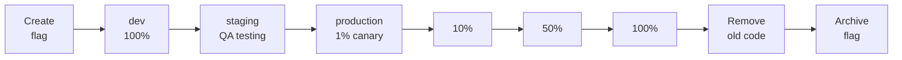

# Flag Lifecycle & Workflow

The complete feature flag lifecycle in **можно**<span class=brand-dot>.</span>: from creation to archival. Flag organization with tags, naming conventions, and typical team workflow.

## Flag Lifecycle

A flag in **можно**<span class=brand-dot>.</span> has two states:

| State | What happens |
|-------|-------------|
| **Active** | Flag is visible in the dashboard. SDKs fetch its configuration and evaluate locally. Default state after creation. |
| **Archived** | Flag hidden from main lists. SDKs stop receiving its configuration. Audit history is preserved. |

Activation rules are configured **per environment** — enabled/disabled, context constraints, segments, and percentage rollout. See [Targeting](./targeting.md) and [Rollout](./rollout.md).

## Creating a Flag

Navigate to **Flags** and click **New Flag**. Required fields:

| Field | Required | Description |
|-------|----------|-------------|
| **Key** | Yes | Unique identifier, immutable after creation |
| **Name** | Yes | Human-readable label shown in the dashboard. |
| **Description** | No | What the flag does and why it exists. |
| **Type** | Yes | `RELEASE` — standard feature flag for gradual rollout. `KILLSWITCH` — emergency shutoff. |
| **Tags** | No | Labels for grouping and filtering. |

After creation the flag is immediately active. Configure activation rules — otherwise the flag returns `false` for everyone.

> **Tip:** The flag key is its identifier in code (`isEnabled("new-checkout", ctx)`). Make keys descriptive. Avoid `flag-42`.

## Editing a Flag

All fields except **key** can be modified. Changes are recorded in the [audit log](./audit.md) with full diff details.

Common edits:
- Adjusting activation rules (enabled, constraints, segments, percentage)
- Updating name and description
- Managing tags

## Typical Team Workflow



Each stage is a change to activation rules on a specific environment. Stages D–G are gradual production rollout with metrics monitoring at each step.

| Stage | Environment | Configuration | Who |
|-------|-------------|---------------|-----|
| Create | — | Flag created, no rules yet | Developer |
| Development | dev | Enabled, 100% | Developer |
| Testing | staging | Enabled, QA segment | QA |
| Canary | production | 1–5% | Release engineer |
| Rollout | production | 10% → 50% → 100% | Release engineer |
| Cleanup | — | Old code removed from app | Developer |
| Archive | — | Flag archived | Developer |

## Archive and Delete

### When to Archive
- Flag at 100% and old code removed
- Need to preserve audit history
- Flag may be needed again

### When to Delete
- Flag created in error (typo in key)
- Aborted experiment flag
- Test flag from local development

### Via API

```bash
# Archive
curl -X POST "http://localhost:8080/api/v1/flags/42/archive" \
  -H "Authorization: Bearer $TOKEN"

# Restore from archive
curl -X POST "http://localhost:8080/api/v1/flags/42/unarchive" \
  -H "Authorization: Bearer $TOKEN"
```

## Naming Conventions

Use kebab-case with meaningful prefixes:

| Type | Prefix | Example |
|------|--------|---------|
| Standard feature | none | `new-checkout`, `ai-search` |
| Kill switch | `kill-` | `kill-payment-gw`, `kill-third-party` |
| Experiment | `exp-` | `exp-pricing-layout`, `exp-cta-color` |
| Temporary | `tmp-` | `tmp-holiday-banner-2026` |

## Organizing Flags with Tags

Group flags by team, type, and service:

| Tag | Purpose | Example Flags |
|-----|---------|---------------|
| `team:checkout` | Checkout team | `new-checkout`, `one-click-buy` |
| `type:killswitch` | Emergency switches | `kill-payment-gw`, `kill-third-party` |
| `service:api` | API service | `rate-limit-v2`, `new-auth` |

## Next Steps

- [Targeting](./targeting.md) — Constraints and segments
- [Rollout](./rollout.md) — Percentage rollouts and canary releases
- [Audit](./audit.md) — Who changed what and when
- [Metrics](./metrics.md) — Flag usage monitoring
- [Best Practices](./best-practices.md) — Flag debt management
