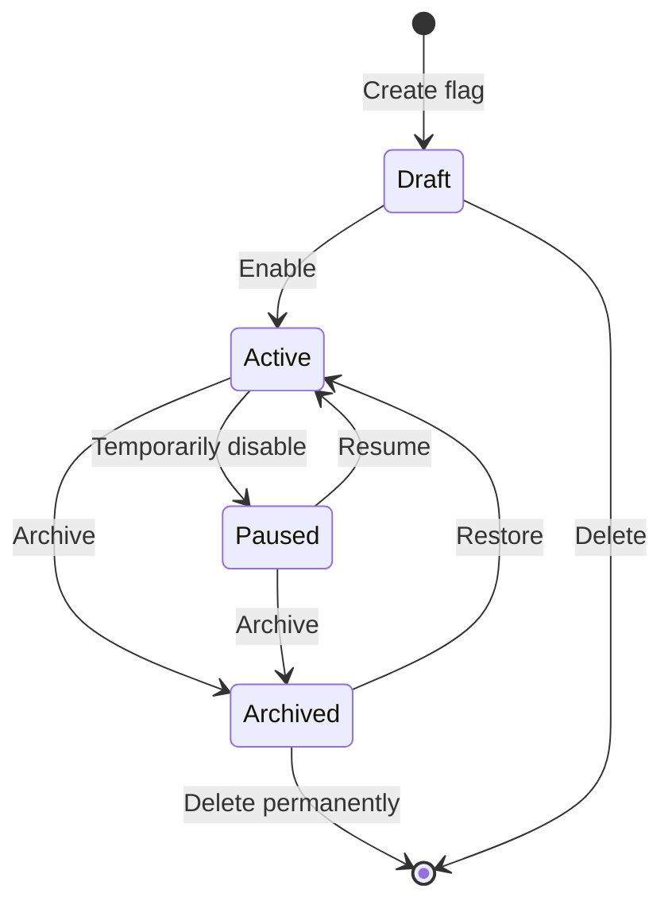
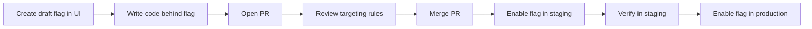

# Flag Lifecycle & Workflow

The feature flag lifecycle in можно spans six stages: **Draft → Active → Paused → Archived → Deleted**. This document covers the complete workflow, from creating your first flag to managing flags in a team environment.

## Flag Lifecycle States



| State | Description |
|-------|-------------|
| **Draft** | Flag created but not evaluating in SDKs. Ideal for setup before launch. |
| **Active** | Flag is live. SDKs evaluate rules and return values. |
| **Paused** | Flag temporarily disabled. SDKs return the default value for all contexts. |
| **Archived** | Flag removed from active evaluation. Retained for audit and historical reference. |
| **Deleted** | Flag permanently removed from the system. Irreversible. |

## Creating a Flag

Navigate to the **Flags** page and click **New Flag**. Fill in the required fields:

| Field | Required | Description |
|-------|----------|-------------|
| **Key** | Yes | Unique identifier, immutable after creation. Use `snake_case` (e.g., `dark_mode_v2`). |
| **Name** | Yes | Human-readable label shown in the dashboard. |
| **Description** | No | Details about the flag's purpose and expected behaviour. |
| **Type** | Yes | `boolean` (on/off) or `string` (multi-value). |
| **Default value** | Yes | The value returned when no targeting rules match or the flag is paused. For booleans: `true` or `false`. |
| **Tags** | No | Comma-separated labels for organization and filtering. |

After creation the flag is in **Draft** state. Configure targeting rules and rollouts before enabling it.

> **Tip:** Keep flag keys descriptive and scoped to their domain. Prefer `checkout_redesign` over `flag_42`.

## Editing a Flag

All fields except the **key** can be modified at any stage. Changes are recorded in the [audit log](./audit.md) with full diff details.

Common edits include:
- Adjusting targeting rules
- Changing the percentage rollout
- Updating the description
- Adding or removing tags
- Modifying the default value

> **Warning:** Changing a boolean flag's type to string (or vice versa) invalidates existing evaluation results. Plan this change carefully and coordinate with consuming services.

## Toggling a Flag

Toggling means switching a flag between **Active** and **Paused**, or changing its default value to rapidly gate a feature.

### From the Dashboard

1. Go to the flag detail page.
2. Click **Pause** to immediately stop evaluation (returns default value).
3. Click **Resume** to re-enable evaluation.

### Using the REST API

```bash
# Pause a flag
curl -X PATCH https://your-instance/api/flags/checkout_redesign \
  -H "Authorization: Bearer $JWT_TOKEN" \
  -H "Content-Type: application/json" \
  -d '{"state": "PAUSED"}'

# Resume a flag
curl -X PATCH https://your-instance/api/flags/checkout_redesign \
  -H "Authorization: Bearer $JWT_TOKEN" \
  -H "Content-Type: application/json" \
  -d '{"state": "ACTIVE"}'
```

> **Tip:** Use the `PATCH` endpoint for quick state changes without re-applying all targeting rules.

## Archiving a Flag

Archive a flag when the feature is fully rolled out and the flag is no longer needed for control. Archived flags:

- Stop being evaluated by SDKs (default value is returned).
- Remain visible in the dashboard for historical reference.
- Retain their full audit history.
- Can be restored to **Active** if needed.

**When to archive:** The feature has been stable in production for a release cycle and no rollback is anticipated.

**When NOT to archive yet:** The flag is temporary but the feature is still being rolled out or monitored.

## Deleting a Flag

Deletion is **permanent and irreversible**. Before deleting, consider archiving instead.

**When to delete:**
- The flag was a short-lived experiment and all related code has been removed.
- The flag key is no longer referenced in any codebase.
- The flag was created in error.

> **Warning:** Deleting a flag that is still referenced in application code will cause SDK evaluation errors. Always remove flag references from code before deletion.

## Organizing Flags with Tags

Tags are free-form labels you attach to flags for filtering and grouping.

**Recommended tagging strategy:**

| Tag | Purpose | Example |
|-----|---------|---------|
| `team:payments` | Owning team | `team:platform` |
| `env:staging` | Deployment environment | `env:production` |
| `type:experiment` | Flag category | `type:kill-switch` |
| `service:checkout` | Owning service | `service:api-gateway` |

Use the dashboard filter bar or API query parameters to find flags by tag:

```bash
curl https://your-instance/api/flags?tags=team:payments,type:experiment \
  -H "Authorization: Bearer $JWT_TOKEN"
```

## Flag Dependencies

можно does not enforce formal flag dependencies, but you can model them by chaining targeting rules or coordinating rollout strategies.

### Explicit Dependency via Segments

Create a **segment** representing the parent flag's target audience, then reference that segment in the child flag's targeting rules:

1. Create a segment `checkout_v2_users` targeted by the parent flag.
2. In the child flag `checkout_v2_promo`, add a targeting rule that includes the segment `checkout_v2_users`.

This ensures the child flag only evaluates for users who have the parent flag enabled. See [Targeting](./targeting.md) for segment configuration.

### Implicit Dependency via Application Code

Handle dependencies in your application:

```java
if (client.isFlagEnabled("checkout_v2", context)) {
    boolean showPromo = client.isFlagEnabled("checkout_v2_promo", context);
}
```

> **Tip:** Document flag dependencies in the flag description field so the team understands the relationship at a glance.

## Team Workflow Best Practices

### Pull Request Flow



1. **Create the flag as Draft** before writing code. Configure targeting rules but leave it disabled.
2. **Write the guarded code** in a feature branch. Use the flag key in your application.
3. **Review** both the code and the flag configuration in the PR. Reference the flag key in the PR description.
4. **Enable the flag in staging** after merge. Verify behaviour.
5. **Enable the flag in production** with a conservative rollout (see [Rollout](./rollout.md)).

### Ownership

- Assign a **flag owner** using a tag (e.g., `owner:alice`).
- The owner is responsible for the flag's lifecycle: creation, rollout, and eventual removal.
- Review owned flags weekly to identify candidates for archiving.

### Communication

- Announce new flags in your team's communication channel.
- Include the flag key, purpose, default value, and expected lifetime.
- Notify the team before pausing or archiving a flag that other services may depend on.

### Environment Separation

Use separate API keys per environment (staging, production) and tag flags accordingly. This prevents accidental cross-environment toggling.

## Next Steps

- Configure [Targeting Rules](./targeting.md) to control who sees each flag value.
- Set up a [Gradual Rollout](./rollout.md) to safely release features.
- Review the [Audit Log](./audit.md) to track every change.
