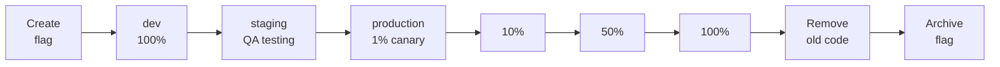

# Flag Lifecycle & Workflow

The complete feature flag lifecycle in **можно**.: from creation to archival. Flag organization with tags, naming conventions, and typical team workflow.

## Flag Lifecycle

A flag in **можно**. has two states:

| State | What happens |
|-------|-------------|
| **Active** | Flag is visible in the dashboard. SDKs fetch its configuration and evaluate locally. Default state after creation. |
| **Archived** | Flag hidden from main lists. SDKs stop receiving its configuration. Audit history is preserved. |

Activation rules are configured **per environment** — enabled/disabled, context constraints, segments, and percentage rollout. See [Targeting](./targeting.md) and [Rollout](./rollout.md).

## Creating a Flag

Navigate to **Flags** and click **New Flag**. Required fields:

| Field | Required | Description |
|-------|----------|-------------|
| **Key** | Yes | Unique identifier, immutable after creation |
| **Name** | Yes | Human-readable label shown in the dashboard. |
| **Description** | No | What the flag does and why it exists. |
| **Type** | Yes | `RELEASE` — standard feature flag for gradual rollout. `KILLSWITCH` — emergency shutoff. |
| **Tags** | No | Labels for grouping and filtering. |

After creation the flag is immediately active. Configure activation rules — otherwise the flag returns `false` for everyone.

> **Tip:** The flag key is its identifier in code (`isEnabled("new-checkout", ctx)`). Make keys descriptive. Avoid `flag-42`. See [Best Practices](./best-practices.md#naming-conventions) for naming conventions.

## Editing a Flag

All fields except **key** can be modified. Every change is recorded in the [audit log](./audit.md).

Common edits:
- Adjusting activation rules (enabled, constraints, segments, percentage)
- Updating name and description
- Managing tags

## Typical Team Workflow

Each stage is a change to activation rules on a specific environment. Canary launch and gradual rollout in production — with metrics monitoring at each step.

An example workflow — adjust to your team's needs:

| Stage | Environment | Configuration | Who |
|-------|-------------|---------------|-----|
| Create | — | Flag created, no rules yet | Developer |
| Development | dev | Enabled, 100% | Developer |
| Testing | staging | Enabled, QA segment | QA |
| Canary | production | 1–5% | Release engineer |
| Rollout | production | 10% → 50% → 100% | Release engineer |
| Cleanup | — | Old code removed from app | Developer |
| Archive | — | Flag archived | Developer |

## Archive and Delete

### When to Archive
- Flag at 100% and old code removed
- Need to preserve audit history
- Flag may be needed again

### When to Delete
- Flag created in error (typo in key)
- Aborted experiment flag
- Test flag from local development

## Organizing Flags with Tags

Tags are flag metadata in `key:value` format. They let you group and filter flags independently of their names. A single flag can have multiple tags.

### Why Tags Matter

You have 50 flags. Keys are descriptive, but finding all flags owned by the checkout team is impossible without tags:

| Task | Without tags | With tags |
|------|-------------|-----------|
| Find all checkout team flags | Scroll through all 50 flags | Filter `team:checkout` — 3 flags |
| Show all emergency kill switches | Search by `kill-` prefix in keys | Filter `type:killswitch` — reliable |
| Find flags for a specific service | Guess from names | Filter `service:api` |

### Creating Tags

Tags are created in the **Tags** section in the sidebar. Each tag is a pair:

| Field | Example |
|-------|---------|
| Tag name | `team` |
| Value | `checkout` |

Once created, a tag can be assigned to any flag during creation or editing.

### Recommended Categories

| Category | Format | Examples |
|----------|--------|----------|
| Team | `team:name` | `team:checkout`, `team:platform` |
| Flag type | `type:purpose` | `type:killswitch`, `type:experiment` |
| Service | `service:name` | `service:api`, `service:payments` |
| Status | `status:state` | `status:deprecated`, `status:permanent` |

A flag can carry multiple tags: `team:checkout`, `type:killswitch`, `service:api` — the flag belongs to a team, is classified by type, and is bound to a service simultaneously.

## Next Steps

- [Targeting](./targeting.md) — Constraints and segments
- [Rollout](./rollout.md) — Percentage rollouts and canary releases
- [Audit](./audit.md) — Who changed what and when
- [Metrics](./metrics.md) — Flag usage monitoring
- [Best Practices](./best-practices.md) — Flag debt management
