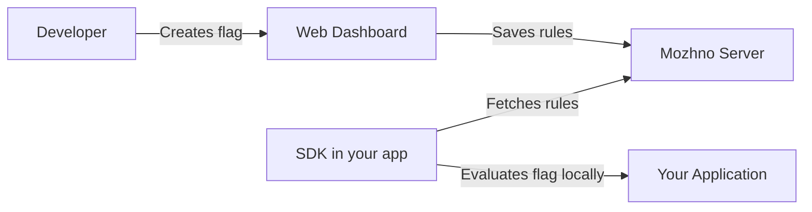

# Introduction

**можно.** is a feature flag management server for teams of any size.

With it you can:

- **Toggle features** on production without deploying code
- **Roll out gradually** — first 1% of users, then 10%, then everyone
- **Target specific users** — show a feature only to users from a certain country, on a Premium plan, or on a specific device
- **Run A/B tests** with multivariate flags
- **Track all changes** through the audit log

## How It Works

1. You create a flag in the web dashboard and configure rules: which users, on which environments, with what rollout percentage.
2. The SDK in your application fetches rules from the server once and caches them.
3. On each flag evaluation, the SDK makes the decision **locally** — zero network latency.
4. When rules change, the SDK receives updates in the background.

## Key Concepts

| Concept | Description |
|---------|-------------|
| **Flag** | A named toggle point in code. Can be boolean (on/off) or multivariate (A/B/C). |
| **Strategy** | How a flag is rolled out: instant, gradual, scheduled, or custom logic. |
| **Segment** | A reusable user group with shared targeting rules. |
| **Context** | User or request attributes used to evaluate flag rules. |
| **Environment** | dev / staging / production — a flag can have different settings on each. |
| **API Key** | SDK access key to the server, tied to a specific environment. |

## Ready to Try?

Head over to [Quick Start](/en/guide/quick-start) — get the server running in 5 minutes.
