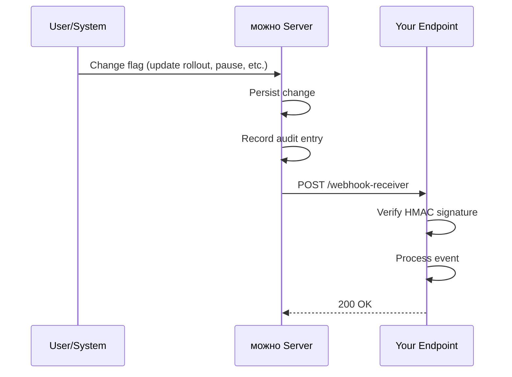

# Integrations & Webhooks

можно integrates with your CI/CD pipeline, monitoring stack, and chat tools through webhooks. This document covers webhook configuration, event types, payload format, and practical integration examples.

## Webhooks Overview

Webhooks are HTTP callbacks that можно fires when specific events occur. Each webhook has:

- A **URL** — the endpoint that receives the HTTP POST request.
- A **secret** — a shared secret for HMAC-SHA256 signature verification.
- **Event subscriptions** — which event types trigger the webhook.
- **Status** — active or disabled.



## Setting Up a Webhook

### Dashboard

1. Navigate to **Settings → Webhooks**.
2. Click **New Webhook**.
3. Enter the **URL** of your receiver endpoint.
4. (Optional) Provide a **secret** for signature verification.
5. Select the **events** you want to subscribe to.
6. Click **Save**.

### API

```bash
curl -X POST https://your-instance/api/webhooks \
  -H "Authorization: Bearer $JWT_TOKEN" \
  -H "Content-Type: application/json" \
  -d '{
    "url": "https://your-service.example.com/webhooks/mozhno",
    "secret": "whsec_your_shared_secret",
    "events": ["flag.updated", "flag.archived", "audit.entry.created"],
    "active": true
  }'
```

## Event Types

| Event | Trigger | Description |
|-------|---------|-------------|
| `flag.created` | Flag created | A new flag was added |
| `flag.updated` | Flag modified | Targeting rules, rollout %, or any field changed |
| `flag.deleted` | Flag deleted | A flag was permanently removed |
| `flag.archived` | Flag archived | A flag was moved to archived state |
| `flag.restored` | Flag restored | An archived flag was restored to active |
| `flag.paused` | Flag paused | A flag was temporarily disabled |
| `flag.resumed` | Flag resumed | A paused flag was re-enabled |
| `segment.created` | Segment created | A new segment was defined |
| `segment.updated` | Segment updated | Segment conditions were modified |
| `segment.deleted` | Segment deleted | A segment was removed |
| `audit.entry.created` | Any change | Generic event for any audit log entry |

> **Tip:** Subscribe to `audit.entry.created` to receive all changes as a single event stream. Use specific events when you only care about certain resource types.

## Webhook Payload Format

All webhooks use the following HTTP request format:

- **Method:** `POST`
- **Content-Type:** `application/json`
- **Headers:**
  - `X-Mozhno-Event`: Event type (e.g., `flag.updated`)
  - `X-Mozhno-Delivery`: Unique delivery ID (UUID)
  - `X-Mozhno-Signature`: HMAC-SHA256 signature (if secret is configured)

### Example Payload: flag.updated

```json
{
  "event": "flag.updated",
  "timestamp": "2026-06-21T10:30:00Z",
  "deliveryId": "d5e8f1a2-3b4c-4d5e-8f9a-0b1c2d3e4f5a",
  "actor": {
    "email": "alice@example.com",
    "type": "USER"
  },
  "resource": {
    "type": "FLAG",
    "key": "checkout_v2",
    "name": "Checkout Redesign v2"
  },
  "changes": {
    "rolloutPercentage": {
      "before": 10,
      "after": 25
    }
  }
}
```

### Example Payload: flag.archived

```json
{
  "event": "flag.archived",
  "timestamp": "2026-06-21T12:00:00Z",
  "deliveryId": "a1b2c3d4-e5f6-4a7b-8c9d-0e1f2a3b4c5d",
  "actor": {
    "email": "bob@example.com",
    "type": "USER"
  },
  "resource": {
    "type": "FLAG",
    "key": "old_experiment",
    "name": "Old Experiment Flag"
  }
}
```

## Verifying Webhook Signatures

When a secret is configured, можно signs each payload with HMAC-SHA256. Verify the signature to ensure the request originated from можно:

```java
import javax.crypto.Mac;
import javax.crypto.spec.SecretKeySpec;
import java.util.HexFormat;

public boolean verifySignature(String payload, String signatureHeader, String secret) {
    Mac mac = Mac.getInstance("HmacSHA256");
    SecretKeySpec keySpec = new SecretKeySpec(secret.getBytes(StandardCharsets.UTF_8), "HmacSHA256");
    mac.init(keySpec);
    byte[] computed = mac.doFinal(payload.getBytes(StandardCharsets.UTF_8));
    String expected = HexFormat.of().formatHex(computed);
    String received = signatureHeader.replace("sha256=", "");
    return MessageDigest.isEqual(expected.getBytes(), received.getBytes());
}
```

> **Warning:** Use a constant-time comparison (`MessageDigest.isEqual`) to prevent timing attacks when comparing signatures.

## CI/CD Integration

### GitHub Actions Example

Automate flag creation and state changes as part of your deployment pipeline:

```yaml
name: Deploy with Feature Flag

on:
  push:
    branches: [main]

jobs:
  deploy:
    runs-on: ubuntu-latest
    steps:
      - uses: actions/checkout@v4

      - name: Deploy to staging
        run: ./deploy-staging.sh

      - name: Enable flag in staging
        run: |
          curl -X PATCH "${{ secrets.MOZHNO_URL }}/api/flags/${{ env.FLAG_KEY }}" \
            -H "Authorization: Bearer ${{ secrets.MOZHNO_JWT }}" \
            -H "Content-Type: application/json" \
            -d '{"state": "ACTIVE", "rolloutPercentage": 100}'

      - name: Run integration tests
        run: ./run-integration-tests.sh

      - name: Set production rollout to 10%
        if: success()
        run: |
          curl -X PATCH "${{ secrets.MOZHNO_URL }}/api/flags/${{ env.FLAG_KEY }}" \
            -H "Authorization: Bearer ${{ secrets.MOZHNO_JWT }}" \
            -H "Content-Type: application/json" \
            -d '{"rolloutPercentage": 10}'

      - name: Rollback on failure
        if: failure()
        run: |
          curl -X PATCH "${{ secrets.MOZHNO_URL }}/api/flags/${{ env.FLAG_KEY }}" \
            -H "Authorization: Bearer ${{ secrets.MOZHNO_JWT }}" \
            -H "Content-Type: application/json" \
            -d '{"state": "PAUSED"}'
```

### GitLab CI Example

```yaml
canary_release:
  stage: deploy
  script:
    - |
      curl -X PATCH "${MOZHNO_URL}/api/flags/${FLAG_KEY}" \
        -H "Authorization: Bearer ${MOZHNO_JWT}" \
        -H "Content-Type: application/json" \
        -d "{\"rolloutPercentage\": 5}"
  environment:
    name: production
```

## Testing Webhooks

### Local Testing with a Request Bin

Use a service like webhook.site or a local tool to inspect webhook payloads during development:

1. Create a webhook receiver URL (e.g., `https://webhook.site/your-uuid`).
2. Configure a webhook in можно pointing to that URL.
3. Make a change in можно (e.g., update a flag).
4. Inspect the captured request in the request bin.

### Testing with curl Locally

Simulate a webhook delivery for testing your receiver:

```bash
curl -X POST http://localhost:8081/webhook-receiver \
  -H "Content-Type: application/json" \
  -H "X-Mozhno-Event: flag.updated" \
  -H "X-Mozhno-Delivery: test-delivery-001" \
  -H "X-Mozhno-Signature: sha256=$(
    echo -n '{"event":"flag.updated","test":true}' \
    | openssl dgst -sha256 -hmac "whsec_test_secret" \
    | awk '{print $2}'
  )" \
  -d '{"event":"flag.updated","test":true}'
```

## Webhook Delivery & Retries

- **Timeout:** можно waits up to 10 seconds for your endpoint to respond.
- **Retries:** Failed deliveries are retried up to 3 times with exponential backoff (1 min, 5 min, 15 min).
- **Disable on failure:** If all retries fail for 10 consecutive deliveries, the webhook is automatically disabled. You will receive an email notification.
- **Manual re-enable:** Reactivate the webhook from the dashboard after fixing the receiver.

You can view the delivery history and status for each webhook in the dashboard under **Settings → Webhooks → [webhook name] → Delivery Log**.

## Chat Integration Examples

### Slack Notification on Flag Change

Create a webhook receiver that posts to Slack:

```javascript
const express = require("express");
const crypto = require("crypto");

app.post("/webhooks/mozhno", async (req, res) => {
  const event = req.headers["x-mozhno-event"];
  const payload = req.body;

  if (event === "flag.paused") {
    await fetch(process.env.SLACK_WEBHOOK_URL, {
      method: "POST",
      headers: { "Content-Type": "application/json" },
      body: JSON.stringify({
        text: `:warning: Flag \`${payload.resource.key}\` was PAUSED by ${payload.actor.email}`,
      }),
    });
  }

  res.sendStatus(200);
});
```

## Next Steps

- Explore the [REST API](../api/rest.md) for programmatic flag management.
- Set up [SDK integration](../sdk/overview.md) to consume flags in your applications.
- Review [Best Practices](./best-practices.md) for flag lifecycle automation.
