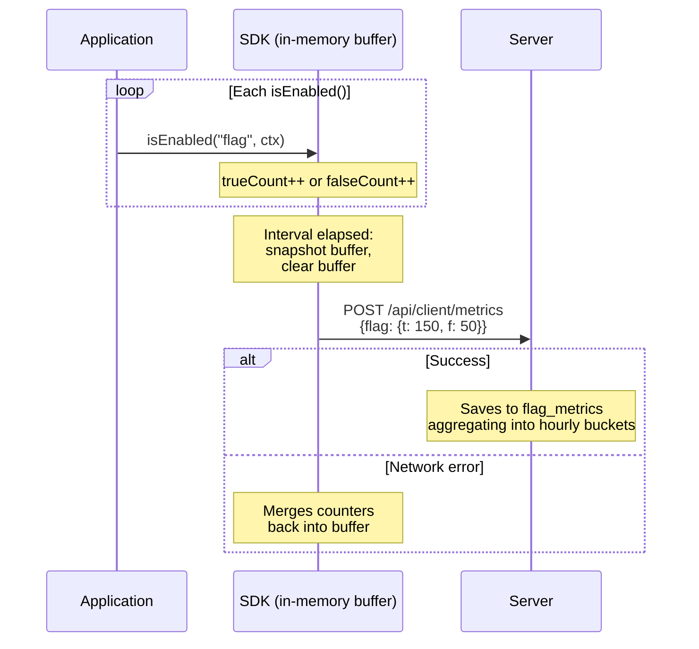

# Metrics & Analytics

**можно**<span class=brand-dot>.</span> collects feature flag usage metrics: how many times a flag was evaluated and what result it returned. Metrics are visualized in the web dashboard via sparkline charts and accessible through the REST API.

## How Metrics Are Collected

The SDK accumulates `true`/`false` counters for each flag in a local buffer (`ConcurrentHashMap`). At a configurable interval (default: 60 seconds), the buffer is sent to the server in a single request:



Each record contains:

| Field | Description |
|-------|-------------|
| `flagId` | Flag ID |
| `environmentId` | Environment ID |
| `evaluationTrueCount` | Number of `true` returns |
| `evaluationFalseCount` | Number of `false` returns |
| `timeBucket` | Hourly interval |
| `instanceId` | SDK instance identifier |
| `appName` | Application name |

## Viewing Metrics in the Dashboard

Each flag page displays a sparkline chart — a miniature graph showing the flag's evaluation trend over the selected period. The green line represents `true`, the gray line `false`.

Clicking the sparkline opens a dialog with a full chart and a list of SDK instances grouped by application. Filter by application name and specific instance. Metrics are retained for the last 48 hours.

## Disabling Metrics

If metrics are not needed, disable them in the SDK:

```java
MozhnoConfig config = MozhnoConfig.builder()
    .appName("my-app")
    .instanceId("instance-1")
    .mozhnoUrl("http://localhost:8080")
    .apiKey("<api-key>")
    .disableMetrics(true)
    .build();
```


## Interpreting Metrics

| Pattern | Interpretation |
|---------|---------------|
| `trueCount` is growing | The flag is being enabled for more users — rollout is working |
| `falseCount` is growing, `trueCount = 0` | Flag is off or no one matches the targeting rules |
| Sudden spike in `falseCount` | Possible issue: flag suddenly stopped being enabled |
| No metrics at all | SDK is not sending data — check connectivity |

## Limits

| Parameter | Default | Description |
|-----------|---------|-------------|
| Send interval (SDK) | 60 seconds | `sendMetricsInterval` / `metricsInterval` |
| Max metrics per API key | 1000 | `CLIENT_MAX_METRICS_PER_KEY` |

## Related Pages

- [SDK Overview](/en/sdk/overview) — how SDK sends metrics
- [Monitoring](/en/self-hosting/monitoring) — Prometheus, health checks
- [Targeting](/en/guide/targeting) — rules and segments