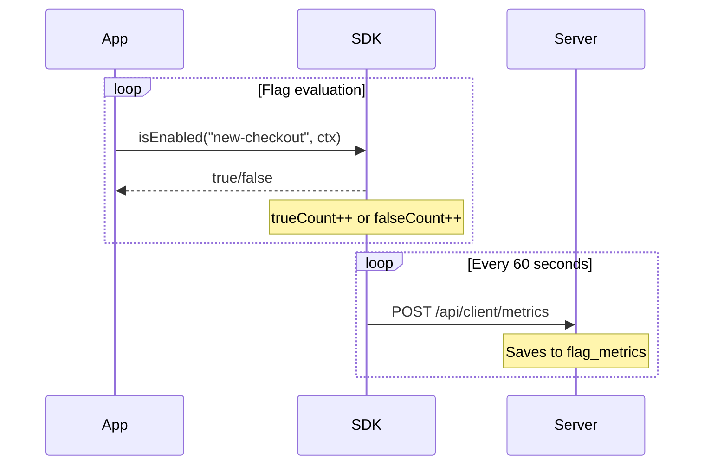

# Metrics & Analytics

**можно**<span class=brand-dot>.</span> collects feature flag usage metrics: how many times a flag was evaluated and what result it returned. Metrics are visualized in the web dashboard via sparkline charts and accessible through the REST API.

## How Metrics Are Collected

The SDK accumulates evaluation counters for each flag in memory and sends them to the server at a configurable interval (default: 60 seconds):



Each record contains:

| Field | Description |
|-------|-------------|
| `flagId` | Flag ID |
| `environmentId` | Environment ID |
| `evaluationTrueCount` | Number of `true` returns |
| `evaluationFalseCount` | Number of `false` returns |
| `timeBucket` | Time interval (rounded to the minute) |
| `instanceId` | SDK instance identifier |
| `appName` | Application name |

## Viewing Metrics in the Dashboard

Each flag page displays a sparkline chart — a miniature graph showing the flag's evaluation trend over the selected period. The green line represents `true`, the gray line `false`.

Clicking the sparkline opens the **Flag Metrics** dialog with a full chart and filters:

| Filter | Description |
|--------|-------------|
| **Environment** | Development / Production |
| **Instance** | A specific SDK instance |
| **Application** | Application name |
| **Period** | Last hour / 24 hours / 7 days / 30 days |

## Metrics REST API

### Flag Metrics

```http
GET /api/v1/flags/{flagId}/metrics
```

| Parameter | Type | Description |
|-----------|------|-------------|
| `environmentId` | `long` | Environment ID |
| `instanceId` | `string` | SDK instance ID |
| `appName` | `string` | Application name |

```bash
curl "http://localhost:8080/api/v1/flags/42/metrics?environmentId=3" \
  -H "Authorization: Bearer $JWT_TOKEN"
```

Response:

```json
{
  "metrics": [
    {
      "timeBucket": "2026-06-21T13:41:00Z",
      "trueCount": 150,
      "falseCount": 50,
      "instanceId": "instance-1",
      "appName": "web-app"
    }
  ]
}
```

### Project Metrics

```http
GET /api/v1/metrics
```

| Parameter | Type | Description |
|-----------|------|-------------|
| `environmentId` | `long` | Environment ID |

Returns aggregated metrics across all project flags.

## Disabling Metrics

If metrics are not needed, disable them in the SDK:

```java
MozhnoConfig config = MozhnoConfig.builder()
    .appName("my-app")
    .instanceId("instance-1")
    .mozhnoUrl("http://localhost:8080")
    .apiKey("<api-key>")
    .disableMetrics(true)
    .build();
```


## Exporting Metrics via SPI

Through `MetricsSinkSpi`, metrics can be directed to external systems:

| Destination | Implementation |
|-------------|----------------|
| Prometheus | Standard endpoint `/actuator/prometheus` |
| Datadog, New Relic | Enterprise implementation of `MetricsSinkSpi` |
| Local storage | `JdbcMetricsSinkProvider` (default) |

## Interpreting Metrics

| Pattern | Interpretation |
|---------|---------------|
| `trueCount` is growing | The flag is being enabled for more users — rollout is working |
| `falseCount` is growing, `trueCount = 0` | Flag is off or no one matches the targeting rules |
| Sudden spike in `falseCount` | Possible issue: flag suddenly stopped being enabled |
| No metrics at all | SDK is not sending data — check connectivity |

## Limits

| Parameter | Default | Description |
|-----------|---------|-------------|
| Send interval (SDK) | 60 seconds | `sendMetricsInterval` / `metricsInterval` |
| Max metrics per API key | 1000 | `CLIENT_MAX_METRICS_PER_KEY` |

## Related Pages

- [SDK Overview](/en/sdk/overview) — how SDK sends metrics
- [Monitoring](/en/self-hosting/monitoring) — Prometheus, health checks
- [Targeting](/en/guide/targeting) — rules and segments