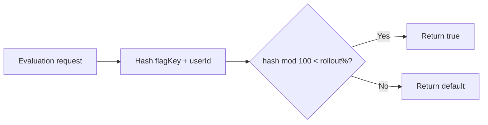
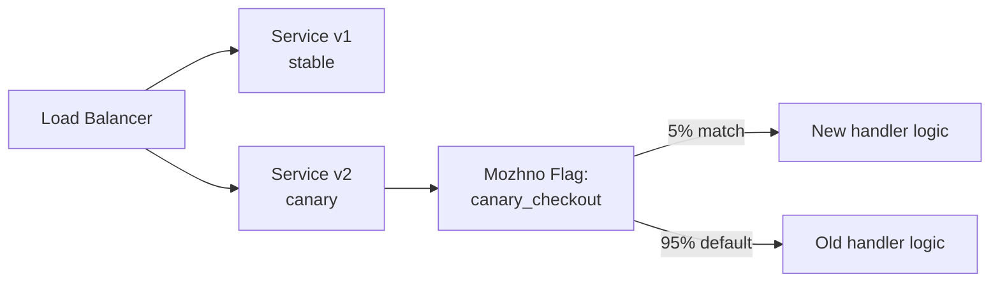
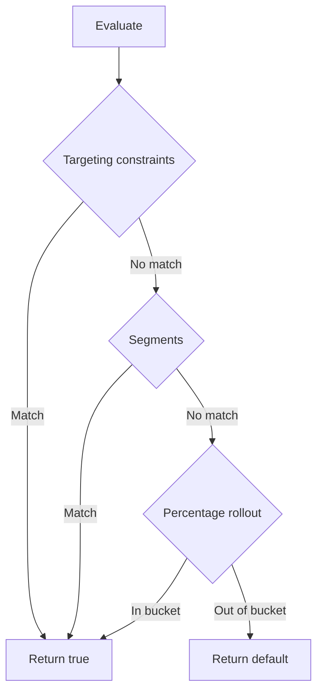

# Percentage Rollout & Canary Releases

Percentage rollout lets you gradually expose a feature to a fraction of your user base. Combined with targeting rules, it enables safe canary release patterns and controlled rollback.

## How Percentage Rollout Works

можно uses a deterministic MurmurHash3 algorithm based on the flag key and user identifier to assign each evaluation to an in-group or out-group:

```
hash = MurmurHash3(flagKey + (userId || sessionId)) % 100
if hash < percentage → enabled
```

The same context always produces the same result — a given user does not flip between enabled and disabled on repeat evaluations.



> **Important:** Percentage rollout is applied only after constraints and segments. Targeting rules have higher priority. See [Targeting Rules](./targeting.md) for the full evaluation order.

## Setting Up a Percentage Rollout

In the dashboard, configure the strategy for a flag on a specific environment:

1. Navigate to the flag detail page.
2. Add or edit a strategy for the target environment.
3. Set the **percentage** (0–100).
4. Configure optional **context constraints** and **segments** for additional targeting.

### Rollout Hash Attribute

The rollout uses `userId` from the evaluation context as the hashing key. If `userId` is absent, `sessionId` is used as a fallback. If neither is present, the hash seed is just the flag key (all anonymous users get the same bucket).

> **Warning:** Always send `userId` or `sessionId` in your evaluation context for proper percentage rollout distribution.

## Gradual Rollout Strategies

### Strategy 1: Linear Ramp-Up

Increase the percentage incrementally over days or hours while monitoring metrics:

```
0% → 5% → 25% → 50% → 100%
```

| Stage | Percentage | Duration | Action |
|-------|------------|----------|--------|
| **Internal** | 0% (targeted) | Ongoing | QA and internal users only (use targeting rules) |
| **Canary** | 5% | 1–2 hours | Monitor error rates and latency |
| **Beta** | 25% | 1 day | Check conversion metrics, user feedback |
| **General** | 50% | 1 day | Validate at scale |
| **Full** | 100% | — | All users; consider archiving the flag |

### Strategy 2: Ring Deployment

Target by infrastructure ring or environment:

| Ring | Who | Mechanisms |
|------|-----|------------|
| **Ring 0** | CI/CD test suite | Targeting rule: `userId` in `["ci-test"]` |
| **Ring 1** | Internal employees | Segment: `internal_employees` (email contains `@company.com`) |
| **Ring 2** | Staging environment | Separate staging instance |
| **Ring 3** | Canary (5% production) | Percentage rollout: 5% |
| **Ring 4** | Production (100%) | Percentage rollout: 100% |

## Canary Release Pattern

A canary release deploys a new version alongside the existing one, routing a small percentage of traffic via a feature flag.



### Implementing a Canary with можно

1. **Create a RELEASE flag** `checkout_v2` with default disabled.
2. **Deploy** both v1 and v2 of the service.
3. The v2 code checks `client.isEnabled("checkout_v2", context)` before executing new logic.
4. In можно, set a strategy with **percentage rollout to 5%** for `checkout_v2`.
5. v1 ignores the flag and runs the stable path.
6. **Monitor** error rates, latency, and business metrics for the 5% canary group.
7. Gradually increase the percentage or **roll back to 0%** if issues arise.

## Combining Targeting Rules with Rollout

Targeting rules and percentage rollout work together:



**Example: Internal + 10% external:**

| Priority | Type | Configuration |
|----------|------|---------------|
| 1 | Constraint rule | `email` contains `"@company.com"` |
| — | Percentage rollout | 10% rollout |
| — | Default | `false` |

All employees get the feature (constraint match), and 10% of external users get it via rollout. The remaining 90% of external users see the default.

## Rollback Procedures

### Emergency Rollback (Kill Switch)

If a feature causes incidents, disable the strategy or set percentage to 0%.

**Dashboard:** Disable the strategy on the flag detail page.

**API:**
```bash
curl -X PUT "https://your-instance/api/v1/flags/42/strategies" \
  -H "Authorization: Bearer $TOKEN" \
  -H "Content-Type: application/json" \
  -d '{"flagId": 42, "environmentId": 3, "enabled": false}'
```

For instant kill switches, use a KILLSWITCH flag type — disabled by default, enable it to block a feature immediately.

## Next Steps

- Review [Audit Log](./audit.md) to track who modified rollout percentages.
- Learn about [SDK Evaluation](../sdk/overview.md) to understand how rollouts are computed locally.
