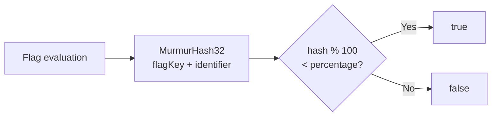
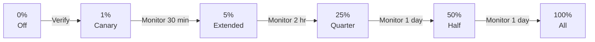
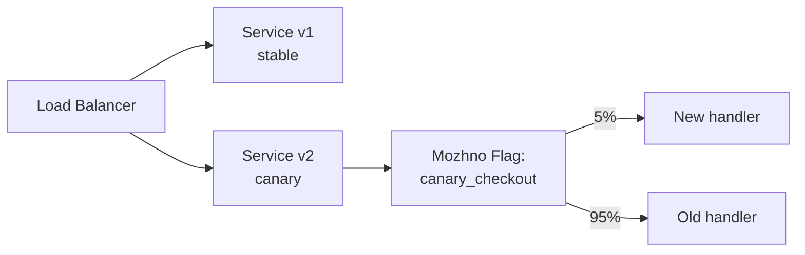

# Percentage Rollout & Canary Releases

Percentage rollout lets you gradually expose a feature to a fraction of your user base. **можно**<span class=brand-dot>.</span> uses deterministic MurmurHash32 hashing for consistent bucketing.

## How Percentage Rollout Works

Percentage rollout is the `percentage` field (0–100) in a flag's strategy settings. When evaluating a flag, the SDK computes:

```
hash = MurmurHash32(flagKey + identifier) % 100
if hash < percentage → enabled
```

MurmurHash32 guarantees **deterministic bucketing**: the same user always gets the same result for the same flag at the same percentage.

The identifier is `userId`, with `sessionId` as fallback. If neither is provided, the SDK auto-generates a stable anonymous identifier (`anonymousId`): browser SDKs persist it in localStorage so it survives page reloads, while server SDKs generate it at client startup and keep it for the lifetime of the process.

This makes anonymous traffic bucketing **uniform and sticky**: each anonymous user/instance always lands in the same bucket, so rollout percentages apply fairly to the whole audience. This behavior is controlled by the `stickyAnonId` option (default `true`) in all SDKs. When disabled, all anonymous requests without an identifier fall into a single bucket — the SDK logs a warning.

> **On upgrade:** in SDK versions before `stickyAnonId`, all anonymous requests without an identifier landed in a single bucket (based on the flag key). After upgrading, anonymous traffic moves to new buckets — tied to the localStorage ID in browsers, or to the app instance ID on the server — so the effective rollout percentage for the anonymous audience may shift abruptly. Plan the upgrade while flags are at 100%/0%, or temporarily set `stickyAnonId(false)` to preserve the legacy behavior.

100% enables for everyone; 0% disables for everyone.



## Example Rollout Strategy

One possible scenario — adjust the percentages and duration to your project:



| Stage | Percentage | Duration | What to Check |
|-------|------------|----------|---------------|
| **Preparation** | 0% | Before launch | Flag created, strategy configured, code deployed |
| **Canary** | 1% | 30 min | Errors, latency, resource usage. Rollback if anomalies |
| **Extended** | 5% | 2 hr | Metric stability, business indicators |
| **Quarter** | 25% | 1 day | Behavior across diverse audience |
| **Half** | 50% | 1 day | Compare metrics with old variant |
| **All** | 100% | — | Feature fully enabled |

> **Tip:** Don't skip stages. Even a "safe" feature can cause unexpected load spikes. A 1% canary catches issues with minimal impact.

## Canary Release Pattern

A canary release routes a small percentage of traffic to a new version via a feature flag:



1. Create a RELEASE flag with default disabled
2. Deploy both v1 and v2 of the service
3. v2 code checks `client.isEnabled("flag", context)` before executing new logic
4. Set strategy with **percentage rollout to 5%**
5. Monitor error rates, latency, and business metrics for the canary group
6. Gradually increase the percentage or **roll back to 0%** if issues arise

## Rollout and Targeting

Percentage rollout applies **after** targeting rules: the user must first pass constraints and segments, and only then is the percentage check applied. See [Combining Constraints and Segments](/en/guide/targeting#combining-constraints-and-segments).

## Rollback

### Instant Rollback

Set the percentage to 0 or disable the strategy (`enabled: false`) — the feature is instantly disabled for everyone.

### Kill Switch

For emergencies, use a **KILLSWITCH** flag type: when disabled in the dashboard, `isEnabled()` returns `false` for everyone — functionality is blocked immediately.

```java
if (!client.isEnabled("payment-gateway-killswitch")) {
    throw new ServiceUnavailableException();
}
```

## Example Per-Environment Configuration

One possible approach — independent rollout per environment:

| Environment | Percentage | Rules |
|-------------|------------|-------|
| **dev** | 100% | No restrictions |
| **staging** | 100% | QA segment |
| **production** | 1% → 100% | Gradual rollout |

This lets you test freely on dev and staging while performing cautious rollouts on production.

## Next Steps

- [Targeting](/en/guide/targeting) — constraints and segments
- [Flag Workflow](/en/guide/flags-workflow) — flag lifecycle
- [Audit](/en/guide/audit) — track all rollout changes
