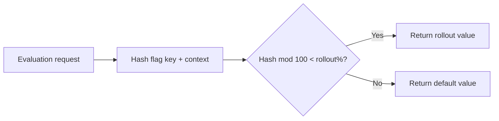
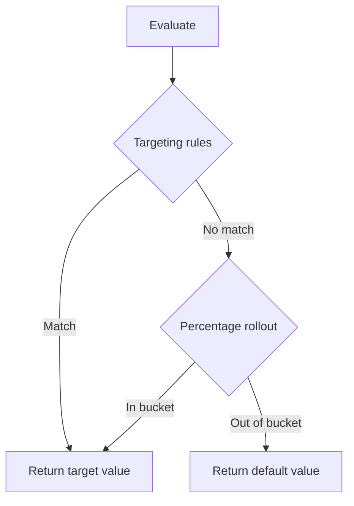

# Percentage Rollout & Canary Releases

Percentage rollout lets you gradually expose a feature to a fraction of your user base without targeting specific individuals. Combined with targeting rules, it enables safe canary release patterns and controlled rollback.

## How Percentage Rollout Works

можно uses a deterministic hashing algorithm based on the flag key and the evaluation context to assign each evaluation to an in-group or out-group. The same context always produces the same result — a given user does not flip between enabled and disabled on repeat evaluations.



> **Important:** Percentage rollout is only applied if no targeting rule matched. Targeting rules have higher priority. See [Targeting Rules](./targeting.md) for the full evaluation order.

## Setting Up a Percentage Rollout

### In the Dashboard

1. Navigate to the flag detail page.
2. In the **Rollout** section, enable the percentage slider.
3. Set the percentage (0–100%).
4. Choose the **rollout value** — the value returned for users in the enabled bucket.
5. Define the **rollout attribute** — the context attribute used for hashing. Default is `userId`.

### Rollout Attribute

The rollout attribute determines the hashing key. Choose an attribute that:

- Is **stable** — does not change across sessions for the same identity.
- Is **unique** — distinguishes individual users or tenants.
- Is **present** — always provided in the evaluation context.

| Recommended Attribute | Use Case |
|------------------------|----------|
| `userId` | User-level feature rollout |
| `tenantId` | Organisation-level rollout (entire org gets the feature or not) |
| `sessionId` | Session-level experiments (not persistent across logins) |

> **Warning:** If the rollout attribute is missing from the evaluation context, the flag returns the default value. Ensure your application always sends the chosen attribute.

## Gradual Rollout Strategies

### Strategy 1: Linear Ramp-Up

Increase the percentage incrementally over days or hours while monitoring metrics:

```
0% → 5% → 25% → 50% → 100%
```

| Stage | Percentage | Duration | Action |
|-------|------------|----------|--------|
| **Internal** | 0% (targeted) | Ongoing | QA and internal users only (use targeting rules) |
| **Canary** | 5% | 1–2 hours | Monitor error rates and latency |
| **Beta** | 25% | 1 day | Check conversion metrics, user feedback |
| **General** | 50% | 1 day | Validate at scale |
| **Full** | 100% | — | All users; consider archiving the flag |

### Strategy 2: Ring Deployment

Target by infrastructure ring or environment rather than percentage:

| Ring | Who | Mechanisms |
|------|-----|------------|
| **Ring 0** | CI/CD test suite | Targeting rule: `userId equals "ci-test"` |
| **Ring 1** | Internal employees | Segment: `internal_employees` (email contains `@company.com`) |
| **Ring 2** | Staging environment | Separate staging instance |
| **Ring 3** | Canary (5% production) | Percentage rollout: 5% |
| **Ring 4** | Production (100%) | Percentage rollout: 100% |

### Strategy 3: Geographic Ramp-Up

Release to lower-risk regions first, then expand:

```bash
# Ring 1: Small markets
curl -X PATCH https://your-instance/api/flags/new_checkout \
  -H "Authorization: Bearer $JWT_TOKEN" \
  -H "Content-Type: application/json" \
  -d '{
    "targetingRules": [
      {
        "conditions": [{"attribute": "country", "operator": "IN", "values": ["SE", "DK", "NO"]}],
        "targetValue": true
      }
    ],
    "rolloutPercentage": 0
  }'

# Ring 2: Larger markets after validation
curl -X PATCH https://your-instance/api/flags/new_checkout \
  -H "Authorization: Bearer $JWT_TOKEN" \
  -H "Content-Type: application/json" \
  -d '{
    "targetingRules": [
      {
        "conditions": [{"attribute": "country", "operator": "IN", "values": ["DE", "FR", "ES", "IT", "SE", "DK", "NO"]}],
        "targetValue": true
      }
    ]
  }'
```

## Canary Release Pattern

A canary release deploys a new version of a service alongside the existing version, routing a small percentage of traffic to the new version via a feature flag.

```mermaid
graph LR
    LB[Load Balancer] --> Old[Service v1<br/>(stable)]
    LB --> New[Service v2<br/>(canary)]
    New --> Flag[Mozhno Flag:<br/>canary_checkout]
    Flag -->|5% match| NewHandler[New handler logic]
    Flag -->|95% default| OldHandler[Old handler logic]
```

### Implementing a Canary with можно

1. **Create a boolean flag** `checkout_v2` with default value `false`.
2. **Deploy** both v1 and v2 of the service.
3. The v2 code checks `client.isFlagEnabled("checkout_v2", context)` before executing new logic.
4. In можно, set the **percentage rollout to 5%** for `checkout_v2`.
5. v1 ignores the flag and runs the stable path.
6. **Monitor** error rates, latency, and business metrics for the 5% canary group.
7. Gradually increase the percentage or **roll back to 0%** if issues arise.

## Monitoring Rollout Progress

### Metrics to Watch

| Metric | Tool | Threshold |
|--------|------|-----------|
| Error rate | Sentry, Datadog, Grafana | No increase from baseline |
| P95 latency | Datadog, Prometheus | < 2× baseline |
| Conversion rate | Amplitude, Mixpanel | No degradation |
| Crash rate | Firebase, Sentry | No increase |
| SDK evaluation latency | можно dashboard | < 5 ms per eval |

### можно Dashboard Monitoring

The flag detail page shows:
- **Evaluation count** over time (chart)
- **Percentage breakdown** of true/false evaluations
- **Top context values** seen during evaluation

### Alerting with Webhooks

Configure a [webhook](./integrations.md) to notify your monitoring platform when a flag is modified:

```json
{
  "event": "flag.updated",
  "flag": {
    "key": "checkout_v2",
    "rolloutPercentage": 50
  },
  "timestamp": "2026-06-21T10:30:00Z",
  "actor": "alice@example.com"
}
```

## Rollback Procedures

### Emergency Rollback (Kill Switch)

If a feature causes incidents, immediately pause the flag or set its rollout to 0%:

**Dashboard:** Click **Pause** on the flag detail page.

**API:**
```bash
# Instant kill — returns default value for everyone
curl -X PATCH https://your-instance/api/flags/checkout_v2 \
  -H "Authorization: Bearer $JWT_TOKEN" \
  -H "Content-Type: application/json" \
  -d '{"state": "PAUSED"}'
```

> **Tip:** Keep a documented runbook with curl commands for critical flags so on-call engineers can roll back without navigating the dashboard.

### Gradual Rollback

If early indicators are negative but not critical, reduce the percentage instead of pausing entirely:

```bash
# Reduce from 50% to 5%
curl -X PATCH https://your-instance/api/flags/checkout_v2 \
  -H "Authorization: Bearer $JWT_TOKEN" \
  -H "Content-Type: application/json" \
  -d '{"rolloutPercentage": 5}'
```

### Rollback Verification

After rolling back, verify:

1. **Error rates** return to baseline.
2. **Flag evaluations** in the dashboard show 100% default value.
3. **Application logs** confirm the old code path is active.
4. **Notify the team** that the rollback is complete.

### Post-Rollback Analysis

- Review the [audit log](./audit.md) to confirm who changed what and when.
- Investigate root cause before re-enabling the rollout.
- Consider adding additional targeting rules (e.g., `appVersion` checks) before the next attempt.

## Combining Targeting Rules with Rollout

Targeting rules and percentage rollout work together:



**Example: Internal + 10% external:**

| Priority | Type | Configuration |
|----------|------|---------------|
| 1 | Targeting rule | `email contains "@company.com"` → `true` |
| — | Percentage rollout | 10% rollout on `userId` → `true` |
| — | Default | `false` |

All employees get the feature (rule match), and 10% of external users get it via rollout. The remaining 90% of external users see the default value.

## Next Steps

- Review [Audit Log](./audit.md) to track who modified rollout percentages.
- Set up [Webhooks](./integrations.md) to automate rollout monitoring.
- Learn about [SDK Evaluation](../sdk/overview.md) to understand how rollouts are computed locally.
