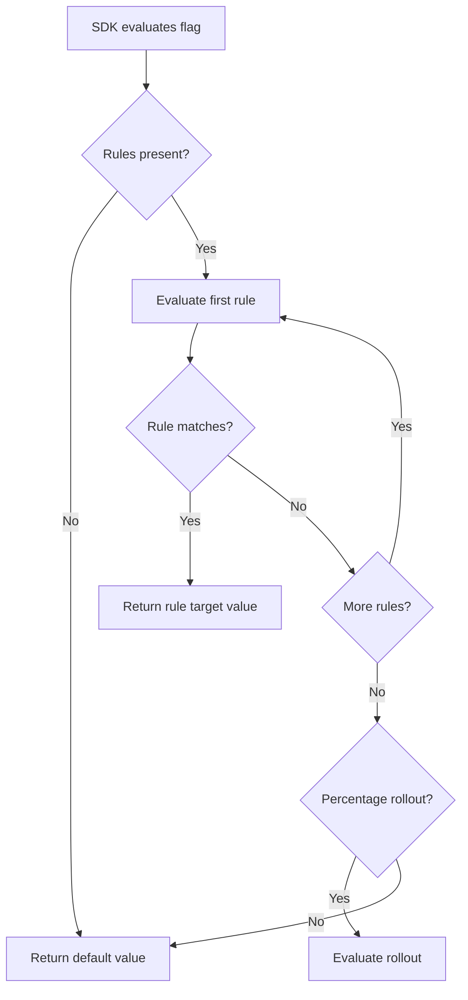
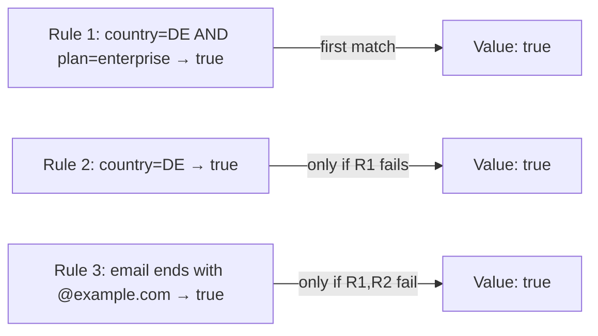
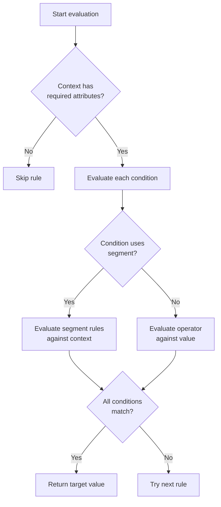

# Targeting Rules

Targeting rules determine **which users receive which flag value** at evaluation time. Each rule is a logical expression evaluated against the context attributes you provide at runtime.

## How Targeting Works

When an SDK evaluates a flag, it processes the flag's targeting rules in order:



The **first matching rule wins**. If no rule matches, the percentage rollout is evaluated. If there is no rollout, the default value is returned.

## Context Attributes

The evaluation context is a set of key-value pairs your application sends at runtime. Typical attributes:

| Attribute | Type | Example | Description |
|-----------|------|---------|-------------|
| `userId` | String | `"user-12345"` | Unique user identifier |
| `email` | String | `"alice@example.com"` | User email address |
| `country` | String | `"DE"` | ISO 3166 country code |
| `plan` | String | `"pro"` | Subscription tier |
| `beta` | Boolean | `true` | Whether the user is in the beta programme |
| `tenantId` | String | `"org-789"` | Multi-tenant identifier |
| `appVersion` | String | `"2.4.1"` | Application version |
| `custom` | Any | `{"role": "admin"}` | Arbitrary custom data |

### Providing Context to SDKs

**Java:**
```java
EvaluationContext context = EvaluationContext.builder()
    .set("userId", "user-12345")
    .set("country", "DE")
    .set("plan", "pro")
    .build();

boolean enabled = client.isFlagEnabled("premium_features", context);
```

**JavaScript:**
```js
const context = {
  userId: "user-12345",
  country: "DE",
  plan: "pro",
};

const enabled = await client.isEnabled("premium_features", context);
```

## Operators

Each targeting rule compares an attribute against one or more values using an operator.

| Operator | Description | Example |
|----------|-------------|---------|
| **Equals** | Exact match | `country equals "DE"` |
| **Not Equals** | Does not match | `plan not equals "free"` |
| **Contains** | Substring match | `email contains "@example.com"` |
| **Not Contains** | Substring does not appear | `email not contains "@competitor.com"` |
| **In** | Value is in a list | `country in ["DE", "FR", "ES"]` |
| **Not In** | Value is not in a list | `country not in ["US", "CA"]` |
| **Regex** | Regular expression match | `email regex "^[a-z]+@example\\.com$"` |
| **Greater Than** | Numeric comparison | `appVersion greater than "2.0.0"` |
| **Less Than** | Numeric comparison | `appVersion less than "3.0.0"` |
| **Greater Than or Equal** | Numeric comparison | `appVersion >= "1.5.0"` |
| **Less Than or Equal** | Numeric comparison | `appVersion <= "2.9.9"` |
| **Exists** | Attribute is present | `beta exists` |
| **Not Exists** | Attribute is absent | `beta not exists` |

> **Tip:** The `in` and `not in` operators are more readable than multiple OR conditions. Use them for list-based targeting like country allow-lists.

### Semantic Version Comparison

The comparison operators (`>`, `<`, `>=`, `<=`) support semantic version strings:

```
appVersion greater than "2.0.0"
```

This correctly compares `"2.10.0"` as greater than `"2.9.0"`, not lexicographically.

## Combining Multiple Rules

Rules are combined with **AND** logic within a single rule entry and evaluated top-to-bottom with **first-match-wins** (OR) logic across entries.

### Single Rule (AND logic)

A single rule can have multiple conditions. All conditions must be true for the rule to match:

| Attribute | Operator | Value |
|-----------|----------|-------|
| `country` | equals | `"DE"` |
| `plan` | in | `["pro", "enterprise"]` |

This rule matches when `country` is `"DE"` **AND** `plan` is either `"pro"` or `"enterprise"`.

### Multiple Rules (OR logic / priority ordering)

When you add multiple rule entries, they are evaluated in priority order:



Use reorder handles in the dashboard to change rule priority. Drag rules up (higher priority) or down (lower priority).

### Example: Production Ramp-Up

| Priority | Conditions | Target Value |
|----------|------------|--------------|
| 1 | `userId in ["qa-tester-1", "qa-tester-2"]` | `true` |
| 2 | `tenantId equals "internal-demo"` | `true` |
| 3 | `country in ["DE", "FR"]` AND `plan equals "enterprise"` | `true` |
| (fallback) | none | `false` (default) |

Internal QA team gets the feature first, followed by the internal demo tenant, then a subset of paying customers.

## Using Segments in Targeting

A **segment** is a reusable set of targeting conditions. Instead of repeating the same conditions across multiple flags, define a segment once and reference it.

### Creating a Segment

1. Navigate to **Segments** in the dashboard.
2. Click **New Segment**.
3. Provide a name (e.g., `beta_testers`).
4. Define the matching conditions (e.g., `beta equals true`).

### Referencing a Segment in a Rule

In the flag targeting editor, add a rule condition with the **Segment** operator:

| Attribute | Operator | Value |
|-----------|----------|-------|
| — | in segment | `beta_testers` |
| `country` | equals | `"DE"` |

This rule matches users who are beta testers **AND** are located in Germany.

> **Tip:** Segments are evaluated at flag evaluation time against the provided context, not pre-computed. Changes to a segment immediately affect all flags that reference it. Use the [audit log](./audit.md) to track segment modifications.

### Segment Dependencies

Monitor which flags use a segment from the segment detail page. Before deleting a segment, verify no active flags reference it.

## Evaluation Logic with Segments



## Practical Tips

- **Start with broad rules** and narrow down as you gain confidence.
- **Use segments** for concepts that apply to multiple flags (environments, user tiers, experiments).
- **Test in staging** with a rule targeting `userId equals "qa-user"` before going to production.
- **Audit regularly**: check that rules still make sense and remove stale conditions.
- **Avoid regex on large datasets**: regex evaluation is client-side and fast, but overly broad patterns can cause unexpected matches.

## Next Steps

- Set up a [Gradual Rollout](./rollout.md) for rules that should apply to a percentage of users.
- Learn about [SDK Evaluation](../sdk/overview.md) to understand how context flows from your app to the SDK.
