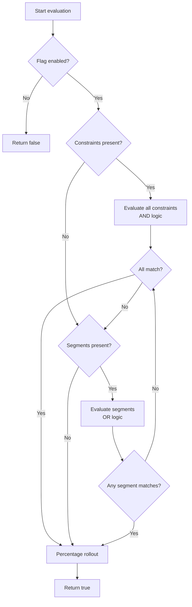

# Targeting

Targeting determines **which users** see a feature. **можно**<span class=brand-dot>.</span> uses constraints, segments, and percentage rollout for precise audience control.

## How Targeting Works

When an SDK evaluates a flag, it processes in this order:

1. **Flag enabled?** — if the flag (or strategy) is disabled, return `false`
2. **Context constraints** — all must match (AND logic)
3. **Segments** — at least one must match (OR logic)
4. **If both constraints and segments are present** — either passing grants access (OR)
5. **Percentage rollout** — deterministic distribution via MurmurHash32
6. **Default** — if nothing is configured, return `true`



## Context Attributes

The evaluation context is a set of key-value pairs your application sends at runtime. All values are strings.

| Attribute | Example | Description |
|-----------|---------|-------------|
| `userId` | `"user-12345"` | Unique user identifier (used for rollout hashing) |
| `sessionId` | `"sess-abc"` | Session identifier (fallback for rollout hashing) |
| `country` | `"DE"` | ISO 3166 country code |
| `plan` | `"enterprise"` | Subscription tier |
| `appVersion` | `"2.4.1"` | Application version (semver comparison) |

### Providing Context

**Java:**
```java
MozhnoContext context = MozhnoContext.builder()
    .userId("user-12345")
    .addProperty("country", "DE")
    .addProperty("plan", "enterprise")
    .build();

boolean enabled = client.isEnabled("premium_features", context);
```

**JavaScript:**
```js
const context = {
  userId: "user-12345",
  country: "DE",
  plan: "enterprise",
};

const enabled = client.isEnabled("premium_features", context);
```

## Constraint Operators

Each constraint compares a context field against one or more values using an operator. All constraints within a strategy use **AND** logic.

```json
{
  "field": "country",
  "operator": "in",
  "values": ["DE", "FR", "ES"]
}
```

The context type determines how the operator interprets the value. See the full operator-type compatibility matrix at [Contexts](/en/concepts/contexts#context-types-and-operators).

## Segments

A **segment** is a reusable group of users with its own set of constraints. Within a segment, all constraints use AND logic. A strategy can reference multiple segments — matching **any** of them is enough (OR logic). See [Segments](/en/concepts/segments) for details.

### Benefits of Segments

| Benefit | Description |
|---------|-------------|
| **Single source of truth** | Change the segment — all flags update automatically |
| **DRY** | Don't repeat the same rules on every flag |
| **Audit** | See who changed the segment composition and when |

## Percentage Rollout

Deterministic distribution via hashing:

```
hash = MurmurHash32(flagKey + identifier) % 100
if hash < percentage → enabled
```

The same identifier always gets the same result for the same flag. The identifier is `userId`, with `sessionId` as fallback.

> **Important:** If neither `userId` nor `sessionId` is provided, the hash is seeded with just the flag key — all anonymous users land in the same bucket (either all get the feature, or none do). The SDK logs a warning in this case.

100% rollout enables the flag for everyone; 0% disables it.

## Combining Constraints and Segments

A strategy can contain both constraints and segments simultaneously:

- Passing **either** is enough — constraints OR any of the segments
- Neither constraints nor any segment match → flag returns `false` (rollout is not applied)
- Passed → percentage rollout is then applied

## Next Steps

- [Rollout](/en/guide/rollout) — percentage rollouts and canary releases
- [Segments](/en/concepts/segments) — reusable user groups
- [Flags](/en/concepts/flags) — flag types and lifecycle
- [SDK Overview](/en/sdk/overview) — how the SDK evaluates rules locally
