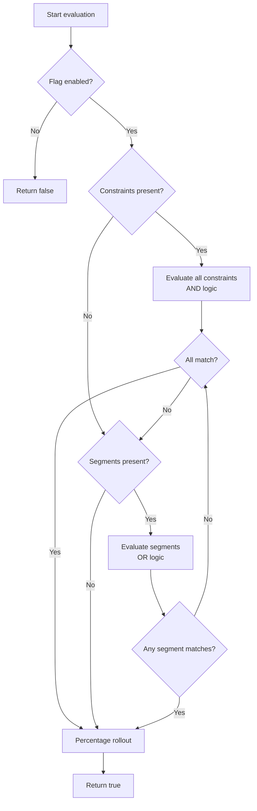

# Targeting Rules

Targeting rules determine **which users receive which flag value** at evaluation time. Each rule is a constraint evaluated against the context attributes you provide at runtime.

## How Targeting Works

When an SDK evaluates a flag, it processes in this order:

1. **Flag enabled?** — if the flag (or strategy) is disabled, return `false`
2. **Context constraints** — all must match (AND logic)
3. **Segments** — at least one must match (OR logic)
4. **If both constraints and segments are present** — either passing grants access (OR)
5. **Percentage rollout** — deterministic distribution via MurmurHash32
6. **Default** — if nothing is configured, return `false`



## Context Attributes

The evaluation context is a set of key-value pairs your application sends at runtime. All values are strings.

| Attribute | Example | Description |
|-----------|---------|-------------|
| `userId` | `"user-12345"` | Unique user identifier (used for rollout hashing) |
| `sessionId` | `"sess-abc"` | Session identifier (fallback for rollout hashing) |
| `country` | `"DE"` | ISO 3166 country code |
| `plan` | `"enterprise"` | Subscription tier |
| `appVersion` | `"2.4.1"` | Application version (semver comparison) |

### Providing Context

**Java:**
```java
MozhnoContext context = MozhnoContext.builder()
    .userId("user-12345")
    .addProperty("country", "DE")
    .addProperty("plan", "enterprise")
    .build();

boolean enabled = client.isEnabled("premium_features", context);
```

**JavaScript:**
```js
const context = {
  userId: "user-12345",
  country: "DE",
  plan: "enterprise",
};

const enabled = client.isEnabled("premium_features", context);
```

## Constraint Operators

Each constraint compares a context field against one or more values using an operator:

| Operator | Description | Example |
|----------|-------------|---------|
| `in` | Value is in a list | `country` in `["DE", "FR", "ES"]` |
| `not_in` | Value is NOT in a list | `country` not_in `["US", "CA"]` |
| `eq` | Equal (numeric for `contextType: number`) | `plan` eq `"enterprise"` |
| `ne` | Not equal | `plan` ne `"free"` |
| `gt` | Greater than | `appVersion` gt `"2.0.0"` |
| `gte` | Greater than or equal | `age` gte `"18"` |
| `lt` | Less than | `priority` lt `"5"` |
| `lte` | Less than or equal | `retries` lte `"3"` |
| `contains` | Substring match | `email` contains `"@example.com"` |

### Context Types

The `contextType` determines how values are compared:

| Type | Comparison | Example |
|------|------------|---------|
| `string` (default) | String comparison | `country` in `["DE"]` |
| `number` | Numeric (double) | `age` gte `"18"` |
| `time` | ISO8601 datetime | `eventDate` gt `"2026-01-01T00:00:00Z"` |
| `semver` | Semantic versioning | `appVersion` gte `"2.1.0"` |

Semantic version comparison correctly handles `"2.10.0"` > `"2.9.0"`.

## Combining Constraints

Within a single strategy, all constraints use **AND** logic — every constraint must match for the flag to be enabled:

```json
{
  "constraints": [
    {"field": "country", "operator": "in", "values": ["DE", "FR"]},
    {"field": "plan", "operator": "eq", "values": ["enterprise"]}
  ]
}
```

This means: `country` is DE or FR **AND** `plan` is enterprise.

Multiple constraints on the same `(field, operator)` are merged — any matching value passes that constraint (OR within a constraint group).

## Using Segments in Targeting

A **segment** is a reusable set of constraints. Reference segments in a strategy rather than repeating rules:

- **Within a segment**: All constraints must match (AND logic)
- **Across segments**: At least one segment must match (OR logic)
- **Constraints + segments**: Either passing grants access (OR between them)

> **Tip:** Segments are evaluated at flag evaluation time against the provided context. Changes to a segment immediately affect all flags that reference it.

## Percentage Rollout

When percentage rollout is configured:

```
hash = MurmurHash32(flagKey + userId) % 100
if hash < percentage → enabled
```

The same user always gets the same result for the same flag. If `userId` is absent, `sessionId` is used instead. 100% rollout enables the flag for everyone; 0% disables it.

## Next Steps

- Set up a [Gradual Rollout](./rollout.md) for percentage-based releases.
- Learn about [SDK Evaluation](../sdk/overview.md) to understand how context flows from your app to the SDK.
